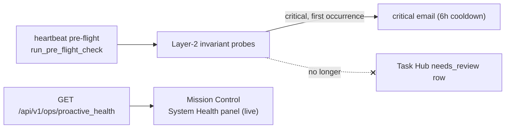
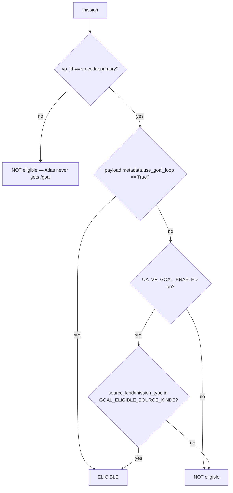

# Agent Operating Playbook

This is the operator-facing playbook for **how the autonomous agents actually
behave** at runtime — the orchestration posture Simone takes, how work is
claimed and delegated, what happens when a mission fails, and the guardrails
that keep the system from sawing its own arm off. Every behavioral claim here
is grounded in the code paths listed in the frontmatter. Where the live
directive file (`memory/HEARTBEAT.md`) and the code agree, that's the contract.
Where they drift, the **code wins** and the drift is flagged.

> This doc describes *operating behavior*. For the mechanical data model and
> dispatch SQL, see the Task Hub doc (`02_execution_core/02_task_hub.md`). For
> VP mission internals, see `03_agents/01_vp_workers_and_delegation.md`. For
> verification discipline see `08_operations/02_production_verification_rules.md`.

---

## 1. The orchestration posture: delegate, supervise, sign off

Simone (`memory/HEARTBEAT.md`) is the **orchestrator, not the only worker**.
The canonical directive is explicit: "You are the manager of an AI
organization, not its only worker." Every Task Hub item routes through Simone
for situational awareness, but **awareness is not ownership**. The default
posture is *delegate → supervise → sign off*.

Two execution reports run under Simone, each in a clean context window per
mission:

| Report | `vp_id` | Lane |
|---|---|---|
| **Atlas** | `vp.general.primary` | Research, synthesis, intelligence, brief authoring, multi-source analysis, root-cause investigation, content generation. The default lane for "read + think + write." |
| **Cody** | `vp.coder.primary` | Code changes, PRs, tests, debugging, demo workspaces — anything touching a repo. |

Simone executes work **directly** only when it is:
- Trivial (one tool call, no research)
- Interactive operator chat (`chat_panel` where Kevin is waiting on Simone's voice)
- Cross-cutting judgment that genuinely needs full context (queue triage, policy, ambiguous prioritization)

The rule of thumb in the directive: if a task takes >5 minutes of Simone's
context to do herself, she should be asking "can Atlas do this with a fresh
window?" — and the answer is almost always yes.

### Default routing matrix (by `source_kind`)

| Task `source_kind` / pattern | Default owner |
|---|---|
| `proactive_signal_discord`, `proactive_signal` | Atlas |
| `claude_code_kb_update` | Atlas |
| `convergence_detection`, `insight_detection` | Atlas |
| `tutorial_build`, `cody_scaffold_request` | Cody |
| `cron_run` failures needing investigation | Atlas |
| `chat_panel` (operator chat) | Simone |
| `proactive_health:invariant:*` | **No Task Hub row** — surfaced via the Mission Control **System Health** panel (live `/api/v1/ops/proactive_health`) + critical email (see §1.1) |
| `simone_chat` | Simone |
| Anything unclear | Atlas by default |

This is the **default**, overridable when delegation overhead clearly exceeds
the work, or when a cross-task pattern is worth handling personally.

### 1.1 `proactive_health` findings: surface, don't enqueue

Critical pipeline-invariant findings from the Proactive Activity Watchdog
(`services/proactive_health_notifier.run_pre_flight_check`) are **not** written
to Task Hub. They surface through exactly two channels:

| Channel | What it is | Audience |
|---|---|---|
| **System Health panel** | The canonical dashboard surface. A panel on the Mission Control tab that renders the live `GET /api/v1/ops/proactive_health` response (Layer 1 process-liveness + Layer 2 pipeline invariants). Always reflects current state — when a finding recovers it simply disappears; nothing to clear. An email-acknowledged finding stays visible (severity unchanged) with a muted **ACKED** chip (the `acknowledged`/`acked_at_utc` payload annotation). | Operator + Simone |
| **Critical email** | One digest email covering all current critical findings, 6h cooldown (`proactive_health_notifier.py::send_critical_digest`, driven by the proactive-health systemd timer), sent regardless of dormancy (infra incident-response, Exception #3). Each finding carries an **Acknowledge (mute until recovered)** link — clicking it suppresses that finding-id from future digests until the finding stays green long enough to count as recovered (`UA_PROACTIVE_HEALTH_ACK_RECOVERY_SECONDS`, default 6h, hysteresis against minutes-scale flaps; 30-day max-lifetime backstop), after which the next NEW red alerts again immediately. Suppress-until-recovered, **not** a timed snooze. Mechanics: As-built notes in `06_platform/08_scheduling_substrate_adr.md` Decision 3. | Operator |



**The no-write decision (and why).** Earlier (2026-05-20, P0c) the pre-flight
parked a `needs_review` Task Hub row for every critical finding
(`task_id = proactive_health:<finding_id>`, `source_kind = proactive_health`).
That channel was removed because it was **redundant** with the email + the live
endpoint, and the rows themselves caused four concrete failure modes:

- **Zombie rows** — a finding that self-healed (pipeline recovered) left a stale
  `needs_review` row that nobody closed.
- **Severity mislabel** — health findings landed in the same lane as real work,
  so a transient invariant looked like a stalled mission.
- **Board-lane pollution** — `proactive_health:*` rows crowded the "Needs Review"
  lane, burying genuinely-stalled work.
- **Resurrection-on-trash** — clearing a row by trashing it didn't stop the next
  tick from re-parking an identical row, so they came back.

The live endpoint has none of these problems: it is **stateless and
self-healing** — when the underlying invariant recovers, the panel simply stops
showing it. No clear step, no resurrection. (The email **Acknowledge** link
above mutes only the *digest*; the panel keeps showing the finding, ACKED chip
and all, until it actually recovers.)

**Consequence for the board.** The Task Hub **"Needs Review"** lane now means
**only genuinely-stalled real work sessions** — missions/tasks that need human
or rescue-evaluator attention. It is no longer a dumping ground for health
findings. If a critical invariant reveals a real pipeline failure that needs a
code fix, dispatch it as a normal investigation (route to Atlas/Cody via
`vp_dispatch_mission`); do not re-park it as a health row.

### Simone's four context-dependent roles

| Posture | Triggered by | Job |
|---|---|---|
| **Full executor** | `chat_panel`, `simone_chat` | Do the work, reply to Kevin |
| **Router** | Most `source_kind`s | Dispatch to Atlas/Cody, release the claim |
| **Observer** | VP successes (CC visibility) | Nothing — successes close themselves |
| **Rescue-evaluator** | `vp_mission_failure` items | Evaluate the failure, pick a rescue verb (§5) |

---

## 2. How a delegation is executed cleanly

When Simone delegates, the directive prescribes a precise sequence:

1. **Dispatch the mission.**
   `vp_dispatch_mission(objective=..., target_vp="vp.general.primary"|"vp.coder.primary", task_id=<source_task_id>)`.
   The objective is natural language that captures *what done looks like*. The
   source `task_id` is included so the VP can reference it and so Simone can
   correlate later.
2. **Release the claim.**
   `task_redirect_to(task_id, target_vp=..., reason="delegated via vp_dispatch_mission")`.
   This clears retry counters and stamps `metadata.preferred_vp` so the
   lifecycle audit does not fire a "missing lifecycle mutation" guardrail.
   **Do not** call `complete` on the source task — the VP will close it.
3. **Move on.** Don't keep mental state on the delegated task.

**Successes close automatically.** When the VP finishes,
`worker_loop._execute_mission_logic` syncs the terminal status into Task Hub
and closes both the mirror row (`task_id == mission_id`) AND the original
source task (resolved via `_resolve_source_task_id_from_payload`). There is
**no `needs_review` pause for Simone sign-off** — that pause was rejected
architecturally to preserve cap-of-1 throughput. The VP emails Kevin directly
and CCs Simone for situational awareness only.

> **GOTCHA (delegated-zombie pattern):** Pre-PR-#493, the worker only looked
> for the source task_id under `payload.metadata.task_id` — a key nobody wrote
> — so source rows sat in `status=delegated` forever. The current code
> (`_resolve_source_task_id_from_payload`) checks three locations in priority
> order: top-level `payload.task_id`, then `payload.metadata.linked_task_id`,
> then `payload.metadata.task_id`. This is why passing `task_id` to
> `vp_dispatch_mission` matters — without it the source close silently no-ops.

### Close discipline (the lifecycle guardrail)

Every claimed assignment **must** terminate with one of: `complete`, `block`,
`park`, `review`, `approve`, or `task_redirect_to` (for delegation). If a
session ends with a claim still `seized` + `in_progress`, the lifecycle
guardrail fires and emails the operator `[ERROR] Execution Missing Lifecycle
Mutation`.

Anti-patterns that trip the guardrail:
- Claiming a task then forgetting to close it.
- Calling `complete` on a *sibling* task — the tool's `task_id` must match the
  assignment exactly.
- `TodoWrite "completed"` without invoking `task_hub_task_action`. TodoWrite is
  scratchpad; it never persists to the DB. The guardrail reads the **live DB**,
  not the internal todo list.

The full action verb set lives in `task_hub.py` (`ACTION_SEIZE`,
`ACTION_COMPLETE`, `ACTION_PARK`, `ACTION_REVIEW`, `ACTION_REDIRECT_TO`,
`ACTION_REHYDRATE`, `ACTION_RE_EVALUATE`, etc.).

---

## 3. The `/goal` completion loop (Cody-only)

For Cody work with a **verifiable end state** (tests pass, lint clean, PR
opened, a file present), Simone requests the `/goal` loop. It drives Cody
across multiple turns until a Haiku evaluator confirms the condition holds —
no per-turn operator nudging.

Eligibility is decided by `self_briefing.is_goal_eligible_mission`:



Key facts verified in code:
- `/goal` is **Cody-only**. `is_goal_eligible_mission` returns `False`
  immediately for any `vp_id != "vp.coder.primary"`.
- The explicit per-task override `metadata.use_goal_loop=True` is checked
  **before** the global flag, so an operator opt-in always wins even when
  `UA_VP_GOAL_ENABLED` is OFF (the prod default — see `vp_goal_enabled`).
- `GOAL_ELIGIBLE_SOURCE_KINDS = {cody_demo_task, cody_scaffold_request,
  tutorial_build, tutorial_build_task}`.
- `UA_VP_GOAL_ENABLED` defaults **OFF** (`vp_goal_enabled` returns False unless
  the env is `1/true/yes/on`).

> **`task_id` is REQUIRED for /goal inheritance** when dispatching an
> operator-typed task. `vp_dispatch_mission` reads `args.get("task_id")` to
> look up the linked task hub row and propagate `metadata.use_goal_loop=True`.
> Passing only `idempotency_key="task-<id>"` does NOT substitute — that key is
> purely dispatch dedup.

### Completion attestation guard

When a mission IS `/goal`-eligible, the worker enforces that the VP wrote
`COMPLETION.md` before accepting a `completed` outcome
(`worker_loop._execute_mission_logic` →
`self_briefing.check_completion_attestation`). A missing file **demotes the
outcome to `failed`** with `failure_mode="missing_completion_attestation"`,
which then surfaces to Simone as a rescue item.

> **GOTCHA (2026-05-26 fix):** the guard previously gated on the GLOBAL
> `vp_goal_enabled()` flag instead of per-mission eligibility, so successful
> Cody missions *without* `use_goal_loop` were spuriously demoted for missing a
> file they were never told to write. It now checks
> `is_goal_eligible_mission(mission)`. The check also has a dual-path fallback
> (PR #492): it looks in `outcome.payload.cli_workspace_dir` in addition to the
> canonical mission workspace, because Cody sometimes writes `COMPLETION.md` to
> his actual cwd when the brief scoped work to a `/tmp` dir.

---

## 4. Mission priority tiers (anti-starvation)

VP missions land in one of four **semantic tiers** rather than relying on raw
numeric priority (`vp/mission_priority.py`). Lower rank = claimed sooner.

| Tier | Rank | Meaning | Examples |
|---|---|---|---|
| `operator_daily` | 0 | Kevin reads with morning coffee; >2h delay = SLA breach | `briefing`, `morning_briefing`, `evening_briefing`, `youtube_daily_digest` |
| `operator_signal` | 1 | Proactive intelligence Kevin wants but isn't blocking on | `insight_brief`, `convergence_brief`, `convergence_evaluation`, `research`, ideation evals |
| `maintenance` | 2 | Housekeeping | `curation`, `proactive_wiki`, `doc-maintenance` |
| `background` | 3 | Opportunistic — the **safe default** | everything unmapped |

Why tiers beat numeric-only priority (documented in the module): a numeric
scheme (lower=urgent, default 100) punishes the forgetful caller — any cron
author who omits priority gets the *lowest* urgency. That trap killed the
2026-05-27 morning briefing, which sat at the default behind ~110
`insight_brief`s. With tiers, the unmapped default (`background`) means
forgotten work runs **last**, never blocking operator-facing work.

`resolve_tier` returns `background` for unknown mission types, with a defensive
substring guard that catches LLM-chosen names containing `ideation`,
`convergence`, `intel_brief`, or `insight_brief` (these are always
`operator_signal`, since Simone dispatches the proactive-insight families under
unpredictable names).

Within a tier, numeric `priority` is a fine-grained tiebreaker, and
`created_at` is the final tiebreaker.

---

## 5. Failure rescue (rescue-evaluator posture)

When a VP mission finalizes as `failed` or `cancelled` (and `failure_mode !=
"operator_cancel"`), `durable/state.finalize_vp_mission` calls
`vp_failure_rescue.surface_failure_to_simone`, which creates an informational
`vp_mission_failure` Task Hub item routed to Simone. **Simone does NOT fix the
VP's work herself** — she is an evaluator and dispatcher in this posture.

The `failure_mode` is a stable string the rescue logic uses to pick a verb
(`worker_loop._classify_outcome_failure_mode` derives it; values enumerated in
`finalize_vp_mission`'s docstring):

`vp_self_reported`, `goal_cap_hit`, `subprocess_crash`, `auth_failure`,
`workspace_guard`, `timeout`, `operator_cancel`,
`missing_completion_attestation`, `unspecified`.

The rescue item carries `metadata.brief_path` (the VP's BRIEF.md, may be
`None`), `metadata.transcript_tail` (last 2 KB of subprocess output),
`metadata.failure_mode`, and `metadata.failure_count` (failures in this rescue
chain).

### The four rescue verbs (pick exactly one)

| Verb | When |
|---|---|
| `vp_dispatch_mission_retry(mission_id, additional_guidance, max_additional_turns=None)` | Self-reported or `/goal` cap-hit, AND your guidance addresses the gap. Same chain, same brief, guidance prepended. |
| `vp_dispatch_mission_redispatch_fresh(mission_id, additional_context)` | Crash / env corruption / workspace contamination — where prior state may be the problem. Same chain, fresh workspace. |
| `escalate_vp_failure_to_operator(mission_id, summary, why_escalating, recommended_action=None)` | `auth_failure` / `workspace_guard` / config-shaped (Simone can't fix), OR `failure_count >= 3`, OR you choose not to retry. Creates a `chat_panel` task to Kevin. |
| `task_hub_task_action(task_id="vp_failure:<mission_id>", action="complete", note="ambient — failure_count=N")` | Choosing not to act this cycle. The failure becomes context; `failure_count` tells future-you whether to escalate. |

`_classify_outcome_failure_mode` checks markers in priority order:
`missing_completion_attestation` first (so the protocol-violation signal
survives), then auth/workspace-guard/signal/timeout/goal-cap markers, then
`status` fallbacks. This ordering was a 2026-05-26 fix — previously a demoted
mission was mislabeled `vp_self_reported`.

---

## 6. Worker-exit classification (protocol violations)

Owned subprocesses (cron `!script`, VP CLI client, demo workspace) and the
in-process LLM cron path are classified into six buckets by
`worker_exit_classifier.classify_worker_exit`. This distinguishes "clean
success" from "exited cleanly but never told Task Hub what it did" (a protocol
violation).

| Outcome | Meaning | `is_failure` | `is_protocol_violation` |
|---|---|---|---|
| `clean_exit_zero` | rc=0 AND task closed via finalize/`complete` | no | no |
| `clean_exit_zero_no_disposition` | rc=0 but task still `in_progress` | no | **yes** |
| `nonzero_exit` | rc != 0 (or `None`) | yes | no |
| `signaled` | killed by OS signal (OOM, external SIGKILL) | yes | no |
| `timeout_killed` | UA's own timeout machinery killed it | yes | no |
| `cancelled_mid_run` | coroutine cancelled externally (session reaper, operator) | yes | no |

Classification order in code: `was_cancelled` → `was_timeout_killed` →
`was_signaled` → `return_code != 0` → (rc==0) `task_closed_normally ?
clean_exit_zero : clean_exit_zero_no_disposition`.

> **GOTCHA (`cancelled_mid_run`):** `asyncio.CancelledError` inherits from
> `BaseException`, not `Exception`, so it bypasses generic `except Exception`
> handlers. Callers **must explicitly detect cancellation and pass
> `was_cancelled=True`** — otherwise a reaped LLM-cron coroutine is
> mis-painted as `clean_exit_zero`. This was the 2026-05-13 gateway-freeze
> miscount.

A protocol violation routes the task to `needs_review` via
`park_task_for_protocol_violation(conn, task_id, site, ...)`, where `site` is
one of `cron`/`vp_cli`/`demo`. It is **best-effort** by design — it never
raises into the spawn site's happy path. Protocol violations do **not** bump
the retry counter (`is_failure=False`); they're handled by the `needs_review`
path instead.

---

## 7. Stale-task recovery (no per-task reapers)

There are two distinct staleness mechanisms. **Do not write your own reaper** —
compose with these.

### 7a. Stale assignment release (the live mechanism)

`dispatch_service.dispatch_sweep` runs a top-of-sweep release pass before every
claim, calling `task_hub.release_stale_assignments`:

- Releases `seized`/`running` assignments older than
  `UA_DISPATCH_STALE_AFTER_SECONDS` (default **1800s = 30min**).
- Gated by `UA_DISPATCH_STALE_SWEEP_ENABLED` (default **on**).
- Released assignments are finalized as `abandoned` with
  `reopen_in_progress=True`, so the underlying task reopens and is eligible in
  the very next queue rebuild this sweep performs.
- The **calling session is auto-excluded**, plus any
  `additional_running_sessions` passed in (Hermes Phase A.2), so a long-running
  tick doesn't accidentally release live peers.

### 7b. Stale-task PARKING (separate, default OFF)

`task_hub._apply_stale_policy` (run during `rebuild_dispatch_queue`) parks
tasks that miss too many dispatch cycles. This is **disabled by default**:

- `UA_TASK_STALE_ENABLED` — default **`0` (off)**.
- `UA_TASK_STALE_MIN_CYCLES` — default `4` (min 1).
- `UA_TASK_STALE_MIN_AGE_MINUTES` — default `180` (min 10).

When enabled, a task that has missed `>= MIN_CYCLES` dispatch cycles AND is
`>= MIN_AGE_MINUTES` old is moved to `stale_parked` / `TASK_STATUS_PARKED`.

> Distinguish these two: 7a releases stuck *claims* (almost always desirable,
> on by default); 7b parks *unclaimed* tasks that keep getting skipped (off by
> default — turning it on means the operator accepts that old never-dispatched
> work gets parked out of the queue).

---

## 8. Idle dispatch & system-load guard

The fixed heartbeat interval (~30 min) is too slow to grab freed-up capacity,
so `idle_dispatch_loop` continuously checks for idle agents + waiting work and
nudges a dispatch.

- Poll interval: `UA_IDLE_POLL_INTERVAL_SECONDS` (default **60s**).
- Enabled via `should_run_loop("idle_poll", prod_default=True)`.
- **Nudge mechanism:** external callers (e.g. email hooks) call
  `nudge_dispatch(reason)` to wake the loop immediately via an `asyncio.Event`,
  thread-safe through `loop.call_soon_threadsafe`. If the loop isn't running
  yet, the nudge is silently dropped (next poll picks it up).
- Cooldown: **10s** after a nudge, full interval after a regular poll.
- It wakes exactly **one** idle session per cycle (`sorted(idle_sessions)[0]`)
  — round-robin was judged not worth the complexity since the heartbeat handles
  multi-session.

### System-load guard (process-explosion backstop)

Before dispatching, the idle loop consults
`system_load_guard.is_system_healthy`. If unhealthy, **dispatch is blocked** —
this prevents the cascade where dispatching more work onto a saturated VPS only
makes things worse.

- `UA_MAX_PROCESS_COUNT` — per-user process ceiling, default **250**.
- `UA_MAX_SWAP_PCT` — swap usage ceiling, default **85.0%**.

A blocked dispatch logs a warning with the reason, process count, and swap %.

---

## 9. Heartbeat scope and the dispatch concurrency cap

- The heartbeat does **health checks and proactive dispatch only**. It does NOT
  execute trusted-email work inline (that's the email task-bridge → Task Hub →
  dispatch path).
- `max_proactive_per_cycle` (resolved in `heartbeat_service`) bounds how many
  proactive items a single cycle dispatches; default is small (1).
- Overall agent dispatch concurrency is governed by
  `UA_HOOKS_AGENT_DISPATCH_CONCURRENCY` (surfaced in the System Health Check
  directive) — the "cap-of-1 throughput" the architecture intentionally
  preserves by rejecting per-task Simone sign-off.
- ZAI/GLM inference concurrency is separately limited by the
  `DagConcurrencyGovernor` global slot acquired around `client.run_mission` in
  the worker loop, and rate-limit (429) events feed the `CapacityGovernor`.

---

## 10. Operating hours / dormancy (cross-reference)

Content-generation crons respect the **6:00 AM – 10:00 PM Houston (America/Chicago)**
active window; infrastructure-event handlers (deploy, auto-merge, CI watchdogs,
error alerting) run 24/7. Full mechanics, documented exceptions, and the guard
test live in `08_operations/03_dormancy_and_operating_hours.md`.

---

## 11. Known directive/code drift (flagged, not silently inherited)

The live `memory/HEARTBEAT.md` System Health Check still instructs querying
**`task_hub.db`**:

```
sqlite3 /opt/universal_agent/AGENT_RUN_WORKSPACES/task_hub.db "SELECT status, COUNT(*) ..."
```

> **CONFIRMED DRIFT — the canonical Task Hub DB is `activity_state.db`, not
> `task_hub.db`.** All Task Hub connections in code resolve
> `durable/db.get_activity_db_path()` (verified in `worker_loop` and
> `dispatch_service`). `AGENT_RUN_WORKSPACES/task_hub.db` is stale (last
> meaningful mtime ~2026-05-01); prior handoff docs named the wrong path. The
> HEARTBEAT directive's `task_hub.db` health query is therefore likely reading
> an empty/legacy DB and reporting misleading pressure counts. This is a
> **directive bug to correct in `HEARTBEAT.md`**, not a code bug — but it
> distorts operator-visible health reporting. Fix: point the health query at
> `AGENT_RUN_WORKSPACES/activity_state.db`.

The directive also pins specific mission-control tile thresholds
(`mission_control_tiles.py` `task_hub_pressure`): `in_progress > 10` OR
`stuck >= 1` = WARN; `in_progress > 25` OR `stuck >= 3` = CRITICAL. The "No
invented metrics" rule in the directive exists because a 2026-05-14 digest
fabricated a "453/500 (90.6%)" task count — there is no 500-cap anywhere.

---

## 12. Coding-session discipline (the field manual)

The other half of "how agents operate" is **how a coding agent (Claude Code /
Cody) should work a non-trivial task** so it doesn't rely on the operator as
the QA loop. These are distilled from the watchdog-restoration session (PRs
#367→#401), where four PRs of green-tests-but-structurally-broken code shipped
before the operator caught them. Treat them as load-bearing operating rules,
not aspirations.

### 12a. Recurring failure modes (observed, not theorized)

| Failure mode | Preventive habit |
|---|---|
| Shipped code that compiles + passes unit tests but **never ran on real data** (`crons: []` survived 4 PRs) | After a PR adds field X, `curl`/query the **production** endpoint and assert X is populated on real data, not a fixture. |
| **Wrong-DB-path, twice** (PR #376 → #392 both pointed at the wrong `*.db`) | Before picking a DB connection, run `sqlite3 <each candidate>.db '.tables'` and grep for the target table. The path that *contains* the table wins. See the `activity_state.db` correction in §11. |
| Investigated one symptom, ignored 3+ identical siblings failing nearby | Before fixing one red light, enumerate every sibling of the same class; if >0 could fail the same way, write **one universal probe**, not N targeted ones. |
| "Sidecar written" treated as "feature working" without checking payload non-emptiness | Verification asserts a **semantic** property (non-empty, expected counts, fields populated). "File exists and parses" is necessary, never sufficient. |
| Trusted a prior PR's framing (even your own commit message) instead of re-deriving from source | Prior commit messages are evidence, not authority. Re-verify the claim against live state; grep the function the prior PR touched and read its **current body**. |
| Built a notifier that emits findings nothing consumes | For every signal produced, **name the consumer** — grep `memory/HEARTBEAT.md` (Simone), `.claude/agents/*.md` (sub-agents), and Task Hub task types. No consumer = dead signal. |

### 12b. Pre-flight checklist for a non-trivial task

```
[ ] Read the canonical doc for the area you're touching BEFORE coding (CLAUDE.md
    § Documentation Maintenance + § Pre-Implementation Reading).
[ ] If surface area > 5 files: holistic inventory FIRST (Explore the related
    subsystems) before proposing any fix.
[ ] List every sibling system of the same class. For each: does it fail
    silently under the same failure mode?
[ ] Ground-truth check on PRODUCTION state before proposing fixes — hit the
    endpoint, dump the table, count the rows. Do not trust prior PR framings.
[ ] If fixing a "wrong-X" bug: independently verify what canonical X is on prod;
    cite the path/value with a verified command in the PR body.
[ ] Write the failing test first; only then write the fix (RED must fail for the
    RIGHT reason — TypeError/AssertionError, not an import error).
[ ] After deploy: confirm the deployed SHA via /api/v1/version, then re-run the
    SAME query you used to diagnose. Expected fix-state = done; else new bug.
[ ] Name the consumer of every signal this PR produces.
```

### 12c. What GOOD looks like (the second half of that session worked)

- **Holistic inventory before any fix** — an Explore pass enumerated all ~36
  proactive systems + their evidence, then cross-referenced live prod. This
  caught framework bugs two prior PRs had missed.
- **TDD with a meaningful RED** — every PR authored failing-test-first, where
  the failure message was diagnostic (TypeError on missing param), not
  incidental.
- **Source-driven DB-path verification** — grepped the actual writer
  (`INSERT INTO proactive_artifacts`), traced its `conn` up to the resolver,
  confirmed the DB before writing the fix.
- **Incremental, dependency-ordered PRs** — ~50–300 lines each, single concept,
  shipped in strict structural order; each shippable alone.
- **Post-deploy prod verification** — `/api/v1/version` SHA check + re-run the
  diagnostic query on the live VPS. See `08_operations/02_production_verification_rules.md`
  for the full Ship-then-Verify cadence.

> The full anti-pattern catalog and the watchdog-restoration retrospective live
> in `08_operations/02_production_verification_rules.md` and the incident
> patterns doc (`08_operations/05_incident_response_patterns.md`). This section
> is the distilled operating discipline.

---

## 13. Quick operator reference

| I want to… | Mechanism |
|---|---|
| Force a delegation | `vp_dispatch_mission(...)` + `task_redirect_to(...)`; never `complete` the source |
| Drive Cody to a verifiable end state | `metadata={"use_goal_loop": True}` + **required** `task_id` |
| Stop spurious stale-claim releases of a live session | pass it in `additional_running_sessions` / it's auto-excluded if it's the caller |
| Turn on stale-task parking | `UA_TASK_STALE_ENABLED=1` (off by default) |
| Loosen/tighten stale claim release | `UA_DISPATCH_STALE_AFTER_SECONDS` (1800), `UA_DISPATCH_STALE_SWEEP_ENABLED` |
| Raise the system-load dispatch ceiling | `UA_MAX_PROCESS_COUNT` (250), `UA_MAX_SWAP_PCT` (85) |
| Speed up idle pickup | `UA_IDLE_POLL_INTERVAL_SECONDS` (60) or call `nudge_dispatch()` |
| Rescue a failed VP mission | one of the four §5 verbs, never fix it yourself |
