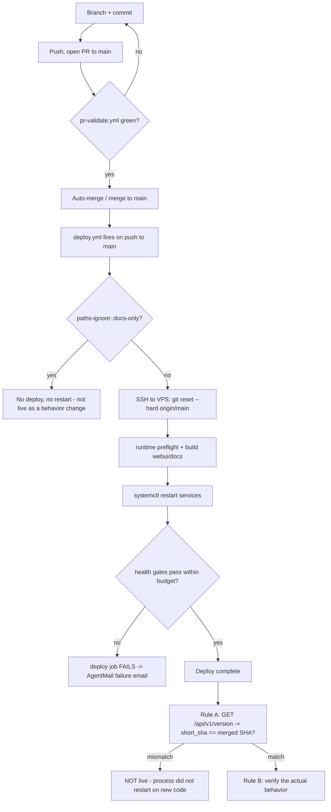

# Production Verification Rules

This doc is the **operational contract** for proving a change actually reached
production before you declare it done. It is grounded in the deploy machinery
that exists in code today — `deploy.yml`, the `/api/v1/version` endpoint, the
PR-validate gate, and the deploy-window suppression logic — not in aspiration.

The single root mistake these rules exist to prevent: **conflating "merged" or
"green CI" with "live on the VPS."** A commit on a branch is not deployed. A
commit on `main` is not deployed until the GitHub Actions deploy workflow has
run to completion *and* the live process confirms the change took effect.

### Why this discipline exists (postmortem context)

Two real failures motivate every rule below (carried as rationale, not
code-verified):

- **The v2 ClaudeDevs rebuild (2026-04-15 → 2026-05-06).** 17 PRs shipped with
  439 passing unit tests and a "shakedown log" that declared the system green.
  When an operator pulled production state, `/opt/ua_demos/` held only the smoke
  workspace — Phase 2/3 had never run end-to-end, because `memory/HEARTBEAT.md`
  never directed the principal to scan new vault entities, and a URL judge was
  silently dropping the docs downstream phases needed. Every test stubbed the
  boundary it didn't own, so none caught the gap. **The architecture diagram is
  not the system; a skill file on disk is not a heartbeat directive that invokes
  it; a mocked end-to-end loop is not a production run.**
- **The Task Hub near-miss (2026-05-06).** An agent was minutes from shipping
  ~50 lines of orchestration logic into `HEARTBEAT.md` (claim tasks, route to
  Simone, concurrency cap, orphan reset) before the operator asked "doesn't Task
  Hub already do this?" — it did. Every line was redundant with
  `services/dispatch_service.py` + `task_hub.py`, which the agent hadn't read.
  The actual missing piece was a 30-line *producer* change. **Read the function
  body before you propose logic that may already exist.**

---

## 1. The Ship-then-Verify cadence

A change is "shipped" only after this full sequence completes. Each rule below
maps to a concrete check you can run.



### Rule A — `/api/v1/version` SHA check (the deploy-took-effect probe)

The gateway exposes a **public, unauthenticated** version endpoint so any
verifier — a browser agent, an operator, a CI step — can confirm which commit
is actually running:

- `GET http://127.0.0.1:8002/api/v1/version` (on-host) returns
  `{commit_sha, short_sha, branch, commit_subject, commit_committed_at,
  process_started_at, repo_root}`.
- The handler is `gateway_server.py::version_info`. The payload is produced by
  `_capture_version_info()`, which shells out to `git -C <repo_root> rev-parse
  HEAD` (and `--abbrev-ref HEAD`, `log -1`) at the repo root resolved relative
  to the module file.

**Critical caching behavior (verify in code):** the result is cached in a
module-level global `_VERSION_INFO`, captured **once** on first request and
never refreshed until the process restarts:

```python
_VERSION_INFO: dict[str, Any] | None = None

@app.get("/api/v1/version")
async def version_info():
    global _VERSION_INFO
    if _VERSION_INFO is None:
        _VERSION_INFO = _capture_version_info()
    return _VERSION_INFO
```

This is *deliberate and load-bearing*: the cache is invalidated only by a
restart, and a restart is exactly when the deployed code changes. So the
reported SHA matches the running code **by construction**. The corollary is the
whole point of Rule A: if `/api/v1/version` still shows the old SHA after a
deploy, the gateway **did not restart on the new code** — the deploy did not
take effect, regardless of what `git log origin/main` says. `deploy.yml` does
`git reset --hard origin/main` then `systemctl restart`, so a stale SHA means
the restart silently failed or hit an old interpreter.

> Never declare an end-to-end UI verification valid until a browser agent has
> hit `/api/v1/version` and confirmed `short_sha` equals the merged commit's
> short SHA. This is mandated in the endpoint docstring itself and in
> `CLAUDE.md` § Production Verification Rules.

### Rule B — backend-logic vs. UI-rendering verification paths

Confirming the SHA (Rule A) only proves the *code* is live. You still have to
prove the *behavior*. Pick the verification path that matches what you changed:

- **Backend logic** (gateway endpoints, DB queries, scoring/ranking,
  service-layer functions): the *authoritative pre-ship* check is direct Python
  invocation in dev — it exercises the new code in-process:
  ```
  PYTHONPATH=src uv run python -c "from universal_agent.services.X import Y; print(Y(...))"
  ```
  Post-ship, hit the endpoint / inspect the DB row / read the log line directly.
  Don't infer backend behavior from the UI — the UI may cache or transform, and
  a browser pass against production *before* your change deploys is looking at
  the old code (its findings about the new behavior are noise).
- **UI rendering** (dashboard panels, web-ui components): drive an actual
  browser against the live dashboard (`app.clearspringcg.com`, or
  `127.0.0.1:8002` on-host). A backend response shape is not proof the panel
  renders it. Pre-deploy local browser checks are acceptable when the change is
  `web-ui/`-only (Next.js hot reload). The browser agent's first action is
  always Rule A: hit `/api/v1/version`, confirm the SHA, abort if it's stale.

### Rule C — branch-versus-deploy honesty

State the deploy status precisely. The three states are distinct:

1. **On a feature branch** — not deployed. Period.
2. **Merged to `main`** — *still not deployed* if the deploy workflow hasn't
   completed green. Watch the run.
3. **Deploy workflow green AND `/api/v1/version` confirms the SHA** — now it's
   live.

Never say "the fix is shipped" before state 3. If you can't reach the VPS to
confirm, say so and schedule the check.

### Rule D — phase-boundary smoke is mandatory

Any PR whose value depends on a *downstream* agent picking up its output (a
phase boundary) requires a real end-to-end smoke producing a real artifact on
real disk. "Mechanical loop synthesized in memory" is not verification. If smoke
can't run from the dev box, schedule it on the VPS within 24h of merge and
record the result back in the PR thread.

---

## 2. What the deploy actually does (so you know what "took effect" means)

`deploy.yml` is the single production deploy workflow. It fires on `push` to
`main` (which only happens via merged PR) and on manual `workflow_dispatch`.

**Trigger gating — `paths-ignore`.** GitHub skips the deploy only when
**every** changed file matches a `paths-ignore` glob: `docs/**`, `**.md`,
`reports/**`, `state/**`, `artifacts/**`, `memory/**`. A *mixed* code+docs
commit still deploys (the safe default). Consequence for Rule C: a docs-only
merge to `main` never restarts the gateway, so a docs change is "merged" but
there is no behavior deploy to verify.

**Concurrency guard.** The workflow declares
`concurrency: { group: deploy-production, cancel-in-progress: false }`. When
several PRs merge within seconds, their `push` triggers fire deploy.yml
simultaneously; this serializes them so they queue rather than racing on
`/opt/universal_agent/.git/index.lock`. `cancel-in-progress: false` means every
queued deploy runs to completion — last-write-wins on production. (The
deploy-failure email body explicitly tells the operator that subsequent merges
will wait behind a failed run.)

**Deploy steps, in order (all over SSH to the VPS as the deploy user):**

1. Tailscale connect + SSH preflight (a non-interactive `echo SSH_OK` probe;
   detects the Tailscale interactive-check failure mode explicitly).
2. `git fetch origin main` → `git reset --hard origin/main` →
   `git update-ref refs/heads/main` (keeps the local `main` ref in sync so an
   operator who later runs `git checkout main` during incident recovery doesn't
   land on stale code). A stale-lock guard removes a dead `.git/index.lock`.
3. `chown -R ua:ua`, then write a **clean bootstrap `.env`** containing only
   Infisical creds + a fixed set of runtime keys (`UA_RUNTIME_STAGE=production`,
   `FACTORY_ROLE=HEADQUARTERS`, `UA_DEPLOYMENT_PROFILE=vps`, ports, etc.). This
   is why VPS-side hand-edits to `/opt/universal_agent/.env` do **not** survive a
   deploy — the file is overwritten every time. Durable values must live in code
   defaults or in this bootstrap dict.
4. `scripts/deploy_validate_runtime.sh` — centralized runtime preflight that
   asserts the expected environment/runtime-stage/factory-role/profile/
   machine-slug and that required keys (e.g. `UA_OPS_TOKEN`) resolve. A failed
   preflight aborts the deploy before any restart.
5. Render webui env, install CLIs (NotebookLM, goplaces, hackernews-pp), build
   the Next.js web-ui (`rm -rf .next && npm run build`), build MkDocs.
6. Set the **deployment-window flag** `touch /tmp/ua-deployment-window` (see §3),
   install systemd units (production lane, VP workers, CSI timers), sync project
   skills into `/home/ua/.claude/skills/` (so VP worker subprocesses can
   discover them from any CWD).
7. `systemctl restart` the service set: `universal-agent-gateway`,
   `-api`, `-webui`, `-telegram`, `ua-discord-cc-bot`, `ua-discord-intelligence`,
   plus VP worker units.
8. **Interpreter sanity** — `ensure_current_venv_interpreter` compares each
   service's `ExecMainPID` `/proc/<pid>/exe` against the current `.venv` python
   and force-restarts if it's running an old interpreter. This is a direct
   guard against the "Rule A SHA matches but behavior didn't change because the
   process never actually swapped interpreters" failure.
9. **Health gates** (see §2.1). On failure: collect diagnostics
   (`systemctl status` + `journalctl -n 120`) and `exit 1`.
10. Clear the deployment-window flag, finish.

On any job failure, a final `if: failure()` step sends an AgentMail
**deploy-failed** email (`[deploy-failed] universal_agent main @<short_sha>`) to
`kevinjdragan@gmail.com`. It is best-effort — a missing API key or send error
never double-faults the deploy.

### 2.1 Health gates — the deploy's own verification

The deploy doesn't trust "restart returned 0." It polls three HTTP health
endpoints in parallel via `check_local_health` / `run_health_check`:

| Service | URL | Budget |
|---|---|---|
| gateway | `http://127.0.0.1:8002/api/v1/health` | 96 attempts × 5s = **8 min** |
| api | `http://127.0.0.1:8001/api/health` | 24 × 5s = 2 min |
| webui | `http://127.0.0.1:3000/dashboard` | 24 × 5s = 2 min |

The gateway gets an 8-minute budget because its lifespan startup runs a long
synchronous subsystem init (factory registry, DB schema migration, heartbeat +
daemon session seeds, task lifecycle reconcile, email-mapping reconcile, task
recovery sweep, autonomous cron registration, session reaper, workspace
archiver, stale-VP-mission reconcile) **before** FastAPI begins serving.
Accumulated production state pushed cold start past the old 4-minute window.

`SELECT 1` against the runtime DB and returns `503` if the DB is disconnected or
erroring. So "gateway healthy" means "process up *and* DB reachable," not just
"port open."

**Crashloop fail-fast.** Inside the wait loop, `scripts/check_crashloop.sh`
tracks the unit's `NRestarts` delta. It records a baseline on the first call,
lets attempts 1–2 pass (slow first cycle), and from attempt 3 onward, if the
unit restarted ≥ threshold (default 5) times during the wait, it aborts the wait
immediately with diagnostics instead of burning the full retry budget on a
service that's clearly crashlooping. (It lives in a separate script because
GHA's workflow validator rejected the equivalent inline shell — see the
2026-05-27 deploy.yml parser quirk.)

**Discord baseline-aware gate.** Discord services are checked with
`check_discord_regression`, which captures pre-deploy state and **only fails the
deploy if a service was `active` before and is not after** (a true regression).
A service that was already crashing pre-deploy surfaces as a `::warning::`, not a
failure — so chronic discord flakiness can't mask a real PR-caused failure
elsewhere.

---

## 3. Deploy-window suppression (why a restart isn't a phantom incident)

A `systemctl restart` sends `SIGTERM` to the gateway, which kills in-flight
heartbeat/cron/daemon work mid-execution. Those casualties look exactly like
genuine failures (negative exit codes, lifecycle mutations that never landed).
To avoid paging on self-inflicted restart noise, the runtime detects an active
deploy window.

`cron_service.py::_is_deploy_window_active()` returns `True` on **either** signal
(OR'd, both deliberately conservative — they widen the suppression window, never
narrow it):

1. The flag file `/tmp/ua-deployment-window` exists. `deploy.yml` `touch`es it
   **before** the restart and removes it on `EXIT` (plus a backstop
   `sleep 1500 && rm` for the 25-min worst case). This is the primary signal and
   covers all GHA-driven deploys.
2. Fallback: this gateway process started within the last
   `_DEPLOY_WINDOW_FALLBACK_UPTIME_SEC` (= **60**) seconds. Covers the rare race
   where the flag cleanup ran before the cron failure-handler, and operator-
   initiated `systemctl restart`.

Real failures (OOM, code crash) *outside* this window still surface loudly. The
downstream effect (per the 2026-05-29 lifecycle-miss work, PR #563): an
`execution_missing_lifecycle_mutation` guardrail tripped during a deploy window
is treated as a self-healing non-event (dashboard-only, no email); the same miss
outside a deploy window pages loudly.

---

## 4. The pre-deploy gate: `pr-validate.yml`

`pr-validate.yml` is the **only pre-deploy gate**. It runs on every PR
(`pull_request` to `main`; `feature/latest2` lingers transitionally in the
branch list). Branch protection on GitHub enforces that it passes; this workflow
produces the "passing" check. Don't merge red.

Gates (all under `bash -euo pipefail` so a `... | tail` can't mask a failure —
the lesson of PR #153, where the pipe-to-tail bug hid 12 pre-existing failures):

1. `uv sync --frozen` on Python 3.13.
2. **Syntax check** — `py_compile` every changed `.py` (the gate that would have
   caught the 2026-05-07 `durable/state.py` SyntaxError import storm in seconds).
3. **Stray-artifact tripwire** — refuses `.py.bak` / `.swp` / `.orig` files
   (autonomous patchers leave these behind).
4. **Architecture-canvas pointer verify** — only when canvas sources are touched.
5. **Ruff** (changed files only, `--select E9,F --ignore E402,F401,F541,F811,F841`)
   — errors-only on new code; legacy rot is tackled separately.
6. **Hardcoded-date-literal guard** in `tests/` (`check_test_date_literals.py`) —
   prevents the class of failure where a hardcoded packet date ages past a
   rolling window and reds every open PR.
7. **Unit tests** — `pytest tests/unit -x -q`. The full suite runs nightly.

Note the diff scope everywhere is `origin/$BASE_REF...HEAD` with `fetch-depth:
50` — large enough for any real PR diff, deliberately not `fetch-depth: 0`
(which made the initial fetch huge and prone to network-stall hangs).

---

## 5. Verification checklist (apply to every PR / "phase complete" claim)

These are the code-grounded versions of the rules in `CLAUDE.md`. Restated here
so the operational checklist lives next to the machinery.

- [ ] **Deployed ≠ invoked.** A skill in `.claude/skills/<name>/` does nothing
      until some invoker references it by name. Prove at least one of: a
      sub-agent definition greps positive, a `HEARTBEAT.md` directive greps
      positive, or a Task-Hub producer+consumer pair both reference the task
      type. Note the deploy now rsyncs `.claude/skills/` to
      `/home/ua/.claude/skills/` so VP worker subprocesses can discover them.
- [ ] **Phase complete = real artifact on real disk** (a Task Hub row from a
      non-test run, a `/opt/ua_demos/<id>/manifest.json`, a non-mocked vault
      page). In-memory loop ≠ verification.
- [ ] **Diagnostics read the canonical resolver, not a guess.** Path resolution
      lives in code (e.g. `artifacts.py:resolve_artifacts_dir`). Read the
      resolver before scripting a `find` / `ls`.
- [ ] **No conflation of similarly-named code paths.** Follow the call chain
      from the actual call site; function names lie, bodies don't.
- [ ] **Prove the claim by reading the function body** before asserting a
      behavior. If you didn't read it, say "I think X but haven't confirmed."
- [ ] **Phase-boundary smoke is mandatory** (Rule D).
- [ ] **Sandbox honesty** — if you can't SSH the VPS, say so up front; don't
      claim "I checked."
- [ ] **Branch-vs-deploy honesty** — Rule C states 1/2/3 above.

If a rule isn't satisfiable for a given PR, say so explicitly in the commit
message and SHIP_HANDOFF with a concrete operator step to close the gap.
Acceptable: "shipped the code but Phase 2 wiring needs a Simone agent file
deployed — see Followup #1." Unacceptable: silence.

---

## 6. Gotchas

- **`/api/v1/version` is cached for the process lifetime.** A stale SHA after
  deploy is the signal, not noise. Don't add a "refresh" — the cache is the
  mechanism.
- **`.env` on the VPS is clobbered every deploy** (step 3). VPS-side edits don't
  survive. Use code defaults or the bootstrap dict.
- **`/api/v1/health` is a *deep* check** (DB `SELECT 1`, returns 503 on DB
  failure) — a green health gate means DB-reachable, not merely port-open.
- **Docs-only merges don't deploy** (`paths-ignore`). "Merged" is not "live as a
  behavior change" for a docs-only PR — there's nothing to verify with Rule A.
- **Mixed code+docs commits DO deploy** — `paths-ignore` skips only when *every*
  file matches. Don't assume your docs edit rode along inertly if you also
  touched a `.py`.
- **A green deploy job is necessary but Rule A is still required.** The deploy
  health gate proves the *new process* is healthy; `/api/v1/version` proves it's
  running *your* SHA. The interpreter-sanity step exists precisely because these
  can diverge.
- **Deploy concurrency queues; it does not cancel.** A failed deploy blocks
  subsequent merges' deploys until resolved (stated in the failure email).
- **`check_crashloop.sh` is a separate file by necessity** — inline shell broke
  the GHA validator (2026-05-27 parser quirk). Don't try to inline it back.
