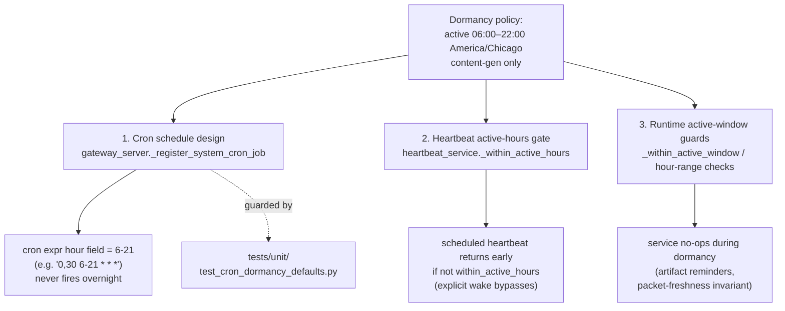

# Dormancy & Operating Hours

## What it is

A project-wide convention that **content-generation work is confined to a daytime
"active window" — 6:00 AM to 10:00 PM Houston time (America/Chicago)** — and goes
**dormant from 10:00 PM to 6:00 AM**. The intent: stop burning quota/API calls
overnight to produce intelligence nobody reads until morning.

There is **no central "dormancy engine."** Dormancy is enforced in three distinct
places, each with its own mechanism:

1. **Cron schedule design** — system cron jobs registered in `gateway_server.py`
   use cron expressions whose hour field is constrained to the active window
   (e.g. `0,30 6-21 * * *`). The cron simply never fires overnight.
2. **Heartbeat active-hours gate** — `heartbeat_service.py` checks an
   `active_start`/`active_end` window before running a scheduled heartbeat and
   returns early (skips the run) if outside it.
3. **Active-window runtime guards** — a few services (artifact reminders, the
   proactive-pipeline freshness invariant) call an explicit
   `_within_active_window` / hour-range check and no-op during dormancy.

The active window is **content-generation only**. Infrastructure-event handlers
(deploy, auto-merge, CI failure filing, error alerting) run 24/7 because the events
they respond to can land at any wall-clock time and silent breakage until 6 AM is
unacceptable.

## Terminology in plain language

One metaphor covers most of it: each job has an **alarm clock** (when it wakes
up) and a **task** (what it does once awake).

- **Active window** — the "awake hours" we optimize for: 6 AM – 10 PM Houston.
  **Dormant hours** are the overnight stretch (10 PM – 6 AM) when the operator is
  asleep and won't look at anything produced.
- **Windowed** — the job only does its task during the awake hours; overnight it
  stays quiet. *Example:* the hourly intel digest emails you 6 AM – 10 PM, never
  at 3 AM.
- **24/7** — the job runs around the clock, ignoring the window. Reserved for the
  few jobs where waiting until morning would be harmful (e.g. a dispatcher that
  must react within a minute).
- **Interval cron** — a job whose alarm repeats all day ("every 30 minutes",
  "every hour"). Because it keeps ringing, it *would* fire overnight unless told
  not to — so these are the only jobs where "should it run overnight?" is a real
  question, and the only ones the dormancy guard enforces.
- **Fixed-time cron** — a job whose alarm is set for one specific moment (or a
  few): "7:05 AM", "3:15 AM". It fires at that time and that's it. There is
  nothing to "window" — the time was already chosen — so it just runs as
  scheduled.
- **Runtime-gated** — the alarm is set to ring *every hour* (including overnight),
  but each time the job wakes it does a one-second check ("am I in the awake
  window, or has someone flipped me to 24/7?") and either does the task or rolls
  over and sleeps. The decision happens *when it runs*, not in the alarm setting.
  This is what makes a job flippable without editing its schedule.
- **Flippable / "the lever"** — an on/off switch (an env var, `UA_<JOB>_24_7`)
  that makes a windowed job run 24/7 instead — no code change or redeploy, just
  set the switch in Infisical. "Flip the lever" = set it to `true`.
- **Default windowed** — out of the box, with the switch untouched, the job stays
  windowed. You must *deliberately* flip it to get 24/7, so nothing quietly
  starts running overnight by surprise.
- **Opt-in vs opt-out** — two layers that together sound contradictory but aren't.
  System-wide, dormancy is **opt-in**: a job may run anytime *unless it chooses*
  to respect quiet hours. For a job that already chose quiet hours, the lever is
  an **opt-out**: it pulls that job back out to 24/7 on demand.
- **Documented exception** — the short, written-down list of interval jobs we
  *intend* to run 24/7. The point is that any overnight job is a deliberate,
  recorded decision — never an accident nobody caught.
- **Soft-warn** — when a fixed-time job happens to land overnight (e.g.
  `nightly_wiki` at 3:15 AM, feeding the morning briefing), the guard prints a
  heads-up note instead of *failing*. It keeps the choice visible without blocking
  it. (Contrast a **hard fail**, which blocks the change until you fix it.)

## The active window, in code

The canonical numeric definition lives in `services/dormancy.py` — the single
source of truth for the window:

```python
HOUSTON_TZ = "America/Chicago"
ACTIVE_START_HOUR = 6     # inclusive
ACTIVE_END_HOUR = 22      # exclusive (22:00 is the start of dormancy)
```

and the membership test (`dormancy.is_active_window`):

```python
return ACTIVE_START_HOUR <= houston_hour < ACTIVE_END_HOUR
```

So **active hours are 6, 7, …, 21** (the 9:30 PM tick is fine; 22:00 itself is the
start of dormancy). If `zoneinfo`/`tzdata` is unavailable the function fails
**permissive** — every hour is treated as active so reminders/alerts aren't
silently lost.

The runtime call sites delegate to this module instead of reimplementing the
check: `cron_artifact_reminders._within_active_window`,
`gateway_server._csi_incident_in_waking_window`, and the
`proactive_pipeline_invariants` packet-freshness / demo-triage-rank checks all
call `dormancy.is_active_window` (those invariants previously inlined
`6 <= now.hour <= 21`, which is identical for integer hours, and still skip the
first 30 minutes after 6 AM to absorb the overnight gap — the newest packet
legitimately dates to the last 10 PM cron of the prior day).

Windowed **schedules** are pinned to the same window rather than re-deriving it
independently. The in-process cron literals (e.g. `0,30 6-21 * * *`) and the
systemd `OnCalendar` specs (`*-*-* 06..21:00:00`) stay readable as literals, but
two guard tests verify they match the constants so they cannot silently drift:
`tests/unit/test_cron_dormancy_defaults.py` checks the cron literals against
`dormancy.cron_hour_field()` (`"6-21"`), and
`tests/unit/test_dormancy_schedule_consistency.py` checks the static `.timer`
hour ranges against `dormancy.systemd_hour_range()` (`"06..21"`) — the latter
matters because `.timer` files can't import Python and only take effect on
reinstall. `dormancy.should_run(mode=...)` is the per-process **opt-in** gate:
a job is dormancy-bound only if it declares `mode="dormancy_aware"` (default
`"always"` never sleeps), with an optional env override.

## Three enforcement mechanisms



### 1. Cron schedule design (gateway_server)

System cron jobs are registered via `gateway_server._register_system_cron_job`
with a static `default_cron=` literal. Content-generation crons constrain the hour
field to the active window. Examples (code-verified):

| `system_job` | `default_cron` | TZ | Notes |
|---|---|---|---|
| `hackernews_snapshot` | `0,30 6-21 * * *` | America/Chicago | half-hourly, active hours only |
| `vault_lint_contradictions` | `0 7 1 * *` | America/Chicago | monthly, 07:00 Central |
| `vp_coder_workspace_pruning` | `5 17 * * 0` | America/Chicago | Sunday 5:05 PM |

Each registration carries a `cron_env_var` (e.g. `UA_HACKERNEWS_SNAPSHOT_CRON`) and
a `timezone_env_var` so an operator can override the schedule via env, plus an
`enabled` flag (`_proactive_cron_enabled("UA_..._ENABLED")`).

`default_timezone="America/Chicago"` is preferred for in-process crons so DST is
handled automatically. **GitHub Actions schedules are UTC-only** — they're
expressed in UTC and accept ~1h DST drift.

#### Retired / deregistered crons (2026-06-05, S4 cleanup)

- **`hourly_insight_email`** — its registration helper
  `gateway_server._ensure_hourly_insight_email_cron_job` was **deleted**. The job
  was disabled-by-default but re-created its `cron_jobs.json` row on every boot.
  It is superseded by `gateway_server._ensure_hourly_intel_digest_cron_job`
  (`system_job=hourly_intel_digest`, same `0 6-21 * * *` slot), the
  LLM-independent delivery path. The `src/universal_agent/scripts/hourly_insight_email.py`
  / `src/universal_agent/services/hourly_insight_email.py` modules remain (still
  imported elsewhere); only the cron registration is gone.
- **Heartbeat interval env** — `heartbeat_service._resolve_heartbeat_interval_env`
  now honors **only** `UA_HEARTBEAT_INTERVAL`. The deprecated `UA_HEARTBEAT_EVERY`
  alias (unset in production) was dropped from both the resolver and
  `_heartbeat_interval_source_label` (in `heartbeat_service` and `gateway_server`).

VP autonomous-mission worktrees now branch off `origin/main` by default
(`vp/worktree_utils.py::provision_worktree`,
`vp/autonomous_mission_executor.py::execute_autonomous_mission`) — the retired
`feature/latest2` integration branch was the previous default.

### 2. Heartbeat active-hours gate (heartbeat_service)

`HeartbeatScheduleConfig` carries `active_start` / `active_end` as `"HH:MM"`
strings (default `None`) and a `timezone` (default
`os.getenv("USER_TIMEZONE", "America/Chicago")`).

`_within_active_hours(cfg, now_ts)` returns `True` (always-active) when start or end
is unparseable or when they're equal; otherwise it does an HH:MM-minute comparison,
correctly handling wrap-around windows (`end <= start`).

In the heartbeat loop the gate is consulted as `within_active_hours` and:
- a busy session schedules a retry only `... and within_active_hours`;
- a normally-scheduled run **`return`s (skips) when `not within_active_hours`**;
- an **explicit wake** (`wake_requested` / `wake_next`) still respects the
  active-hours gate (the early `return` sits after wake-reason resolution).

Config sources, in precedence order:
- env `UA_HEARTBEAT_ACTIVE_START` / `UA_HEARTBEAT_ACTIVE_END`, or
  `UA_HEARTBEAT_ACTIVE_HOURS` (a `"start-end"` string parsed by
  `_parse_active_hours`) when the explicit start/end aren't set;
- per-session schedule data keys `active_start`/`active_end` (or camelCase
  `activeStart`/`activeEnd`, or an `active_hours`/`activeHours` range string).

`_resolve_active_timezone` accepts `"user"` (→ `USER_TIMEZONE`), `"local"` (→ system
tz), or an explicit IANA name.

### 3. Runtime active-window guards

- `cron_artifact_reminders` — the reminder sweep checks
  `if not _within_active_window(now): continue`, so same-day / Day-3 / Day-7 nudge
  emails are never sent overnight.
- `proactive_pipeline_invariants.claude_code_intel_packet_freshness` — only
  evaluates staleness during active hours (`6 <= now.hour <= 21`), returning `None`
  (no violation) during dormancy so it doesn't false-fire on the expected overnight
  gap.

## Crons exempt from the dormancy window

Dormancy windowing only applies to **interval** crons (`*/N` or hourly ranges —
see "Adding a new cron" below). Two kinds of scheduled work are exempt:

**(a) Interval crons that legitimately run 24/7** — enumerated in the guard
test's `DOCUMENTED_EXCEPTIONS` set (`tests/unit/test_cron_dormancy_defaults.py`),
each with a row here:

| Exception (interval, 24/7) | Why it runs 24/7 |
|---|---|
| `simone_chat_auto_complete` | every-60s SQLite-only housekeeping promoting idle `simone_chat` rows to completed; a chat started near 9 PM would otherwise stay `in_progress` overnight and pollute the dashboard |

> **RETIRED (M3, 2026-06-15):** `atlas_direct_dispatch` (the every-60s Hermes
> Phase C dispatcher) was previously a documented 24/7 exception here. M3 retired
> the standalone cron — its registration helper
> `gateway_server.py::_ensure_atlas_direct_dispatch_cron_job` no longer registers a
> `*/1` schedule; it now **deletes** the persisted `cron_jobs.json` row via
> `_cron_service.delete_job` (the plain `enabled=False` disable-on-flip did not
> durably stop the live prod row). Because it no longer registers an interval
> schedule, it is no longer parsed as an interval cron and needs no dormancy
> exception — its entry was removed from `DOCUMENTED_EXCEPTIONS` in
> `tests/unit/test_cron_dormancy_defaults.py` in the same PR. The dispatch path it
> served is now owned by the M2 Pythonic priority dispatcher
> (`services/priority_dispatcher.py::classify_task` + `::dispatch_claimed`,
> prefer-ATLAS `metadata.preferred_vp = "vp.general.primary"` lane), which remains
> **flag-gated and default-OFF in production** (`UA_PRIORITY_DISPATCHER_ENABLED`
> master + `UA_DISPATCHER_PREFER_ATLAS` Stage-B lane — M3 prepared a staged
> operator-gated enable but did **not** flip either flag). The service module
> `services/atlas_direct_dispatch.py` is kept importable
> (`heartbeat_service` still reads `list_recent_atlas_direct_dispatches` for
> Simone's briefing). Retiring the cron removed its per-fire
> `request_heartbeat_next` coupling-wake
> (`gateway_server.py::_maybe_wake_heartbeat_after_autonomous_cron`, ~60/hr),
> leaving `simone_chat_auto_complete` (`*/1`) as the last autonomous cron feeding
> the coupling at ~62/hr. **M4 then made the coupling selective (default-deny
> allowlist) + ~300s-debounced**: an autonomous cron success now wakes the
> heartbeat only if its `system_job` is explicitly allowlisted
> (`cron_service.py::coupling_wake_allowed_jobs`, **empty by default**), so
> `simone_chat_auto_complete`'s `*/1` fires **no longer feed the coupling** —
> routine dispatch is handled out-of-band by the Python priority dispatcher +
> `idle_dispatch_loop`, and urgent work still wakes via `request_heartbeat_now`.

**(b) Fixed-time crons run as scheduled** — a cron pinned to one or a few
discrete times (e.g. `nightly_wiki` at 3:15 AM, feeding the 6:30 AM briefing)
runs at its chosen time; "24/7 vs windowed" is meaningless for it, so dormancy
does not apply. These are **not** in `DOCUMENTED_EXCEPTIONS`; the guard only
emits an informational notice if a fixed-time cron lands in the dormant hours
(see "The guard test").

Further always-on behaviors are not crons but are explicitly dormancy-exempt:
- `cron_artifact_notifier` sends the **initial** disclosure email immediately on a
  clean cron exit "regardless of dormancy — operator chose this trade-off
  explicitly." (Only the *follow-up* reminders, handled by `cron_artifact_reminders`,
  respect the window.)
  - **Cross-run coalescing (storm suppression).** The artifact id is seeded on
    `f"{job_id}:{int(started_at)}"`, so every cron run mints a *distinct* id and the
    upsert never collides — historically that meant a cron re-run repeatedly against
    the same blocker (canonically `paper_to_podcast_daily` hitting expired NotebookLM
    auth) produced one new artifact + initial email + reminder cadence *per run*,
    flooding the inbox. `cron_artifact_notifier.notify_cron_artifact` now checks for
    an existing unacknowledged disclosure from the **same cron** (matched on the
    stable Task Hub id `cron:<system_job>`, falling back to `job_id`) created within a
    window; if found it refreshes that row in place (`_refresh_coalesced_artifact`)
    and **suppresses the duplicate email + reminder**. As defence-in-depth,
    `cron_artifact_reminders.sweep_pending_artifact_reminders` groups
    reminder-bearing pending artifacts by the same key and nudges only the **newest**
    per cron, stopping older siblings (`stopped_reason=coalesced_same_source`) — this
    also bounds an already-seeded Day-3 wave. Matching keys on cron identity, **never**
    the per-run (LLM-varied) title. Gated by `UA_CRON_ARTIFACT_COALESCE_SAME_DAY`
    (default `1`/on); window via `UA_CRON_ARTIFACT_DEDUP_WINDOW_HOURS` (default `24`).
    Once the operator acks/rejects/archives the row, the next run is allowed to
    surface a fresh artifact so a recurrence is not silently hidden.
  - **Run-freshness gate (false-disclosure suppression).** Cron workspaces are
    reused, so manifests/files from prior runs linger on disk. A deploy-killed
    `paper_to_podcast_daily` run on 2026-06-10 produced nothing, yet the
    notifier picked up a 2-day-old manifest and emailed it as tonight's
    podcast. `cron_artifact_notifier._load_manifest` and the
    `_scan_work_products` fallback now only consider manifests/files with
    `mtime >= started_at` of the current run; when nothing fresh exists the
    notifier logs "run produced no new artifacts" and sends **no** email.
    This also makes the `paper_to_podcast_email_delivery` invariant's
    bracketed-job-id subject marker sound: a notifier email now implies fresh
    artifacts.
- **Heartbeat pre-flight health check** — every Simone heartbeat tick (24/7, the
  heartbeat is a runtime tick driver, not a cron) calls
  `proactive_health_notifier.run_pre_flight_check` (code-verified at
  `heartbeat_service._run_heartbeat`). It polls task-hub stale/parked counts, runs
  every pipeline invariant, and emails the operator on the first occurrence of a new
  critical finding with a 6h per-finding-id cooldown. This is infrastructure
  incident-response (Exception #3), so it fires overnight by design. Default ON via
  `UA_HEARTBEAT_PROACTIVE_HEALTH_ENABLED` (default `True`); mute email-only via
  `UA_HEARTBEAT_PROACTIVE_HEALTH_EMAIL_CRITICAL=0`.
- Infrastructure-event GHA workflows (`pr-auto-merge.yml`, `ci-failure-issue.yml`,
  deploy) are event-driven (`push`/`pull_request`/`workflow_run`), so dormancy never
  applies mechanically.

## Exhibit — current cron dormancy settings

Point-in-time snapshot (2026-06-09) of every registered scheduled job and how
dormancy applies to it. Authoritative source: the `default_cron=` registrations
in `gateway_server.py` plus the systemd timers under `deployment/systemd/`; the
guard tests in `tests/unit/test_cron_dormancy_defaults.py` keep this honest.
**All times America/Chicago (Houston). Active window: 6 AM – 10 PM.**

### Interval crons — dormancy applies

| Job | Schedule | Treatment | 24/7 lever |
|---|---|---|---|
| `hourly_intel_digest` | systemd timer `00..23`, runtime-gated | **Windowed by default**, runtime-flippable | `UA_INTEL_DIGEST_24_7=true` |
| `csi_convergence_sync` | systemd timer `00..23`, runtime-gated | **Windowed by default**, runtime-flippable | `UA_CSI_CONVERGENCE_SYNC_24_7=true` |
| `proactive_signal_card_sync` | systemd timer `00..23:25`, runtime-gated | **Windowed by default**, runtime-flippable | `UA_PROACTIVE_CARD_SYNC_24_7=true` |
| `cron_artifact_reminders_sweep` | `*/30 6-21` | Windowed (also self-gates per reminder) | — |
| `vp_mission_pr_reconciler` | `*/15 6-20` | Windowed (job-specific 6–20) | — |
| `hackernews_snapshot` | `0,30 6-21` | Windowed (source currently parked) | — |
| ~~`atlas_direct_dispatch`~~ | — | **RETIRED (M3, 2026-06-15)** — no longer registers a `*/1` schedule; its ensure-function deletes the row, so it is no longer a dormancy-exception interval cron (see the retirement note above) | — |
| `simone_chat_auto_complete` | `*/1 * * * *` | **24/7** — documented exception (operator-facing state). Since M4 its `*/1` fires are **no longer a heartbeat-coupling source** (excluded by the default-deny allowlist), so its high rate no longer drives Simone wakes | always 24/7 |

### Fixed-time crons — run as scheduled (dormancy does not apply)

| Job | Schedule |
|---|---|
| `nightly_wiki` | 3:15 AM daily — *overnight by design* (feeds the morning briefing) |
| `morning_briefing` | 6:30 AM daily |
| `architecture_canvas_drift` | 6:30 AM Mondays |
| `scratch_pruning` | 7:00 AM daily |
| `proactive_report_morning` | 7:05 AM daily |
| `vault_lint_contradictions` | 7:00 AM on the 1st of each month |
| `insight_scoring_health` | 8:00 AM Sundays |
| `proactive_artifact_digest` | 8:35 AM daily |
| `csi_demo_triage_rank` | 10:05 AM & 3:05 PM daily |
| `intel_auto_promoter` | 10:35 AM & 3:35 PM daily |
| `proactive_report_midday` | 12:05 PM daily |
| `proactive_report_afternoon` | 4:05 PM daily |
| `vp_coder_workspace_pruning` | 5:05 PM Sundays |
| `evening_briefing` | 6:00 PM daily |

### Always-on (not crons — dormancy never applies mechanically)

- **Initial artifact-disclosure email** — sent immediately on a clean cron exit (only the *follow-up* reminders respect the window).
- **Heartbeat pre-flight health check** — runs every heartbeat tick, 24/7, by design (incident response).
- **Event-driven GHA workflows** — deploy / auto-merge / CI-failure / PR-failure, triggered by `push`/`pull_request`/`workflow_run`.

## Runtime 24/7 opt-out (per-job)

Distinct from the blanket `DOCUMENTED_EXCEPTIONS` above (which default a job to
**24/7**), the runtime opt-out lets a windowed job be flipped to 24/7 **at
runtime** — no redeploy, no code change — while its **default stays windowed**.
It is the operator's "opt-in/opt-out per process, never blanket" lever.

How it works (two halves):

1. **Widen the schedule to 24/7.** The systemd `.timer` `OnCalendar` is set to the
   full-day range `00..23` (or, for an in-process cron, the hour field to `*`) so
   the unit fires every hour and the per-run gate can decide.
2. **Gate the work at runtime.** The ExecStart script reads `UA_<JOB>_24_7` and
   calls `dormancy.should_run(mode="always" if <truthy> else "dormancy_aware")`
   **before** `initialize_runtime_secrets()` (so an overnight skip costs no
   Infisical round-trip). Default (env var unset) → `dormancy_aware`, so the job
   no-ops outside 6 AM–10 PM Houston — same effective behavior as before. Set
   `UA_<JOB>_24_7=true` to force `always` (24/7); unset or falsy keeps it
   windowed. (The knob reads as a plain "run 24/7" switch — `true` = 24/7.)

Default windowed + an explicit `_24_7` opt-in keeps the policy "dormancy is
opt-in, never blanket" intact, and avoids surprise overnight Infisical-bootstrap
cost (each flipped job adds ~8 overnight runs/day; `initialize_runtime_secrets()`
is not memoized).

### Pilot jobs and their opt-out env vars

| Job | 24/7 env var (Infisical) | Schedule | To flip to 24/7 |
|---|---|---|---|
| `hourly_intel_digest` (systemd) | `UA_INTEL_DIGEST_24_7` | `00..23` timer, runtime-gated | set var `true` in Infisical, then reinstall the timer (below) |
| `csi_convergence_sync` (systemd) | `UA_CSI_CONVERGENCE_SYNC_24_7` | `00..23` timer, runtime-gated | set var `true` in Infisical, then reinstall the timer (below) |
| `proactive_signal_card_sync` (systemd) | `UA_PROACTIVE_CARD_SYNC_24_7` | `00..23:25` timer, runtime-gated | set var `true` in Infisical, then reinstall the timer (below) |

The env vars live in Infisical (dev + prod) defaulted to `false` (explicit
windowed) so the lever is discoverable. Deliberately **excluded** from the pilot:
`vp_mission_pr_reconciler` (its `6-20` window is a job-specific narrowing, not the
6–22 dormancy window, so the gate would silently widen its default), and
`cron_artifact_reminders_sweep` (it already self-gates per reminder via
`_within_active_window` — a script-level gate on top would double-gate; route any
opt-out through that existing per-reminder check instead). The in-process pattern
(hour field → `*` + a `should_run` gate, plus a `DOCUMENTED_EXCEPTIONS` entry and
the pin-test update) applies to crons like `hackernews_snapshot` when wanted.

### Operator runbook — register + flip

**One-time: register the parameter list in Infisical** (workspace
`9970e5b7-d48a-4ed8-a8af-43e923e67572`), defaulted to the windowed value so the
levers are visible in both environments. Run on a box with the Infisical CLI
authenticated (the agent cannot — prod secret writes are operator-gated):

```bash
for ENV in dev prod; do
  infisical secrets set --env="$ENV" --projectId=9970e5b7-d48a-4ed8-a8af-43e923e67572 \
    UA_INTEL_DIGEST_24_7=false \
    UA_CSI_CONVERGENCE_SYNC_24_7=false
done
```

(Setting them to `false` is a behavioral no-op — windowed is already the default
when unset — it just makes the lever discoverable in the Infisical UI.)

1. **Flip the env var in Infisical** (dev and/or prod): set
   `UA_INTEL_DIGEST_24_7=true` (or the csi var) to go 24/7; set back to
   `false` / remove to return to windowed.
2. **For a systemd job, reinstall the timer on the VPS** so the widened
   `OnCalendar` takes effect (the timer text only changes on reinstall + a
   `daemon-reload`). Run as root:
   `sudo bash scripts/install_vps_phase_a_batch3_timers.sh` — this installer
   covers **both** `hourly-intel-digest` and `csi-convergence-sync`. The agent
   cannot do this (the script enforces an EUID-0 check).
3. **Verify the flip:** `systemctl list-timers` shows the timer's next elapse
   spanning overnight; the next overnight run's journal should show the job
   executing (24/7) or the `dormant window, skipping` log line (windowed).

### Guards (drift protection)

`tests/unit/test_dormancy_schedule_consistency.py` pins the runtime-gated timers
to the full-day `00..23` range (`_RUNTIME_GATED_TIMERS`) and asserts each one's
ExecStart script actually gates on the matching `UA_<JOB>_24_7` env var
(`test_runtime_gated_scripts_call_should_run`) — so a schedule widening can never
ship without its runtime gate, and a hand-edit can't silently re-narrow the
schedule.

## The guard test

`tests/unit/test_cron_dormancy_defaults.py` is the tripwire that keeps a future
commit from registering a 3 AM cron by accident. It does **string-grep against the
source file** (not AST/import — too heavy and `gateway_server` has import-time side
effects). Key checks:

- `test_interval_crons_respect_dormancy_window_or_documented_exception` — regex-
  extracts every `(system_job, default_cron, default_timezone)` triple from
  `gateway_server.py` and, for **interval** crons only (`*/N` or hourly ranges,
  per `_is_interval_cron`), asserts the hour set ⊆ `ACTIVE_HOURS =
  set(range(6, 22))` unless the job is in `DOCUMENTED_EXCEPTIONS` or carries a
  `UA_<JOB>_24_7` runtime opt-out.
- `test_fixed_time_crons_run_as_scheduled` — fixed-time crons (a single or a few
  discrete times) run at their chosen time; this emits an informational notice
  (never fails) if one lands in the dormant hours, so a deliberate overnight
  schedule like `nightly_wiki` (3:15 AM) is allowed.
- `test_hackernews_snapshot_uses_active_hour_range` /
  `test_vp_coder_workspace_pruning_moved_to_active_hours` — pin two specific
  schedules against regression.
- `test_nightly_doc_drift_audit_runs_in_active_hours` /
  `test_openclaw_release_sync_runs_in_active_hours` — these are **GitHub Actions**
  workflows (UTC). They're checked against a conservative DST-overlap window
  `set(range(12, 24)) | {0, 1}` (UTC 12:00–01:00, the intersection of CDT-active and
  CST-active).
- `test_dormancy_doc_exists` / `test_claude_md_links_to_dormancy_doc` — assert the
  canonical doc exists and that `CLAUDE.md` references it with the strings
  `"6:00 AM"`, `"10:00 PM"`, and `"Houston"`.
- Tripwires that infrastructure-event workflows stay present:
  `test_pr_auto_merge_uses_pat_to_avoid_token_suppression`,
  `test_post_merge_deploy_workflow_removed`,
  `test_ci_failure_issue_filer_workflow_exists`.

> Note: the test's `_hours_used_by_cron` helper expects a **5-field** cron
> expression and parses `*`, `H`, `H1,H2`, `H1-H2`, `H1-H2/N`, `*/N` for the hour
> field. A malformed (non-5-field) `default_cron` is reported as a violation rather
> than crashing.

## Adding a new cron — classification rule

Classify any new scheduled unit of work along **two axes** before registering it:

**1. Schedule shape — does dormancy even apply?**
- **Interval / repeating** (`*/N`, or an hourly range like `0 6-21`): fires across
  many hours, so the dormancy window is a real constraint, and a careless
  `*/30 * * * *` quietly runs all night. This is the only shape the guard
  enforces. Schedule it inside `6-21` America/Chicago, OR — if it must run 24/7 —
  add it to `DOCUMENTED_EXCEPTIONS` (with a doc row), OR give it the per-job
  `UA_<JOB>_24_7` runtime opt-out.
- **Fixed-time** (a single or a few discrete times, e.g. `5 7 * * *`,
  `15 3 * * *`): runs at its chosen time — "24/7 vs windowed" doesn't apply, so it
  runs as scheduled. The guard only emits an FYI notice if it lands overnight; a
  deliberate overnight time (e.g. `nightly_wiki` 3:15 AM → morning briefing) is
  fine and needs no exception entry.

**2. Purpose** (for an interval cron, deciding windowed vs 24/7): a 24/7 interval
is justified only if (1) it produces output a downstream service consumes during
dormancy, (2) it captures transient data lost if not collected at the source, or
(3) latency between event and human response matters (incident response/paging).
If none apply, window it.

The two halves are mechanically coupled: adding to `DOCUMENTED_EXCEPTIONS` without
the doc row (or vice versa) leaves the policy half-documented; the test asserts the
doc exists but does not cross-check individual exception rows, so this is a
discipline requirement, not an enforced one.

> [VERIFY: the guard test references the legacy path
> `docs/operations/operating_hours_dormancy.md` for `test_dormancy_doc_exists`. If
> that legacy doc is removed during the refactor, the test will fail — either keep a
> stub at that path, or update `DORMANCY_DOC` in the test and the `CLAUDE.md`
> link before deleting it.]

## Gotchas

- **No central engine.** Three independent mechanisms enforce the same policy.
  Changing the window in one place (e.g. `_ACTIVE_END_HOUR`) does **not** change
  the cron literals in `gateway_server.py` or the heartbeat HH:MM config — they're
  separate sources of truth that happen to agree.
- **Confirm WHICH substrate fires a job before reasoning about its dormancy.**
  Whether a job runs overnight, and whether dormancy even applies to it, depends
  on whether it fires from a **systemd timer** or an **in-process cron** — and a
  job migrated to a timer leaves a `"enabled": false` *tombstone* in
  `cron_jobs.json` plus a stale workspace `run.log`, both of which read as "this
  is off / hasn't run." It is not off. Check the timer
  (`systemctl list-timers 'universal-agent-*'`) and the canonical migrated set
  (`systemd_migrated_jobs.py::SYSTEMD_MIGRATED_SYSTEM_JOBS`) first. Full diagnostic:
  [`03_agents/04_cron_and_scheduling.md`](../03_agents/04_cron_and_scheduling.md)
  § "Is this scheduled job actually running?". (Fixed-time overnight jobs such as
  `nightly_wiki` at 03:15 are a *deliberate* dormant-window exception — see
  "Fixed-time crons" below — they run as scheduled; the guard test only emits an
  informational soft-warn, never a failure.)
- **`zoneinfo` fallback is permissive.** If tzdata is missing,
  `_within_active_window` returns `True` for every hour — reminders fire 24/7 rather
  than being lost. Don't read a `True` as "definitely active."
- **GHA crons are UTC and drift with DST.** ~1h drift across DST changes is accepted
  by design; the guard test uses the conservative 12:00–01:00 UTC overlap so it
  passes in both CDT and CST.
- **Explicit heartbeat wakes still respect active hours.** A `wake_requested`
  session does not bypass the `not within_active_hours` early return for a
  scheduled run.
- **The window widened on 2026-05-19** from 6 AM–9 PM to 6 AM–10 PM Houston. Older
  comments/cron literals may still reference the `6-20` end; the current pinned
  schedules use `6-21`.
- **Dormancy is a cost/quota policy, not a work freeze.** *Detection*/processing
  work may legitimately run overnight; what dormancy gates is *output delivery* to
  the operator (emails, digests). Distinguish "work frozen" from "delivery delayed"
  — they're different. (Operational note carried from the gotcha inventory.)
- **ZAI peak-hours collision (counterintuitive).** The ZAI proxy used by UA's
  autonomous loops is capacity-limited during Greater-China business hours, which
  map to **US Central night** (the China peak is roughly US night). Empirically the
  proxy bursts to ~20 calls/min then stalls 1.5–3 min during that window; the
  observed off-peak target band is **~12:00–17:00 CDT**. So the naive "run heavy
  batch overnight" instinct is exactly backwards here: overnight US runs land in the
  worst window. This reinforces — for a separate reason — keeping content-generation
  crons inside the Houston daytime window. The in-process pacing module is a backstop,
  not the fix; schedule heavy content-gen for the off-peak band.
  (Operational note carried from the gotcha inventory; the daytime active window
  already keeps most content-gen crons clear of the ZAI peak.)
