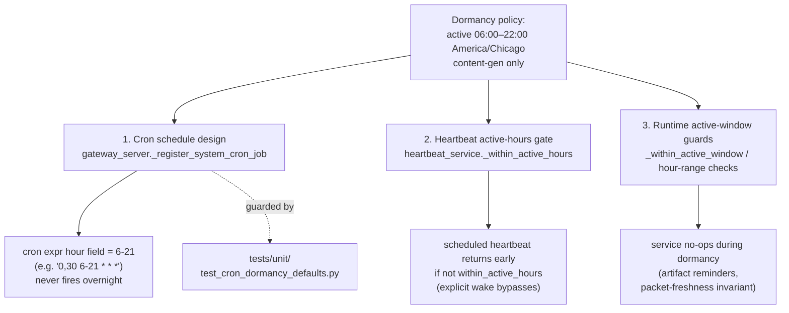

# Dormancy & Operating Hours

## What it is

A project-wide convention that **content-generation work is confined to a daytime
"active window" — 6:00 AM to 10:00 PM Houston time (America/Chicago)** — and goes
**dormant from 10:00 PM to 6:00 AM**. The intent: stop burning quota/API calls
overnight to produce intelligence nobody reads until morning.

There is **no central "dormancy engine."** Dormancy is enforced in three distinct
places, each with its own mechanism:

1. **Cron schedule design** — system cron jobs registered in `gateway_server.py`
   use cron expressions whose hour field is constrained to the active window
   (e.g. `0,30 6-21 * * *`). The cron simply never fires overnight.
2. **Heartbeat active-hours gate** — `heartbeat_service.py` checks an
   `active_start`/`active_end` window before running a scheduled heartbeat and
   returns early (skips the run) if outside it.
3. **Active-window runtime guards** — a few services (artifact reminders, the
   proactive-pipeline freshness invariant) call an explicit
   `_within_active_window` / hour-range check and no-op during dormancy.

The active window is **content-generation only**. Infrastructure-event handlers
(deploy, auto-merge, CI failure filing, error alerting) run 24/7 because the events
they respond to can land at any wall-clock time and silent breakage until 6 AM is
unacceptable.

## The active window, in code

The canonical numeric definition lives in
`services/cron_artifact_reminders.py`:

```python
_HOUSTON_TZ_NAME = "America/Chicago"
_ACTIVE_START_HOUR = 6
_ACTIVE_END_HOUR = 22  # 10 PM
```

and the membership test (`cron_artifact_reminders._within_active_window`):

```python
return _ACTIVE_START_HOUR <= houston.hour < _ACTIVE_END_HOUR
```

So **active hours are 6, 7, …, 21** (the 9:30 PM tick is fine; 22:00 itself is the
start of dormancy). If `zoneinfo`/`tzdata` is unavailable the function fails
**permissive** — every hour is treated as active so reminders aren't silently lost.

`proactive_pipeline_invariants.claude_code_intel_packet_freshness` uses the same
range inline (`6 <= now.hour <= 21`) and additionally skips the first 30 minutes
after 6 AM to absorb the overnight gap (the newest packet legitimately dates to the
last 10 PM cron of the prior day).

## Three enforcement mechanisms



### 1. Cron schedule design (gateway_server)

System cron jobs are registered via `gateway_server._register_system_cron_job`
with a static `default_cron=` literal. Content-generation crons constrain the hour
field to the active window. Examples (code-verified):

| `system_job` | `default_cron` | TZ | Notes |
|---|---|---|---|
| `hackernews_snapshot` | `0,30 6-21 * * *` | America/Chicago | half-hourly, active hours only |
| `vault_lint_contradictions` | `0 7 1 * *` | America/Chicago | monthly, 07:00 Central |
| `vp_coder_workspace_pruning` | `5 17 * * 0` | America/Chicago | Sunday 5:05 PM |

Each registration carries a `cron_env_var` (e.g. `UA_HACKERNEWS_SNAPSHOT_CRON`) and
a `timezone_env_var` so an operator can override the schedule via env, plus an
`enabled` flag (`_proactive_cron_enabled("UA_..._ENABLED")`).

`default_timezone="America/Chicago"` is preferred for in-process crons so DST is
handled automatically. **GitHub Actions schedules are UTC-only** — they're
expressed in UTC and accept ~1h DST drift.

### 2. Heartbeat active-hours gate (heartbeat_service)

`HeartbeatScheduleConfig` carries `active_start` / `active_end` as `"HH:MM"`
strings (default `None`) and a `timezone` (default
`os.getenv("USER_TIMEZONE", "America/Chicago")`).

`_within_active_hours(cfg, now_ts)` returns `True` (always-active) when start or end
is unparseable or when they're equal; otherwise it does an HH:MM-minute comparison,
correctly handling wrap-around windows (`end <= start`).

In the heartbeat loop the gate is consulted as `within_active_hours` and:
- a busy session schedules a retry only `... and within_active_hours`;
- a normally-scheduled run **`return`s (skips) when `not within_active_hours`**;
- an **explicit wake** (`wake_requested` / `wake_next`) still respects the
  active-hours gate (the early `return` sits after wake-reason resolution).

Config sources, in precedence order:
- env `UA_HEARTBEAT_ACTIVE_START` / `UA_HEARTBEAT_ACTIVE_END`, or
  `UA_HEARTBEAT_ACTIVE_HOURS` (a `"start-end"` string parsed by
  `_parse_active_hours`) when the explicit start/end aren't set;
- per-session schedule data keys `active_start`/`active_end` (or camelCase
  `activeStart`/`activeEnd`, or an `active_hours`/`activeHours` range string).

`_resolve_active_timezone` accepts `"user"` (→ `USER_TIMEZONE`), `"local"` (→ system
tz), or an explicit IANA name.

### 3. Runtime active-window guards

- `cron_artifact_reminders` — the reminder sweep checks
  `if not _within_active_window(now): continue`, so same-day / Day-3 / Day-7 nudge
  emails are never sent overnight.
- `proactive_pipeline_invariants.claude_code_intel_packet_freshness` — only
  evaluates staleness during active hours (`6 <= now.hour <= 21`), returning `None`
  (no violation) during dormancy so it doesn't false-fire on the expected overnight
  gap.

## Documented exceptions (24/7 services)

Some services legitimately run inside the dormant window. They are enumerated in
the guard test's `DOCUMENTED_EXCEPTIONS` set
(`tests/unit/test_cron_dormancy_defaults.py`) **and** must have a matching row in
the legacy doc. Code-verified current exceptions:

| Exception | Why it runs 24/7 |
|---|---|
| `nightly_wiki` | 3:15 AM Houston — feeds the 6:30 AM morning briefing |
| `atlas_direct_dispatch` | every-60s dispatcher (Hermes Phase C); latency-sensitive — Atlas-eligible tasks must dispatch within ~60s, not wait for 6 AM. Default OFF via `UA_ATLAS_DIRECT_DISPATCH_ENABLED=0` |
| `simone_chat_auto_complete` | every-60s SQLite-only housekeeping promoting idle `simone_chat` rows to completed; a chat started near 9 PM would otherwise stay `in_progress` overnight and pollute the dashboard |

Further always-on behaviors are not in that set (they aren't cron jobs) but are
explicitly dormancy-exempt:
- `cron_artifact_notifier` sends the **initial** disclosure email immediately on a
  clean cron exit "regardless of dormancy — operator chose this trade-off
  explicitly." (Only the *follow-up* reminders, handled by `cron_artifact_reminders`,
  respect the window.)
- **Heartbeat pre-flight health check** — every Simone heartbeat tick (24/7, the
  heartbeat is a runtime tick driver, not a cron) calls
  `proactive_health_notifier.run_pre_flight_check` (code-verified at
  `heartbeat_service._run_heartbeat`). It polls task-hub stale/parked counts, runs
  every pipeline invariant, and emails the operator on the first occurrence of a new
  critical finding with a 6h per-finding-id cooldown. This is infrastructure
  incident-response (Exception #3), so it fires overnight by design. Default ON via
  `UA_HEARTBEAT_PROACTIVE_HEALTH_ENABLED` (default `True`); mute email-only via
  `UA_HEARTBEAT_PROACTIVE_HEALTH_EMAIL_CRITICAL=0`.
- Infrastructure-event GHA workflows (`pr-auto-merge.yml`, `ci-failure-issue.yml`,
  deploy) are event-driven (`push`/`pull_request`/`workflow_run`), so dormancy never
  applies mechanically.

## The guard test

`tests/unit/test_cron_dormancy_defaults.py` is the tripwire that keeps a future
commit from registering a 3 AM cron by accident. It does **string-grep against the
source file** (not AST/import — too heavy and `gateway_server` has import-time side
effects). Key checks:

- `test_internal_crons_default_to_active_hours_or_documented_exception` — regex-
  extracts every `(system_job, default_cron, default_timezone)` triple from
  `gateway_server.py` and asserts each cron's hour set ⊆ `ACTIVE_HOURS =
  set(range(6, 22))` unless the job is in `DOCUMENTED_EXCEPTIONS`.
- `test_hackernews_snapshot_uses_active_hour_range` /
  `test_vp_coder_workspace_pruning_moved_to_active_hours` — pin two specific
  schedules against regression.
- `test_nightly_doc_drift_audit_runs_in_active_hours` /
  `test_openclaw_release_sync_runs_in_active_hours` — these are **GitHub Actions**
  workflows (UTC). They're checked against a conservative DST-overlap window
  `set(range(12, 24)) | {0, 1}` (UTC 12:00–01:00, the intersection of CDT-active and
  CST-active).
- `test_dormancy_doc_exists` / `test_claude_md_links_to_dormancy_doc` — assert the
  canonical doc exists and that `CLAUDE.md` references it with the strings
  `"6:00 AM"`, `"10:00 PM"`, and `"Houston"`.
- Tripwires that infrastructure-event workflows stay present:
  `test_pr_auto_merge_uses_pat_to_avoid_token_suppression`,
  `test_post_merge_deploy_workflow_removed`,
  `test_ci_failure_issue_filer_workflow_exists`.

> Note: the test's `_hours_used_by_cron` helper expects a **5-field** cron
> expression and parses `*`, `H`, `H1,H2`, `H1-H2`, `H1-H2/N`, `*/N` for the hour
> field. A malformed (non-5-field) `default_cron` is reported as a violation rather
> than crashing.

## Adding a new cron — classification rule

Classify any new scheduled unit of work before registering it:

- **Content-generation** (burns quota to produce intelligence) → respect dormancy:
  schedule inside `6-21` America/Chicago (or the UTC DST-overlap window for GHA).
- **Infrastructure-event** (deploy / auto-merge / CI-failure / alerting) → 24/7.
  Add it to `DOCUMENTED_EXCEPTIONS` in the guard test **and** add an exceptions row
  in the canonical doc, citing the latency-sensitive-incident-response rationale.

The legacy exceptions checklist (operational, still applied): a 24/7 cron is
justified only if (1) it produces output a downstream service consumes during
dormancy (e.g. `nightly_wiki` → morning briefing), (2) it captures transient data
lost if not collected at the source, or (3) latency between event and human
response matters (incident response/paging). If none apply, the cron should be
dormant.

The two halves are mechanically coupled: adding to `DOCUMENTED_EXCEPTIONS` without
the doc row (or vice versa) leaves the policy half-documented; the test asserts the
doc exists but does not cross-check individual exception rows, so this is a
discipline requirement, not an enforced one.

> [VERIFY: the guard test references the legacy path
> `docs/operations/operating_hours_dormancy.md` for `test_dormancy_doc_exists`. If
> that legacy doc is removed during the refactor, the test will fail — either keep a
> stub at that path, or update `DORMANCY_DOC` in the test and the `CLAUDE.md`
> link before deleting it.]

## Gotchas

- **No central engine.** Three independent mechanisms enforce the same policy.
  Changing the window in one place (e.g. `_ACTIVE_END_HOUR`) does **not** change
  the cron literals in `gateway_server.py` or the heartbeat HH:MM config — they're
  separate sources of truth that happen to agree.
- **`zoneinfo` fallback is permissive.** If tzdata is missing,
  `_within_active_window` returns `True` for every hour — reminders fire 24/7 rather
  than being lost. Don't read a `True` as "definitely active."
- **GHA crons are UTC and drift with DST.** ~1h drift across DST changes is accepted
  by design; the guard test uses the conservative 12:00–01:00 UTC overlap so it
  passes in both CDT and CST.
- **Explicit heartbeat wakes still respect active hours.** A `wake_requested`
  session does not bypass the `not within_active_hours` early return for a
  scheduled run.
- **The window widened on 2026-05-19** from 6 AM–9 PM to 6 AM–10 PM Houston. Older
  comments/cron literals may still reference the `6-20` end; the current pinned
  schedules use `6-21`.
- **Dormancy is a cost/quota policy, not a work freeze.** *Detection*/processing
  work may legitimately run overnight; what dormancy gates is *output delivery* to
  the operator (emails, digests). Distinguish "work frozen" from "delivery delayed"
  — they're different. (Operational note carried from the gotcha inventory.)
- **ZAI peak-hours collision (counterintuitive).** The ZAI proxy used by UA's
  autonomous loops is capacity-limited during Greater-China business hours
  (~16:00–22:00 Beijing), which maps to **US Central night** (~00:00–10:00 CDT).
  So the naive "run heavy batch overnight" instinct is exactly backwards here:
  overnight US runs hit ZAI capacity limits. This reinforces — for a separate
  reason — keeping content-generation crons inside the Houston daytime window.
