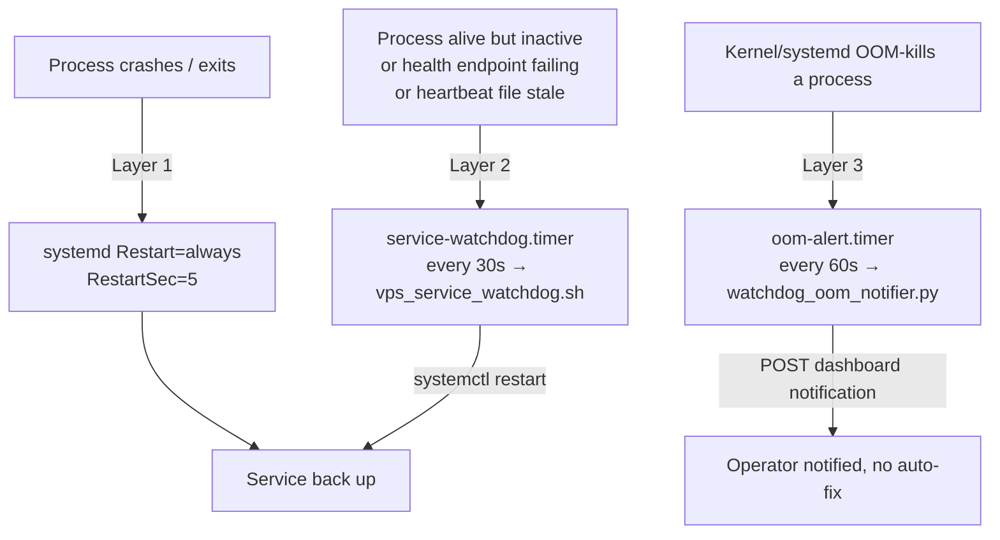

# VPS Recovery & Security

Operator runbook for keeping the production VPS services alive and the host
hardened. Covers the three layers of automatic recovery, the OOM alert path,
the daily health check, and the host hardening profile.

> Scope note: this doc describes **recovery and host security only**. Deploy
> mechanics (GitHub Actions, rsync, crashloop abort) live in the deployment
> docs; this doc references them only where recovery interacts with deploy.

---

## The three recovery layers

UA service recovery is layered, not monolithic. Each layer catches a failure
mode the layer below it cannot.



### Layer 1 — systemd `Restart=always` (in-process crash)

The gateway unit template (`deployment/systemd/templates/universal-agent-gateway.service.template`)
sets `Restart=always` with `RestartSec=5`. If the gateway process exits for any
reason (unhandled exception, SIGSEGV, deploy SIGTERM, OOM kill), systemd brings
it straight back after 5 seconds. This is the first and fastest recovery line;
the watchdog (Layer 2) only acts when systemd's own restart is insufficient
(e.g. the unit went `inactive`/`failed` and stopped retrying, or the process is
alive-but-wedged).

The same template pins **resource limits** to keep a runaway process from taking
the whole box down:

```
MemoryMax=8G     # hard cgroup limit — systemd kills the cgroup if exceeded
MemoryHigh=6G    # soft limit — triggers kernel reclaim / swap pressure
TasksMax=500     # caps total process count within the cgroup
```

VP worker units (`universal-agent-vp-worker@.service`) carry tighter limits
(`MemoryMax=3G`, `MemoryHigh=2G`, `TasksMax=256`).

### Layer 2 — the service watchdog (inactive / unhealthy / stale)

A `systemd` timer + oneshot service + Bash script. The script
(`scripts/vps_service_watchdog.sh`) runs one full cycle each time the timer
fires.

| Unit | File | Behavior |
|---|---|---|
| `universal-agent-service-watchdog.timer` | `deployment/systemd/universal-agent-service-watchdog.timer` | `OnCalendar=*:*:0/30` (every ~30s), `AccuracySec=5s`, `Persistent=true` — wall-clock anchor so `NextElapse` is never `infinity` (see the dead-timer gotcha below) |
| `universal-agent-service-watchdog.service` | `deployment/systemd/universal-agent-service-watchdog.service` | `Type=oneshot`, loads `-/opt/universal_agent/.env`, runs the script |

> **Dead-timer drift (fixed 2026-06-04) — why `OnCalendar`, not `OnUnitActiveSec`.**
> Both safety-net timers (`…-service-watchdog.timer` and `…-oom-alert.timer`) were
> originally **monotonic-only** (`OnBootSec` + `OnUnitActiveSec`, no `OnCalendar`).
> `OnUnitActiveSec` re-arms relative to the unit's *last activation*; the frequent
> deploy `systemctl daemon-reload` (~19/day) reset that monotonic baseline while
> nothing in the deploy path re-`enable --now`'d the timers, so the next-fire
> reference was lost and `systemctl show … -p NextElapseUSecMonotonic` resolved to
> `infinity` — **dead, with no scheduled fire** (watchdog dark from 2026-04-11,
> oom-alert from 2026-05-16). `Persistent=true` could not help: it only catches
> missed *calendar* events, of which a monotonic timer has none. The fix is
> two-part: (1) the `.timer` units now use `OnCalendar` (`*:*:0/30` for the
> watchdog, `minutely` for oom-alert), which always yields a finite wall-clock
> `NextElapse` and survives `daemon-reload`; and (2) the deploy now re-runs both
> dedicated installers every time (see "Install / update" below), re-`enable
> --now`ing the timers on every deploy as belt-and-suspenders.

Per cycle, for each configured service (`check_service`):

0. **Disabled/masked skip** — `systemctl is-enabled`. A unit reporting `disabled`
   or `masked` is intentional operator state and is **skipped** (never
   auto-restarted). This keeps the watchdog from fighting a deliberate shutdown —
   e.g. an autonomous-runtime-split rollback `stop`+`disable`s the worker, and
   resurrecting it would re-enter split mode. All always-on monitored units report
   `enabled`, so this only ever skips a deliberately-off unit.
1. **Active-state check** — `systemctl is-active`. If not `active`, restart
   immediately (`restart_service`) and reset the fail counter. No threshold for
   the inactive case.
2. **Heartbeat-file check (preferred)** — if a heartbeat file is configured, the
   watchdog reads its freshness (`is_heartbeat_fresh`). Fresh → reset counter.
   Stale → increment a per-service consecutive-failure counter; restart once it
   reaches `HEALTH_FAIL_THRESHOLD` (default 3).
3. **HTTP health check (fallback)** — only used when no heartbeat file is set
   and a health URL is configured. HTTP status in `[100, HTTP_OK_MAX_STATUS]`
   (default `499`) counts as healthy; otherwise increment the failure counter
   and restart on threshold.

Failure counters are tracked as per-service files under `STATE_DIR`
(default `/var/lib/universal-agent/watchdog/<sanitized-name>.failcount`). The
service name is sanitized via `service_key` (slashes/colons/at/dot/space →
underscore) to form the filename.

**Cause-aware restarts — alert + rate-limit/escalation (added 2026-06-16).**
A `restart_service` call is no longer silent. Before restarting, the watchdog
consults a per-service **restart ledger** (`<sanitized-name>.restarts`, one epoch
per restart, pruned to `RESTART_WINDOW_SECONDS`, default 3600) via
`restart_count_in_window`:

- **Under the cap** (`UA_WATCHDOG_MAX_RESTARTS_PER_HOUR`, default 6): restart as
  before, record the timestamp (`record_restart`), and fire a best-effort
  `severity=warning` notification.
- **At/over the cap**: a service restarted ≥ cap/hr is not being fixed by more
  restarts. Within `FLAP_COOLDOWN_SECONDS` (default 600) of the last restart the
  watchdog **backs off** (skips the restart, logs `action=skip_restart
  reason=flapping`) and escalates a `severity=error, requires_action=true`
  "flapping" notification (itself rate-limited to once per cooldown via a
  `<sanitized-name>.flapalert` marker). After the cooldown elapses it allows one
  more (escalated) attempt. This stops the previously-invisible "restart every
  30s forever" failure mode.

Alerts are delivered by `scripts/watchdog_restart_notifier.py`, which **bootstraps
Infisical** (`initialize_runtime_secrets`) to obtain `UA_OPS_TOKEN` — the oneshot's
`-/opt/universal_agent/.env` does *not* carry that token — then POSTs to
`/api/v1/ops/notifications`, riding the existing `NotificationDispatcher`
email+Telegram fan-out. The OOM notifier (`watchdog_oom_notifier.py`) gained the
same Infisical bootstrap, closing a latent gap where OOM alerts would 401
silently. The whole notify path is best-effort (`|| true`, `timeout 30`): a
gateway being down can never block its own restart. Knobs:
`UA_WATCHDOG_NOTIFY_ENABLED` (default 1), `UA_WATCHDOG_MAX_RESTARTS_PER_HOUR`,
`UA_WATCHDOG_RESTART_WINDOW_SECONDS`, `UA_WATCHDOG_FLAP_COOLDOWN_SECONDS`.

**Default service specs** (`DEFAULT_SERVICE_SPECS`, format
`service|http_health_url|heartbeat_file`):

| Service | HTTP probe | Heartbeat file | Effective check |
|---|---|---|---|
| `universal-agent-gateway` | `http://127.0.0.1:8002/api/v1/health` | `/var/lib/universal-agent/heartbeat/gateway.heartbeat` | **heartbeat** (takes priority over HTTP) |
| `universal-agent-api` | `http://127.0.0.1:8001/api/health` | — | HTTP |
| `universal-agent-webui` | `http://127.0.0.1:3000/` | — | HTTP |
| `universal-agent-telegram` | — | `/var/lib/universal-agent/heartbeat/telegram.heartbeat` | **heartbeat** |
| `universal-agent-mission-control-sweeper` | — | — | **active-state only** (no HTTP/heartbeat) |
| `universal-agent-autonomous-runtime` | — | — | **active-state only** (the autonomous-runtime split worker; see note) |
| `csi-ingester` | `http://127.0.0.1:8091/healthz` | — | HTTP |

> **The autonomous-runtime split worker is `active-state only` ON PURPOSE.** It is
> a 2nd `gateway_server` process that hosts all the autonomous loops
> (`UA_AUTONOMOUS_RUNTIME_MODE=split`; see
> [Gateway, Sessions & Execution](../02_execution_core/01_gateway_sessions_execution.md)).
> Its `:8092` health endpoint shares the event loop with the heavy agent turns it
> runs, so an HTTP probe would time out and **false-restart it mid-turn** — exactly
> the starvation the split eliminated. `is-active` monitoring (recover a crashed /
> start-limit-exhausted worker, the backstop above `Restart=always`) is the correct
> coverage; a busy-loop probe is not.

> **CSI Ingester health path is `/healthz`, not `/health`.** The CSI service
> (`CSI_Ingester/development/csi_ingester/app.py`) intentionally exposes only
> `/healthz`, `/readyz`, and `/metrics` — there is **no** `/health` route, so a
> manual `curl http://127.0.0.1:8091/health` returns **404**. That 404 means
> "wrong path," **not** "service down" — do not raise a CSI-down alert off it.
> The systemd watchdog (`scripts/vps_service_watchdog.sh`) and the heartbeat
> directive (`memory/HEARTBEAT.md` → VPS System Health Check item 10) already
> use `/healthz`. Separately, CSI *content* freshness (are the 444 YouTube RSS
> channels polling?) is a DB-based signal in
> `utils/db_health_monitor.py::check_csi_source_freshness` (a SQLite query on
> `source_state`, never an HTTP probe); never conflate an HTTP-path 404 with
> channel staleness. (Optional hardening, operator-approval + CSI restart
> required: add a `/health` → `/healthz` alias in CSI's `app.py` so the
> conventional path also answers 200.)

> [VERIFY: legacy runbook 24 lists telegram as "active-state only, no HTTP
> probe." Code now configures a telegram **heartbeat file** by default. The
> active-state check still runs first; the heartbeat is the secondary liveness
> signal. The legacy "active-state only" claim is stale — code wins.]

When the heartbeat file is set it **takes priority** over the HTTP URL —
the gateway, despite having a health URL in its spec, is actually liveness-gated
on its heartbeat file (see Layer 2a). The HTTP URL in the gateway spec is
effectively dead config given the heartbeat file is present.

#### Watchdog tunables (set in `/opt/universal_agent/.env`)

| Env var | Default | Notes |
|---|---|---|
| `UA_WATCHDOG_SYSTEMCTL_BIN` | `systemctl` | |
| `UA_WATCHDOG_CURL_BIN` | `curl` | |
| `UA_WATCHDOG_STATE_DIR` | `/var/lib/universal-agent/watchdog` | fail-count files |
| `UA_WATCHDOG_HEALTH_FAIL_THRESHOLD` | `3` | consecutive failures before restart (must be ≥1) |
| `UA_WATCHDOG_HTTP_TIMEOUT_SECONDS` | `8` | per-probe curl `--max-time` (must be ≥1) |
| `UA_WATCHDOG_HTTP_OK_MAX_STATUS` | `499` | upper bound of "healthy" HTTP status (must be ≥100) |
| `UA_WATCHDOG_POST_RESTART_SETTLE_SECONDS` | `2` | sleep after restart before re-reading state |
| `UA_WATCHDOG_HEARTBEAT_STALE_SECONDS` | `300` | heartbeat older than this → stale |
| `UA_WATCHDOG_SERVICE_SPECS` | (built-in default) | newline-delimited `service|url|heartbeat` to override the whole set |

> [VERIFY: legacy runbook 24 documents `UA_WATCHDOG_HTTP_TIMEOUT_SECONDS` default
> as `3`. The code default is now `8` (`${UA_WATCHDOG_HTTP_TIMEOUT_SECONDS:-8}`).
> Code wins.]

Invalid values for the integer knobs (threshold, timeout, ok-max, settle) cause
the script to `log` an error and `exit 2` before running any checks.

#### Layer 2a — the process heartbeat file (event-loop-independent liveness)

The heartbeat file the watchdog reads is written by
`src/universal_agent/process_heartbeat.py`. This is a **dedicated daemon thread**
(not the asyncio loop) that writes the current Unix timestamp to the file every
`UA_PROCESS_HEARTBEAT_INTERVAL_SECONDS` (default `10`s). Because it runs in its
own OS thread, it keeps updating **even when the event loop is blocked** by a
long-running LLM call — which is the exact failure mode an HTTP `/health` probe
cannot detect (the endpoint stops responding when the loop is starved, causing
false-positive restarts).

- Gateway starts it in its FastAPI lifespan: `process_heartbeat.start()` →
  default path `/var/lib/universal-agent/heartbeat/gateway.heartbeat`, env prefix
  `UA_PROCESS_HEARTBEAT_*` (with legacy fallback `UA_HEARTBEAT_FILE`).
- Telegram bot starts its own (`src/universal_agent/bot/main.py`) with
  `path_env_var="UA_TELEGRAM_PROCESS_HEARTBEAT_FILE"`, default
  `/var/lib/universal-agent/heartbeat/telegram.heartbeat`, no legacy fallback.

The writer uses a temp-file-then-rename for atomicity, and `stop()` **deletes**
the file on clean shutdown so the watchdog immediately sees "no heartbeat"
(rather than a stale-but-present file) — but note the watchdog's active-state
check fires first on a clean stop, so the deletion is mostly belt-and-braces.

> **This is NOT the UA Heartbeat Service** (`heartbeat_service.py`). That is the
> application-level proactive agent scheduler (runs Simone every ~30 min, drives
> `HEARTBEAT.md` checks, task dispatch). The process heartbeat here is a pure
> OS-level liveness signal. Env prefixes differ: `UA_PROCESS_HEARTBEAT_*` vs
> `UA_HEARTBEAT_*` / `UA_HB_*`. Do not conflate them.

### Layer 3 — the OOM alert notifier (memory kills)

`scripts/watchdog_oom_notifier.py`, driven by `universal-agent-oom-alert.timer`
(`OnCalendar=minutely` — every 60s; see the dead-timer gotcha under Layer 2 for
why this is `OnCalendar` and not the original `OnUnitActiveSec`). This is a **notification**
path, not a recovery path: it does not restart anything. systemd Layer 1 already
revives an OOM-killed gateway; this layer tells the operator it happened.

Each run:

1. Reads `last_checked_epoch` from its state file
   (`UA_OOM_ALERT_STATE_FILE`, default
   `/var/lib/universal-agent/watchdog/oom_notifier_state.json`).
2. Scans `journalctl -k` and the gateway unit journal since that epoch for OOM
   signatures:
   - Kernel: `oom-kill:`, `Out of memory: Killed process`, `killed by the OOM
     killer`, `oom_reaper: reaped process`.
   - Service: `A process of this unit has been killed by the OOM killer`.
3. If matches found, POSTs a `system_oom_kill` notification (severity `error`,
   `requires_action: true`) to `UA_OOM_ALERT_ENDPOINT` (default
   `http://127.0.0.1:8002/api/v1/ops/notifications`) authenticated with
   `UA_OPS_TOKEN` via the `x-ua-ops-token` header. Lookback window when no prior
   state: `UA_OOM_ALERT_LOOKBACK_SECONDS` (default `180`, floored at 30).

If `UA_OPS_TOKEN` is empty the POST fails fast with `missing_ops_token` and the
notifier returns non-zero — so an unset ops token silently disables OOM alerting.

---

## Install / update the watchdog + OOM-alert timers

Each safety-net timer has its **own** dedicated root installer (both enforce
`EUID==0`): `scripts/install_vps_service_watchdog.sh` and
`scripts/install_vps_oom_alert.sh`. Each verifies its script + both unit files
exist under `APP_ROOT` (default `/opt/universal_agent`), `chmod 0755`s the
script, installs the units to `/etc/systemd/system` with `0644`,
`daemon-reload`s, then `enable --now`s the timer. The watchdog installer also
starts one immediate cycle; the OOM installer starts its one-shot only once the
gateway health endpoint answers (it retries, then skips — the timer validates on
its next fire regardless).

**The deploy runs both installers automatically.** `scripts/deploy/remote_deploy.sh`
invokes `install_vps_service_watchdog.sh` and `install_vps_oom_alert.sh` (each
behind a non-fatal `|| echo WARN` guard) in its systemd-install block on every
deploy. This is what re-`enable --now`s the `OnCalendar` timers each deploy and
is the durable half of the dead-timer fix above. To (re)install manually on the
VPS:

```bash
cd /opt/universal_agent
sudo bash scripts/install_vps_service_watchdog.sh
sudo bash scripts/install_vps_oom_alert.sh
```

---

## Verify & test recovery

Status:

```bash
ssh ua@uaonvps '
  systemctl is-enabled universal-agent-service-watchdog.timer
  systemctl is-active  universal-agent-service-watchdog.timer
  systemctl status universal-agent-service-watchdog.timer --no-pager -n 20
'
```

Tail watchdog logs (every line is prefixed `[ua-watchdog] <UTC-iso>`):

```bash
ssh ua@uaonvps "journalctl -u universal-agent-service-watchdog --since '20 minutes ago' --no-pager"
```

Healthy-cycle log shapes:
- `service=universal-agent-api health=ok method=http status_code=200`
- `service=universal-agent-gateway health=recovered method=heartbeat previous_failures=2`
- `watchdog cycle complete`

Controlled recovery test (gateway):

```bash
ssh ua@uaonvps 'systemctl stop universal-agent-gateway'
# wait ~30s (one timer interval) + settle
ssh ua@uaonvps '
  systemctl is-active universal-agent-gateway
  journalctl -u universal-agent-service-watchdog --since "10 minutes ago" --no-pager \
    | grep -E "service=universal-agent-gateway action=restart|restart_result"
'
```

Expected: `action=restart reason=inactive:inactive` then
`restart_result=ok post_state=active`.

---

## Daily health check

`scripts/vps_health_check.sh` is a single-source script that runs locally on the
VPS or piped over SSH:

```bash
ssh ua@uaonvps 'bash -s' < scripts/vps_health_check.sh
```

It emits `---`-separated blocks: `uptime`, core count, `free -h`, `df -h /`,
`AGENT_RUN_WORKSPACES` disk usage, count of `edgar.ai|claude` processes, run DB
file listing, gateway `systemctl status` head, a 30-min error/exception/locked
log count for the gateway, and the `UA_HOOKS_AGENT_DISPATCH_CONCURRENCY` `.env`
value.

Quick manual checks (from runbook 20):

```bash
systemctl status universal-agent-gateway --no-pager
curl -sS https://api.clearspringcg.com/api/v1/health           # expect {"status":"healthy"}
curl -I  https://app.clearspringcg.com                         # expect HTTP 200
```

Ops-auth smoke (proves the ops token gate is live):

```bash
curl -i https://api.clearspringcg.com/api/v1/ops/deployment/profile   # expect 401 without token
set -a; source /opt/universal_agent/.env; set +a
curl -i -H "x-ua-ops-token: $UA_OPS_TOKEN" \
  https://api.clearspringcg.com/api/v1/ops/deployment/profile          # expect 200, profile=vps
```

---

## Restart & logs

```bash
# all core services
systemctl restart universal-agent-gateway universal-agent-api universal-agent-webui universal-agent-telegram
# live tail one
journalctl -u universal-agent-gateway -f
```

> The deploy workflow already restarts the core services after rsync, so a
> deploy is a clean way to pick up code changes without a manual restart. New
> Infisical secrets / `.env` values only load at process start. Note that
> `deploy.yml` rewrites `/opt/universal_agent/.env` on every deploy — VPS-side
> manual `.env` edits do not survive a deploy. Put durable values in code
> defaults or the deploy bootstrap.

---

## Host security hardening

> Operator runbook, not code. There are **no UFW/fail2ban/SSH hardening scripts
> in this repo** — host hardening is applied manually on the box. The profile
> below is the documented standard (legacy runbook 26), preserved as still-valid
> operational guidance. App-level auth (`UA_OPS_TOKEN`, dashboard password,
> deployment-profile gating) is a separate layer and is enforced in code.

Recommended profile (solo-dev + agentic-safe):

1. **SSH** — `PermitRootLogin prohibit-password`, `PasswordAuthentication no`,
   `KbdInteractiveAuthentication no`. Always back up `sshd_config`, run
   `sshd -t` before reload. Key auth becomes primary, so keep `~/.ssh` hygiene
   strong.
2. **Firewall (UFW)** — allow inbound `22`, `80`, `443` only; keep **outbound
   open** (agentic tool/model providers need it; a full provider allowlist is
   impractical).
3. **Brute-force** — `fail2ban` enabled for `sshd`.
4. **Secret hygiene** — `/opt/universal_agent/.env` owned `root:root`,
   `chmod 600`.
5. **Patch cycle** — unattended upgrades on; reboot after kernel updates in a
   controlled window.

Validation:

```bash
ssh ua@uaonvps '
  sshd -T | egrep "permitrootlogin|passwordauthentication|kbdinteractiveauthentication|pubkeyauthentication" | sort
  ufw status verbose
  systemctl is-active fail2ban && fail2ban-client status
  for s in universal-agent-gateway universal-agent-api universal-agent-webui; do printf "%s=" "$s"; systemctl is-active "$s"; done
'
```

Rollback: restore the most recent `sshd_config.bak.*`, `sshd -t`, reload;
`ufw disable`; `systemctl disable --now fail2ban`.

### Secret rotation reminder

Rotate immediately if leaked, then restart the core services:
`TELEGRAM_BOT_TOKEN`, `COMPOSIO_API_KEY`, `COMPOSIO_WEBHOOK_SECRET`,
`UA_DASHBOARD_PASSWORD`, `UA_OPS_TOKEN`.

---

## SSH host: `ua@uaonvps` vs `root@uaonvps`

Interactive and most operator commands use **`ua@uaonvps`** (the VPS service
user; `/home/kjdragan/...` paths resolve via SSHFS over Tailscale). Legacy
runbooks 24/26 used `root@uaonvps` / a raw public IP — treat those as historical.
`root` is still needed for the watchdog installer (`EUID==0` enforced) and host
hardening (sshd/ufw/fail2ban), but as `ua` you do not have passwordless sudo, so
service restarts that need sudo must go through a deploy or be run by an operator
with root.

Tailscale note: the box has two hostnames — raw OS `srv1360701` (Hostinger) and
MagicDNS `uaonvps`. SSH/preflight scripts use `uaonvps`; the device-roles admin
API indexes by the raw hostname.

---

## Known limits & gotchas

- **Watchdog is process/endpoint recovery, not SLA validation.** A service that
  is `active` and returns a "healthy" HTTP status but is logically wedged will
  **not** be restarted — unless it has a heartbeat file and the heartbeat goes
  stale. This is exactly why gateway/telegram moved to heartbeat files: an
  event-loop-starved gateway keeps answering `/health` from a thread but stops
  updating its heartbeat.
- **Empty `UA_OPS_TOKEN` silently disables OOM alerting** (POST fails
  `missing_ops_token`).
- **Layer 1 vs Layer 2 ordering matters.** systemd's own `Restart=always`
  usually wins the race on a hard crash; the watchdog's inactive-state branch is
  the backstop for when the unit ends up `failed`/`inactive` and stops retrying.
- **Deploy-window restart noise:** lifecycle-miss / SIGTERM-143 exits during a
  deploy are self-healing non-events; the system reclassifies them to
  dashboard-only (no email/Telegram) during a deploy window. Genuine misses
  outside a deploy still page loudly.
- **`.env` is clobbered on every deploy** — don't rely on VPS-side `.env` edits
  to persist watchdog tunables; bake durable values into the deploy bootstrap.
