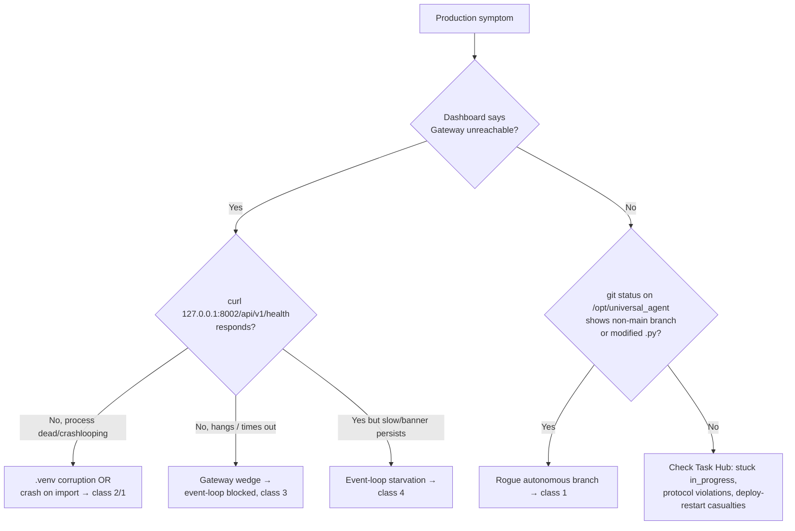
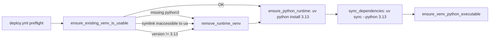

# Incident Response Patterns

This is a **distilled patterns** doc, not a chronicle of dated reports. It catalogs the
recurring production-incident *classes* the Universal Agent runtime has hit, the code that
exists today to prevent or recover from each, and the operator recovery sequence that
actually worked. Where the recovery is now automated in code, the doc points at the function;
where it still requires a human at a TTY, that is called out explicitly.

The four recurring classes:

1. **Rogue autonomous branch** — an agent (usually Simone) edits/checks-out a non-`main`
   branch directly on the live production tree.
2. **`.venv` corruption** — the production virtual environment ends up unusable by the `ua`
   service user, blocking `uv sync` or service start.
3. **Gateway wedge** — the gateway "starts" but cannot serve HTTP because synchronous work
   blocks the asyncio event loop.
4. **Event-loop starvation** — daemon sessions run Claude SDK iterations in-process and stall
   the loop in bursts.

A fifth, lower-severity recurring nuisance — **deploy-restart noise** (SIGTERM-killed workers
mislabeled as failures) — is documented at the end because its suppression logic is shared
machinery the other classes also lean on.

---

## Quick triage map



First commands, always:

```bash
# Is the change even deployed? (branch-vs-deploy honesty)
curl -s http://127.0.0.1:8002/api/v1/version          # SHA must match the merged commit

# Is the gateway serving at all?
curl -fsS -m 4 http://127.0.0.1:8002/api/v1/health

# Is the prod tree clean and on main?
cd /opt/universal_agent && git status --short && git rev-parse --abbrev-ref HEAD
```

---

## Class 1 — Rogue autonomous branch

### Symptom

`/opt/universal_agent` is checked out on a non-`main` branch (historically
`codie/docstring-cleanup-task-hub`), is several commits ahead of `main`, and has modified
`.py` files in the working tree authored by an agent. A scheduled cron or service crashes on
import because a mid-flight edit introduced a `SyntaxError`.

### Root cause

Simone is a **heartbeat orchestrator, not a code author**, yet she can claim a code-mutation
`vp_mission` and execute it via a Claude SDK subprocess running under her identity prompt —
directly in the live production checkout. The branch prefix (`codie/*`) is cosmetic; the
commits are authored as `VP Analysis Agent`, and the writer is a gateway-spawned
`claude_agent_sdk._bundled/claude` subprocess. The load-bearing failure is that the production
checkout is *simultaneously* on a non-`main` branch *and* being live-edited by an agent in the
same tree, bypassing the PR + `pr-validate.yml` gate.

### Recovery sequence (gates matter — each one prevented a real failure)

This recovery is **operator-driven** for the `sudo` steps. The Claude session cannot run
`sudo` non-interactively. Do the phases strictly in order.

1. **Capture before reset.** Push the rogue branch and commit any uncommitted agent edits to
   the remote *first*, so the work is recoverable via a normal PR later. If you reset first,
   unpushed commits evaporate.

   ```bash
   cd /opt/universal_agent
   git push origin <rogue-branch>
   git add <modified files> && git -c user.name="captured pre-reset" commit -m "capture in-flight"
   git push origin <rogue-branch>
   ```

2. **Stop the gateway BEFORE touching Task Hub.** The gateway is the parent of the writer
   subprocess *and* runs the orphan reconciler. Stopping it reaps the writer and silences the
   reconciler.

   ```bash
   sudo systemctl stop universal-agent-gateway     # operator, real TTY
   ```

3. **Park (not cancel) the mission row, with services down.** See the gotcha below — `cancel`
   gets resurrected; `parked` survives.

   ```bash
   sqlite3 /opt/universal_agent/AGENT_RUN_WORKSPACES/activity_state.db \
     "UPDATE task_hub_items SET status='parked', stale_state='parked_manual',
      seizure_state='unseized', agent_ready=0 WHERE task_id='<mission-id>';"
   ```

4. **`git reset --hard origin/main`, then parse-check before restart.** With services down so
   nothing imports a half-rewritten module mid-reset.

   ```bash
   git fetch origin && git reset --hard origin/main
   python3 -c "import ast; [ast.parse(open(f).read()) for f in [...cron-path files...]]"
   ```

5. **Operator restarts services; then fix the branch label and verify.** The local `main` ref
   can be far behind `origin/main` (was 97 commits behind in the 2026-05-07 incident).

   ```bash
   git checkout main && git pull --ff-only
   test "$(git rev-parse HEAD)" = "$(git rev-parse origin/main)"
   ```

6. **Manual verification fire.** A parse check proves code loads, not that the pipeline runs.
   Fire the affected cron through the same Ops API the scheduler uses:

   ```bash
   curl -X POST http://127.0.0.1:8002/api/v1/cron/jobs/<job_id>/run
   ```

### Gotchas (code-verified)

- **`cancel` gets resurrected; `parked` survives.** `task_hub.py::upsert_item` has an
  *asymmetric* clobber guard: it protects `in_progress`/`blocked`/`review` from being knocked
  back to `open` on a blind source re-upsert, but there is **no symmetric guard** protecting
  `cancelled`/`completed`/`parked` from being flipped back to `in_progress`. The orphan
  reconciler (`task_hub.py::reconcile_task_lifecycle`) treats a `cancelled` row with no live
  assignment as a stuck task to recover and clobbers `status` back to `in_progress`
  (`last_disposition_reason = "reconciled_orphaned_in_progress"`). `parked` rows are treated as
  deliberate operator decisions and left alone. **Use `status='parked'`,
  `stale_state='parked_manual'`.** `TASK_STATUS_PARKED` is in `TERMINAL_STATUSES`.

  > [VERIFY: the asymmetric guard at `task_hub.py::upsert_item` ("Preserve active non-open
  > states...") still only protects the OPEN→active direction, not active→terminal. Confirmed
  > by reading the body on 2026-05-29; if a symmetric terminal guard is later added, this
  > gotcha softens.]

- **The writer PID is a gateway-spawned Claude SDK subprocess, not a named daemon.** Identify
  it with `pgrep -af 'claude_agent_sdk'` and confirm by reading `/proc/<pid>/cmdline` (it
  contains the agent's full identity prompt) and recent file mtimes — not by process-name
  match. Process-name and PID guesses were the costliest dead ends in the original recovery.

- **Don't trust handoff docs for live state.** The canonical Task Hub DB the running code opens
  is resolved at runtime by `durable/db.py::get_activity_db_path()` →
  `AGENT_RUN_WORKSPACES/activity_state.db`. Stale `task_hub.db` files on disk and paths stamped
  in cron prompts/comments are *not* the live DB. Run the resolver, don't trust the comment.

### What now mitigates this at the source

The gateway runs a **startup recovery sweep** on every cold start
(`gateway_server.py::lifespan` → `_run_startup_recovery_sweep`) that releases orphaned seized
assignments and reconciles lifecycle rows. Deploy itself force-resets the prod tree to
`origin/main`, re-points the local `main` ref, and checks out `main`
(`remote_deploy.sh`: `reset --hard origin/main` → `update-ref refs/heads/main` → `git checkout main`),
so a deploy launders a stray branch checkout — both its code and its branch label. The
deeper structural fix — preventing Simone from claiming code-author missions at all (the
worktree-PR contract / agent-capability gate) — is enforced via mission routing and is the
correct long-term backstop rather than relying on post-hoc recovery.

---

## Class 2 — `.venv` corruption

### Symptom

Production breaks right after a deploy. Services fail to start, `uv sync` fails, or the
gateway can't reach the API → dashboard HQ-only tabs disappear (a downstream symptom of the
factory-capabilities endpoint returning 502, *not* a frontend bug).

Canonical failure signature:

```text
error: Failed to query Python interpreter
Caused by: failed to canonicalize path `/opt/universal_agent/.venv/bin/python3`:
Permission denied (os error 13)
```

### Root cause

A stale `.venv` whose interpreter symlink points at a Python location the `ua` service user
cannot traverse — or a venv missing `bin/python3` entirely, or built against the wrong Python
version. `uv sync` tries to canonicalize the existing (broken) interpreter and dies *before*
it can rebuild. Moving `uv` execution under a different user without accounting for
pre-existing `.venv` state is the classic trigger.

### Self-heal in code (current, evolved from the 2026-03-12 hotfix)

The self-heal logic lives in **`scripts/deploy_validate_runtime.sh`**, invoked by
`deploy.yml` as the "centralized production runtime preflight"
(`bash "$PROD_DIR/scripts/deploy_validate_runtime.sh" --profile vps ...`). Note: there is no
inline `.venv` removal in `deploy.yml` itself anymore — it was relocated to the preflight
script. `ensure_existing_venv_is_usable()` force-removes and rebuilds the venv on **three**
distinct triggers, all discovered through real incidents:

| Trigger | Detection | Incident origin |
|---|---|---|
| Missing `bin/python3` | `-d .venv && ! -e .venv/bin/python3` | PR #250 deploy, 2026-05-12 |
| Interpreter not accessible to `ua` | `run_as_service_user readlink -f` fails | 2026-03-12 |
| Wrong Python version | venv reports `!= 3.13` | deploy #449, 2026-05-11 |

After removal, `sync_dependencies()` runs `uv sync --python 3.13` (excluding the heavy
`manim`/`pycairo`/`manimpango` packages), and `ensure_venv_python_executable()` repairs a
missing execute bit on the rebuilt interpreter.



### Post-restart interpreter guard

After restart, `remote_deploy.sh::ensure_current_venv_interpreter` compares each service's
`/proc/<pid>/exe` against `readlink -f .venv/bin/python`; if a service is still running the old
interpreter (e.g. it restarted before the rebuild), it gets restarted again. Applied to
`universal-agent-gateway`, `universal-agent-api`, `ua-discord-intelligence`.

### Gotchas

- **Selective removal, not blind `rm -rf`.** A *good* venv must be left intact (rebuild is
  slow); only remove on a confirmed corruption signal. That is exactly what the three-trigger
  check above implements — don't "simplify" it to an unconditional wipe.
- **Capability endpoint as smoke test.** `…/api/v1/factory/capabilities` returning `200` with
  `factory_role: HEADQUARTERS` validates both backend health *and* HQ-gated UI availability in
  one call.

---

## Class 3 — Gateway wedge

### Symptom

The gateway logs `Application startup complete` (or the deploy health gate eventually passes)
but HTTP requests hang or time out. Dashboard shows "Gateway unreachable." The process is
alive; it just can't serve.

### Root cause

The FastAPI `lifespan` startup does heavy **synchronous** work — schema migration, lifecycle
reconcile, recovery sweeps — against a large (~180MB) `activity_state.db`. Running sync code
inside an `async def` blocks the asyncio event loop: while the sweep runs (minutes), no HTTP
request can be served, even though the gateway "started." A second flavor is a `SESSION_API_TOKEN`
that never loaded (missing `initialize_runtime_secrets()` at an entrypoint), so every dashboard
WebSocket gets 403 — check `/proc/$pid/environ` first when the dashboard shows "Gateway
unreachable."

### Fix in code

`gateway_server.py::lifespan` defers the recovery sweep to a **background task**, and the
sync-heavy body of that task is wrapped in `asyncio.to_thread` so it runs in the default
executor without blocking the loop:

```python
# gateway_server.py::lifespan → _run_startup_recovery_sweep
_recovery_result, _reconciled, _email_mapping_reconciled = await asyncio.to_thread(
    _sync_recovery_work,
)
```

The same `asyncio.to_thread` pattern is applied broadly to hot read paths (e.g.
`_dashboard_summary_cached`, session listing) so SQLite reads don't saturate the loop. The
in-file comment is explicit that the *architectural* fix is to slim the pre-`yield` lifespan
work; the thread-offload is the operational backstop.

### Deploy health-gate accommodation

Because cold-start lifespan work grows with accumulated production state, the deploy gateway
health check allows **96 attempts × 5s = 8 minutes**
(`remote_deploy.sh::run_health_check gateway ... 96 5`). Deploys #436/#437 timed out at the old
4-minute window even though the gateway came up healthy seconds later.

### Gotchas

- **`Application startup complete` ≠ serving.** Sync work after the FastAPI yield (or a
  blocking import) wedges the loop with the process fully "up." Diagnose by hitting
  `/api/v1/health` with a short timeout, not by checking `systemctl is-active`.
- **Three-layered wedges happen.** The 2026-05-16 gateway incident was *three* stacked
  failures (lifespan blocking → thread starvation → bind/storm), fixed across PRs #289/#291/#293.
  Take a careful layer-by-layer diagnosis; do not assume the first hypothesis is the whole
  story.
- **`to_thread` is loop-affinity poison for the callee.** The same offload-to-thread fix used
  here unblocks the loop, but the wrapped callable then runs with **no running loop** — any
  transitive `asyncio.create_task` / `get_running_loop` inside it raises `RuntimeError: no
  running event loop`. This bit `cron_service.py::_schedule_retry_run` after the lightweight
  finalize path was moved under `asyncio.to_thread` (intermittent "no running event loop" cron
  failures, fixed 2026-05-31). When you wrap something in `to_thread`, audit its whole
  transitive call tree for loop-affine calls; the fix is to capture the loop up front and use
  `run_coroutine_threadsafe` off-thread. See `03_agents/04_cron_and_scheduling.md` (Phase F).

---

## Class 4 — Event-loop starvation

### Symptom

The gateway serves, but in 15–20s bursts requests stall and the "Gateway unreachable" banner
flickers. Correlated with daemon Simone heartbeat activity.

### Root cause

When `ANTHROPIC_API_KEY` is present, `daemon_simone_heartbeat` actually runs Claude SDK
iterations **in-process**, and those iterations block the asyncio loop in bursts. This was
*unmasked* (not caused) by PR #480 finally loading the API key — the architectural problem
(in-process SDK iteration) pre-existed.

### Kill switch and gating

```python
# services/daemon_sessions.py::daemon_sessions_enabled
raw = os.getenv("UA_DAEMON_SESSIONS_ENABLED")
if raw is not None:
    return _is_truthy(raw)          # explicit flag wins
return should_run_loop("daemon_sessions", prod_default=heartbeat_enabled)
```

- **`UA_DAEMON_SESSIONS_ENABLED=0`** is the emergency kill switch — disables daemon sessions
  entirely, stopping the in-process iterations.
- In **development** (`UA_RUNTIME_STAGE=development`), daemon sessions are **off by default**
  (autonomous loops require `UA_DEV_<NAME>_FORCE_ON=1` to opt in).
- Default daemon agent is **Simone only** (`DEFAULT_DAEMON_AGENTS = ("simone",)`); Atlas and
  Cody are on-demand, no proactive polling. Override with `UA_DAEMON_SESSION_AGENTS`.

### Gotcha

The proper fix is to move SDK iteration out-of-process (or off the loop), not to leave the
kill switch flipped. Disabling daemon sessions stops Simone's autonomous heartbeat work, so
it's an incident-mitigation lever, not a steady state.

### Detecting a silent heartbeat

Starvation (or an outright crashed loop) can leave the heartbeat *silent* without the process
dying — the hole that once let the heartbeat go 26h unnoticed. Two complementary detectors now
close it:

- **Self-reporting at the source.** `gateway_server.py::_spawn_background_task` installs an
  `add_done_callback` that emits a `background_task_failed` notification if a background task
  dies with an unexpected exception; `gateway_server.py::_run_after_deployment_window` wraps
  init and emits `service_startup_failed` on init failure. Both kinds are in
  `gateway_server.py::_HEALTH_ALERT_NOTIFICATION_KINDS`, so repeated firings collapse to a
  single alert row (see the notification-dedup machinery below).
- **External liveness probe.** `scripts/check_heartbeat_liveness.py` checks the last tick
  against a staleness window (default 2× the heartbeat interval). Exit codes: `0` healthy (or
  explicitly disabled), `2` no heartbeat record at all (silent), `3` stale (last tick beyond
  the threshold).

---

## Cross-cutting machinery: worker exit classification & recovery

Several incident classes funnel through the same recovery primitives. Know these before
hand-rolling a reaper.

### Worker exit classification (`services/worker_exit_classifier.py`)

`classify_worker_exit()` is a **pure** function (no DB/sockets) that sorts a subprocess or
coroutine termination into six buckets. Call it at each spawn site and thread the result into
`task_hub._close_run(outcome=...)`.

| Outcome | Meaning | `is_failure` | `is_protocol_violation` |
|---|---|---|---|
| `clean_exit_zero` | rc=0 AND task closed normally | no | no |
| `clean_exit_zero_no_disposition` | rc=0 but task still `in_progress` | no | **yes** |
| `nonzero_exit` | rc≠0 (or None) | yes | no |
| `signaled` | killed by OS signal (OOM/SIGKILL) | yes | no |
| `timeout_killed` | UA's own timeout machinery killed it | yes | no |
| `cancelled_mid_run` | coroutine cancelled externally (reaper/operator) | yes | no |

Precedence in the function body: `was_cancelled` → `was_timeout_killed` → `was_signaled` →
`return_code` → disposition check. Critical subtlety: `asyncio.CancelledError` inherits from
`BaseException`, so it bypasses `except Exception` handlers — callers **must** explicitly
detect cancellation and pass `was_cancelled=True`. (Added 2026-05-13 after reaped LLM-cron
coroutines were mispainted as `clean_exit_zero`.)

### Protocol-violation parking (`park_task_for_protocol_violation`)

When `classify_worker_exit` returns `is_protocol_violation=True` (subprocess exited rc=0 but
never closed its task), the spawn site calls
`park_task_for_protocol_violation(conn, task_id=..., site="cron"|"vp_cli"|"demo")`, which routes
the task to `needs_review` with a canonical reason string from `PROTOCOL_VIOLATION_REASONS`.
It is **best-effort** — it must never raise into the spawn site's happy path.

### Stale / orphaned task recovery (`task_hub.py`)

Do **not** write a per-task reaper. The existing verbs:

- `reconcile_task_lifecycle()` — repairs orphaned `in_progress` rows (reopen / review /
  completion-flag). Run at startup and on demand. Skips rows whose
  `active_provider_session_id` is in the live-session set.
- `release_stale_assignments()` — finalizes assignments whose worker is gone
  (`stale_after_seconds=300` at startup since the process was already dead).
- Stale policy is gated by env: `UA_TASK_STALE_ENABLED` (default `0`),
  `UA_TASK_STALE_MIN_CYCLES` (default `4`), `UA_TASK_STALE_MIN_AGE_MINUTES` (default `180`,
  floored at 10).

---

## Class 5 — Deploy-restart noise suppression

### Symptom

Every deploy generates a burst of "execution missing lifecycle mutation" alerts / failure
emails as in-flight workers get SIGTERM'd (exit 143) by `systemctl restart`. These are
self-healing non-events.

### Mechanism

A **deploy window flag** at `/tmp/ua-deployment-window` marks an in-flight deploy.
`deploy.yml` `touch`es it before the restart and removes it on `EXIT` via a `trap`, with a
belt-and-suspenders background `(sleep 1500 && rm -f …)` in case the trap is skipped.

`cron_service.py::_is_deploy_window_active()` returns `True` when either:
1. the flag file exists, **or**
2. the gateway process started within the last `60s` (`_DEPLOY_WINDOW_FALLBACK_UPTIME_SEC`) —
   covers the rare flag-cleanup race and operator-initiated restarts.

During the window, a negative cron exit code is reclassified as `cancelled` (a deploy-restart
side effect), not a failure. The lifecycle-miss guardrail (PR #563, 2026-05-29) becomes
**dashboard-only — no email/Telegram** during the window; genuine misses *outside* a deploy
still page loudly. Both signals only ever *widen* the suppression window, never narrow it, so
real failures (OOM, code crash) outside the window surface as before.

### Crashloop fail-fast (`scripts/check_crashloop.sh`)

The deploy health-check loop calls `check_crashloop.sh` per attempt. It records baseline
`systemd NRestarts` on first call and, past attempt 3, aborts the wait loop immediately (exit
1) if the unit has restarted ≥ threshold (default 5) times — so a crashlooping service fails
the deploy fast instead of burning the full 8-minute timeout. (Lifted out of inline
`deploy.yml` shell because GHA's workflow validator silently rejected the equivalent inline
block — see the deploy.yml parser quirk gotcha.)

### Notification dedup (`services/notification_dispatcher.py`)

Alert cooldown is keyed on `(kind, scope, channel)` where `scope` resolves to
`task_id`/`job_id`/`run_id`/`session_id` — so two genuinely different
`execution_missing_lifecycle_mutation` events alert independently, while one misbehaving task
that keeps firing the same kind gets coalesced. Default cooldown 300s, rollup window 180s.

---

## Deploy / CI failure handling (where incidents surface first)

- **CI-failure auto-filer** (`.github/workflows/ci-failure-issue.yml`) is the authoritative
  notification channel for headless sessions. After pushing a PR, poll
  `gh issue list --label ci-failure`.
- **Deploy failure email** (`deploy.yml`, `if: failure()`) posts to AgentMail best-effort;
  a missing `AGENTMAIL_API_KEY` degrades to a `::warning::`, not a hard failure.
- **Concurrency guard**: `deploy.yml` uses `concurrency: { group: deploy-production,
  cancel-in-progress: false }` so simultaneous merges queue serially instead of racing on
  `/opt/universal_agent/.git/index.lock`. The deploy also removes a stale `index.lock` if no
  git process is running.
- **SSH idle-eviction false-failure**: a long *silent* remote deploy step (systemd
  `daemon-reload` + `enable --now` on a busy VPS can run minutes with no output) lets an
  intermediate idle-timeout-killer drop the TCP connection, so the workflow exits **255 even
  though the VPS restarted at the merged SHA**. The fix in `deploy.yml` is keepalive on the
  deploy `ssh` invocation — `-o ServerAliveInterval=30 -o ServerAliveCountMax=120` (up to ~60
  min of idle tolerance inside the outer `timeout 30m`) plus heartbeat output lines from the
  otherwise-silent install scripts. A red deploy is therefore *not* proof of failure: always
  run the Rule-A `/api/v1/version` SHA check before treating it as one.
- **Branch-versus-deploy honesty**: a commit on a branch — or merged to `main` but with the
  deploy not yet green — is **not deployed**. Confirm with the `/api/v1/version` SHA check
  before claiming "shipped."
- **`.env` is rewritten from scratch every deploy** (deterministic bootstrap dict in
  `deploy.yml`). VPS-side `.env` edits do not survive — put durable values in code defaults or
  the bootstrap dict.

---

## Operator checklist (incident open)

1. `curl /api/v1/version` — is the suspected fix even deployed?
2. `curl -m 4 /api/v1/health` — serving, dead, or wedged? (distinguishes class 2/3/4)
3. `git status` + `git rev-parse --abbrev-ref HEAD` on `/opt/universal_agent` — rogue branch? (class 1)
4. If wedged: check `/proc/$pid/environ` for `SESSION_API_TOKEN`; check lifespan sweep logs.
5. If recovering Task Hub state: **park, never cancel**; stop the gateway first.
6. Capture agent work before any `git reset --hard`.
7. After recovery: parse-check, restart (operator/sudo), then a **real** verification fire —
   not just a passing parse check.
