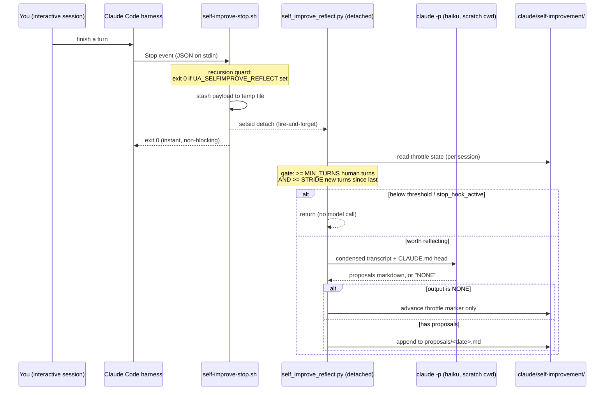

# Self-Improving CLAUDE.md Stop Hook

A **desktop-local** Claude Code `Stop` hook that reflects on each interactive
work session while the context is still fresh and drafts durable **CLAUDE.md
improvement proposals** for human review. It turns every session into a chance
to sharpen the agent operating manual — without ever editing `CLAUDE.md`
automatically, and without touching the autonomous production fleet.

> **One-line mental model:** when you stop typing, a cheap background model reads
> what just happened and asks "did this session teach us a durable rule worth
> writing down?" — and if so, it writes a proposal to a file you review later.

---

## Why this exists

The freshest moment to capture a lesson — a wrong path, a corrected convention,
a tool quirk, a repeated mistake — is the instant a session ends, while the whole
transcript is still on disk. People rarely circle back to codify those lessons.
This hook closes that loop: it harvests generalizable lessons at session
teardown and parks them as reviewable proposals, so the operating manual
(`CLAUDE.md`) compounds in quality over time. It is the mechanical half of the
*automate-don't-instruct* philosophy applied to documentation maintenance.

It deliberately stops short of editing `CLAUDE.md` itself. Per the project's
LLM-native design tenet — *code gates and protects, the LLM synthesizes meaning,
a human promotes the result* — the model **proposes**, a human **disposes**.

---

## Architecture

Three pieces, all on Kevin's desktop only:

| Piece | Path | Role |
|---|---|---|
| Hook entrypoint | `.claude/hooks/self-improve-stop.sh` | Fires on every `Stop`. Reads the payload, detaches the reflector, returns in milliseconds. Never blocks the user. |
| Reflector | `.claude/hooks/self_improve_reflect.py` | Throttled gate + a cheap `claude -p` reflection. Writes proposals. Never edits `CLAUDE.md`. |
| Wiring | `.claude/settings.local.json` → `hooks.Stop` | Registers the hook (async). **Gitignored — desktop-only, never deployed.** |

### Flow



### What the reflector actually does

`self_improve_reflect.py::main` runs the gate and the call:

1. **Loads the payload** the shell stashed (`self_improve_reflect.py::load_payload`),
   deleting the temp file. Bails immediately if `stop_hook_active` is set (we are
   inside a re-prompt loop) or the transcript is missing.
2. **Counts real human turns** via `self_improve_reflect.py::is_human_turn` — a
   user record whose content is a non-empty string, or a block list with a `text`
   block and no `tool_result` block. Tool-result user records do not count.
3. **Throttles.** Skips unless human turns ≥ `MIN_USER_TURNS` (default 4) and at
   least `STRIDE` (default 8) new human turns have happened since the last
   reflection for this session. Per-session state lives in
   `.claude/self-improvement/state/<session_id>.json`.
4. **Condenses the transcript** to user prompts + assistant narration
   (`self_improve_reflect.py::text_from_content`), truncating the middle to stay
   under `MAX_CHARS`.
5. **Asks a cheap model** (`claude -p --model haiku`) using
   `self_improve_reflect.py::PROMPT_TEMPLATE`, which biases hard toward `NONE`
   and only proposes concrete, generalizable rules — explicitly excluding one-off
   facts (those belong in memory, not `CLAUDE.md`) and anything already in the
   `CLAUDE.md` head it is shown.
6. **Writes proposals** to `.claude/self-improvement/proposals/<date>.md` (Houston
   time, `America/Chicago`), with a per-session dedup hash so the same proposal is
   not appended twice. `NONE` (the common, correct outcome) writes nothing but
   advances the throttle marker.

---

## Scope & safety design

This is the part that matters most — the hook is built to be *incapable* of
harming the production fleet or blocking a session.

- **Desktop-only, never deployed.** It is wired exclusively from
  `.claude/settings.local.json`, which is gitignored. It is **intentionally not**
  in the checked-in `.claude/settings.json`. That file deploys to the VPS, where
  the autonomous principals (Simone / Cody / Atlas) and Cody CLI subprocesses run
  — a `Stop` hook there that spawns `claude -p` would burn model quota fleet-wide
  and could recurse. Keeping the wiring local is the primary safety boundary.
- **Never blocks you.** The entrypoint detaches the reflector with `setsid` and a
  backgrounded process with redirected std streams, then returns `exit 0`
  immediately. The slow model call happens after the hook has already returned.
  The hook is also registered `async`.
- **Recursion-guarded.** The reflector spawns `claude -p`, which is itself a
  Claude Code session and would re-fire this very hook. The reflector exports
  `UA_SELFIMPROVE_REFLECT=1` onto that child; the first check in
  `self-improve-stop.sh` makes any nested invocation `exit 0` instantly. As a
  second layer, the reflector runs `claude -p` from a throwaway scratch `cwd`, so
  the child loads no project settings, MCP, or skills.
- **Never edits CLAUDE.md.** Output is only ever appended to
  `.claude/self-improvement/proposals/`. Promotion into `CLAUDE.md` is a human
  action.
- **Cheap and rare.** Throttling means most `Stop` events do nothing, and when it
  does run it is one Haiku call over a truncated transcript.
- **Crash-proof.** `self_improve_reflect.py::main` is wrapped so any exception is
  swallowed — session teardown is never disrupted by reflection failure.

> [VERIFY: this hook assumes `claude` is on `PATH` and authenticated with the
> Anthropic Max plan OAuth credentials in `~/.claude`. On a machine logged into a
> different account the Haiku calls bill against that account instead.]

---

## Runbook

### Review proposals (the main loop)

Proposals accumulate one file per day. Read them with:

```bash
cat .claude/self-improvement/proposals/*.md
# or just today
cat ".claude/self-improvement/proposals/$(date +%F).md"
```

Each entry names the suggested `CLAUDE.md` section, the exact text to add, and the
evidence from the session that prompted it. For each one:

- **Accept** → edit `CLAUDE.md` (or `project_docs/`) to incorporate the rule, then
  delete the proposal entry.
- **Discard** → delete it. No state is kept; discarding is free.

When you accept a proposal, that is the loop closing — a lesson learned in one
session becomes a standing rule for every future session.

### Tune behavior

All knobs are environment variables read by the reflector. Set them in the hook
environment (e.g. via `.claude/settings.local.json` `env`, or your shell profile
for the interactive session):

| Variable | Default | Effect |
|---|---|---|
| `UA_SELFIMPROVE_MIN_TURNS` | `4` | Minimum human turns before a session is eligible. |
| `UA_SELFIMPROVE_STRIDE` | `8` | Reflect at most once per this many new human turns. Lower = chattier. |
| `UA_SELFIMPROVE_MODEL` | `haiku` | Model alias for the reflection call. |
| `UA_SELFIMPROVE_MAX_CHARS` | `24000` | Cap on condensed transcript size sent to the model. |
| `UA_SELFIMPROVE_TIMEOUT` | `180` | Seconds before the `claude -p` call is abandoned. |
| `UA_SELFIMPROVE_DRYRUN` | _(unset)_ | `1` = print the gate decision and prompt size, skip the model call. |
| `UA_SELFIMPROVE_REFLECT` | _(set by reflector)_ | **Do not set manually.** Presence makes the hook no-op (recursion guard). |

### Enable / disable

- **Disable temporarily:** comment out or remove the `Stop` entry in
  `.claude/settings.local.json` (`hooks.Stop`), or open `/hooks` in the session and
  toggle it. `disableAllHooks: true` in settings turns off *all* hooks (heavier
  hammer).
- **Re-enable:** restore the `Stop` entry. The entry's command is
  `$CLAUDE_PROJECT_DIR/.claude/hooks/self-improve-stop.sh`.

### Confirm it is wired

```bash
jq '.hooks.Stop' .claude/settings.local.json
# expect an entry whose command ends in self-improve-stop.sh
```

### Test without spending a model call (dry run)

Synthesize a `Stop` payload pointing at a real transcript and run the reflector in
dry-run mode — it reports the gate decision and prompt size, calls no model:

```bash
LATEST=$(ls -t ~/.claude/projects/-home-kjdragan-lrepos-universal-agent/*.jsonl | head -1)
TMP=$(mktemp)
python3 -c "import json,sys; open(sys.argv[2],'w').write(json.dumps({'transcript_path':sys.argv[1],'session_id':'dryrun','cwd':'$PWD','stop_hook_active':False}))" "$LATEST" "$TMP"
UA_SELFIMPROVE_DRYRUN=1 UA_SELFIMPROVE_MIN_TURNS=1 UA_SELFIMPROVE_STRIDE=1 \
  python3 .claude/hooks/self_improve_reflect.py "$TMP"
```

### Smoke-test the full path (one real Haiku call)

Same as above but drop `UA_SELFIMPROVE_DRYRUN`. On a session with a genuine
lesson it appends a proposal under `.claude/self-improvement/proposals/`; on a
session with nothing generalizable it correctly emits `NONE` and writes no
proposal. Both are success.

---

## Troubleshooting

| Symptom | Cause | Fix |
|---|---|---|
| Hook never fires after editing settings | The config watcher only watches dirs that had a settings file at session start. | Open `/hooks` once (reloads config) or restart the session. `.claude/settings.local.json` pre-existing means it is usually picked up automatically. |
| No proposals ever appear | Sessions too short, or the model keeps returning `NONE` (the expected default for most sessions). | Lower `UA_SELFIMPROVE_STRIDE` / `UA_SELFIMPROVE_MIN_TURNS` to make it more eager, or accept that a quiet hook is working as designed. |
| Reflection seems to run forever | A `claude -p` call hung. | It is capped by `UA_SELFIMPROVE_TIMEOUT` (default 180s) and runs detached, so it cannot block you; the next eligible `Stop` retries. |
| Duplicate-looking proposals across a long session | Different reflection windows surfaced the same lesson. | Per-session exact-text dedup catches identical output; near-duplicates are deduped by you at review time. |
| Worried it touched production | It cannot — the wiring is gitignored and absent from the VPS. | Confirm with `git check-ignore .claude/settings.local.json` (should print the path = ignored). |

---

## Gotchas

- **Proposals and state are gitignored** (`.claude/self-improvement/`). They are
  review-only scratch, not shared artifacts. Do not commit them.
- **The hook scripts themselves are tracked-eligible** (not gitignored) so they
  can be version-controlled, but the *wiring* that activates them lives only in
  the gitignored local settings. Committing the scripts does not activate the hook
  anywhere — they are inert without the `settings.local.json` `Stop` entry.
- **`CLAUDE.md` is shown to the reflector only as a head excerpt** for
  de-duplication; very long manuals are truncated. A proposal that duplicates
  something deep in `CLAUDE.md` is possible — that is what human review is for.
- **Per-session memory vs. CLAUDE.md.** The prompt steers the model to send
  session-specific facts to *memory*, not `CLAUDE.md`. Only durable, generalizable
  rules should ever land in the manual.

---

## Related

- Documentation governance for this tree: `project_docs/CLAUDE.md`.
- Harness hook architecture (the in-`src` SDK hook engine — a different system
  from this operator-local Claude Code hook): see
  [Hook System Architecture](../01_architecture/05_hook_system.md).
- The agent operating manual this hook proposes improvements to: root `CLAUDE.md`.
