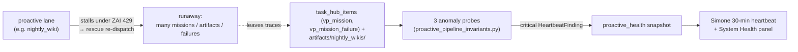

# Proactive-Lane Runaway Protection

This doc owns the **runaway-detection backstop** for proactive autonomous lanes, and records the
**deferred design** of the deeper universal dispatch guardrail. It exists because of a real incident
(below) where a lane meant to do one unit of work did ~130, undetected, for a full day.

## The incident that motivated it (2026-06-14)

The nightly-wiki lane (`nightly_wiki_agent.py::main`, systemd timer `universal-agent-nightly-wiki.timer`,
~3:15 AM CT) is **designed to build one NotebookLM wiki per night** from the day's top proactive signal
card (`UA_DAILY_PROACTIVE_WIKI_COUNT` default 1). On 2026-06-14 it instead created **~132 NotebookLM
notebooks** (109 identically titled "Hierarchical Planning for Long Context Agents").

Two independent failures combined:

1. **The runaway mechanism.** The single nightly `proactive_wiki` mission dispatched to ATLAS stalled with
   `stale_claim_expired` (the agent's claim lapsed before the slow NotebookLM work finished — root cause a
   persistent **ZAI 429 throttle**, not a transient blip). `wiki_rescue_policy.py::_is_transient` classifies
   `stale_claim_expired` as transient, so `wiki_rescue_driver.py::maybe_rescue_failed_wiki_mission`
   re-dispatched it. The re-dispatch path (`vp_orchestration.py::_vp_dispatch_mission_redispatch_fresh_impl`)
   mints a **fresh `mission_id`** via a UUID-suffixed idempotency key, which resets the per-mission retry
   budget (`wiki_rescue_policy.py::MAX_ATLAS_RETRIES`). With no aggregate ceiling, "max 2 retries" became
   effectively unbounded, and each fresh ATLAS (ZAI) mission re-ran the NotebookLM pipeline.

2. **The detection blind spot.** Every probe in `proactive_pipeline_invariants.py` was, until this change, a
   **freshness / silence** check — it fires when a lane goes *quiet*. `nightly_wiki_persistent_silence` only
   fires after **7 days** with no wiki, so a day with 132 wikis read as a healthy, busy day. There was no
   probe for a lane going *loud*. Compounding it, the human-in-the-loop escalation (`vp_failure_rescue.py`
   surfacing `vp_mission_failure` tasks to Simone) was effectively dead — historically 0 of 152 failures were
   ever actioned — so even surfaced failures went nowhere.

The lane was orchestrated by ATLAS, which routes to **ZAI/GLM**, so the storm burned ZAI tokens (full agent
context per re-dispatch) on top of the operator's Gemini/NotebookLM quota — the canonical shape of *untracked*
spend: intended = 1 unit, actual = ~130.

## What shipped: the detection backstop (this PR)

Three new anomaly invariants in `proactive_pipeline_invariants.py`. They register on import via the
`@invariant` decorator (`pipeline_invariants.py::invariant`), are executed each cycle by
`pipeline_invariants.py::run_invariants` (driven by `proactive_health.py`), and surface as
`HeartbeatFinding` objects in category `proactive_health` — read into Simone's heartbeat and the Mission
Control System Health panel. They are read-only and **fail open** (return `None` on a missing
connection / artifacts dir / query error) like every other probe.

| Invariant (`::symbol`) | Fires when | Signal source | Severity |
|---|---|---|---|
| `nightly_wiki_artifact_volume_anomaly` | > `NIGHTLY_WIKI_DAILY_VOLUME_CEILING` (6) `*_wiki_*` files written under `artifacts/nightly_wikis/` in one Houston day | filesystem | critical |
| `proactive_mission_dispatch_storm` | a low-frequency `mission_type` exceeds its cap in `PROACTIVE_MISSION_DISPATCH_CEILINGS` over 24h | `task_hub_items` `source_kind='vp_mission'`, grouped by metadata `mission_type` | critical |
| `vp_rescue_chain_storm` | any `rescue_chain_id` reaches `VP_RESCUE_CHAIN_FAILURE_CEILING` (4) failure rows / `failure_count` in 24h (past the bounded rescue budget) | `task_hub_items` `source_kind='vp_mission_failure'`, grouped by metadata `rescue_chain_id` | critical |

Design choices:

- **Filesystem + dispatch + rescue, three angles.** The notebooks themselves are created on Google's side via
  MCP and leave no row in `proactive_artifacts`, so a generic artifact-table probe would have missed this. The
  three probes triangulate on the traces that *do* exist locally: downloaded files, `vp_mission` rows, and
  `vp_mission_failure` rows. On the 2026-06-14 data the volume probe (14 files > 6) and the dispatch probe
  (4 `proactive_wiki` missions > 3) both fire; the rescue-chain probe is the lane-agnostic net for worse storms.
- **`vp_rescue_chain_storm` is intentionally lane-agnostic** — it catches the same re-dispatch-storm shape in
  *any* mission type (briefings, proactive reports, atlas direct dispatch), per the audit that flagged those
  lanes as sharing the exposure.
- **High-baseline lanes are omitted** from `PROACTIVE_MISSION_DISPATCH_CEILINGS` (Cody `task`/`code_generation`,
  convergence `intel_brief`) — their normal daily volume is high and a flat ceiling would false-fire. Only the
  once/twice-daily proactive lanes are capped.
- **Tunable without a deploy.** `UA_NIGHTLY_WIKI_VOLUME_CEILING` and `UA_VP_RESCUE_CHAIN_FAILURE_CEILING`
  override the defaults (`proactive_pipeline_invariants.py::_int_env`). Raise the volume ceiling if you ever
  raise `UA_DAILY_PROACTIVE_WIKI_COUNT`.

### Operating response when a probe fires

1. Pause the offending lane (for nightly-wiki:
   `sudo systemctl disable --now universal-agent-nightly-wiki.timer`).
2. Inspect the rescue chain (`runbook_command` on each invariant prints the exact query / `find`).
3. Clean up any duplicate external artifacts (e.g. `nlm notebook delete <id>` for NotebookLM).
4. Re-enable the lane once the underlying stall (typically ZAI 429) has cleared.

## Deferred: the universal dispatch guardrail (PR B — DESIGN ONLY, NOT BUILT)

> **Status: deferred by operator decision on 2026-06-14.** The detection backstop above is the chosen
> near-term safety net. This section records the deeper *prevention* design so it can be built later without
> re-deriving it. **None of the changes below are implemented.**

The backstop *detects and alarms*; it does not *prevent* the storm. Prevention requires closing the
mechanism at the shared VP-mission dispatch/rescue chokepoint, so it protects every lane at once.

**Missing mechanisms (root):**

1. **No idempotent side-effects.** Each retry re-creates external state (a new NotebookLM notebook) instead of
   resuming the prior one.
2. **Re-dispatch resets the retry budget.** `vp_orchestration.py::_vp_dispatch_mission_redispatch_fresh_impl`
   uses a UUID-suffixed idempotency key, so each rescue is a *new* `mission_id` with a fresh
   `MAX_ATLAS_RETRIES`. The per-mission cap in `wiki_rescue_policy.py::decide_wiki_rescue` never accumulates
   across the chain.
3. **No aggregate ceiling** on (re)dispatches or side-effects per lane/topic/day that survives mission
   re-creation.
4. **Persistent throttle treated as transient.** `wiki_rescue_policy.py::_is_transient` retries
   `stale_claim_expired` even when the cause is a sustained ZAI 429; the worker loop reports the 429 to the
   capacity governor but does not back off or circuit-break before re-dispatching.

**Fix sketch (surface level), all at the shared chokepoint:**

- **Deterministic rescue idempotency key** in `_vp_dispatch_mission_redispatch_fresh_impl` (drop the UUID
  suffix) so all rescues in a chain resolve to one `mission_id` — `vp/dispatcher.py::dispatch_mission` then
  returns the existing mission instead of creating a new one.
- **Per-chain / per-day ceiling** persisted in a durable store and checked in
  `vp_failure_rescue.py::surface_failure_to_simone` (or `wiki_rescue_policy.py::decide_wiki_rescue`): once a
  rescue chain exceeds N total failures or N successful side-effects, force escalate, never re-dispatch.
- **Throttle circuit-breaker**: when reaping a stale claim under an active ZAI 429
  (`gateway_server.py::_vp_is_running_mission_stale`), stamp a non-transient failure mode so the policy
  escalates instead of hot-retrying into the wall.

Pairing the deferred prevention with the shipped detection would make a recurrence both *impossible to
sustain* and *loud within minutes*. Until then, the detection backstop is the guarantee.

## Related

- Heartbeat / proactive-health surfacing: `services/proactive_health.py`, `services/pipeline_invariants.py`.
- Dormancy scope (these anomaly probes run regardless of the active window — a runaway at 3 AM is still
  critical): [`03_dormancy_and_operating_hours.md`](03_dormancy_and_operating_hours.md).
- Recurring incident classes + recovery: [`05_incident_response_patterns.md`](05_incident_response_patterns.md).
