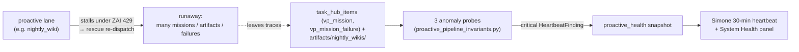

# Proactive-Lane Runaway Protection

This doc owns the **runaway-detection backstop** for proactive autonomous lanes, and records the
**deferred design** of the deeper universal dispatch guardrail. It exists because of a real incident
(below) where a lane meant to do one unit of work did ~130, undetected, for a full day.

## The incident that motivated it (2026-06-14)

The nightly-wiki lane (`nightly_wiki_agent.py::main`, systemd timer `universal-agent-nightly-wiki.timer`,
~3:15 AM CT) is **designed to build one NotebookLM wiki per night** from the day's top proactive signal
card (`UA_DAILY_PROACTIVE_WIKI_COUNT` default 1). On 2026-06-14 it instead created **~132 NotebookLM
notebooks** (109 identically titled "Hierarchical Planning for Long Context Agents").

Two independent failures combined:

1. **The runaway mechanism — an *inner* per-mission loop, not unbounded re-dispatch.** The single nightly
   `proactive_wiki` mission stalled with `stale_claim_expired` (the agent's claim lapsed before the slow
   NotebookLM work finished — root cause a persistent **ZAI 429 throttle**). The rescue path retried it, but
   the **rescue budget held**: production forensics for 2026-06-14 show only **4 `proactive_wiki` missions in
   one rescue chain of 3** (failed → failed → completed). `vp_orchestration.py::_next_chain_id` preserves the
   `rescue_chain_id` across re-dispatch and `vp_failure_rescue.py::_count_chain_failures` accumulates it, so
   `wiki_rescue_policy.py::decide_wiki_rescue` escalates past `MAX_TOTAL_RESCUES`. (The UUID in the rescue
   idempotency key is only there to permit a genuinely fresh workspace; it does **not** reset the chain
   count.) The ~132 notebooks instead came from the **inner loop**: each flailing mission's ATLAS agent ran
   `nlm notebook create` repeatedly — creating a *new* notebook on every retry of its research/studio steps
   instead of reusing the one it made (~33 notebooks/mission). The wiki mission runs as a `claude --print`
   subprocess (`vp/clients/claude_cli_client.py`), so it is outside the in-process `hooks.py` PreToolUse
   path — a hook-level cap there would not fire for it.

2. **The detection blind spot.** Every probe in `proactive_pipeline_invariants.py` was, until this change, a
   **freshness / silence** check — it fires when a lane goes *quiet*. `nightly_wiki_persistent_silence` only
   fires after **7 days** with no wiki, so a day with 132 wikis read as a healthy, busy day. There was no
   probe for a lane going *loud*. Compounding it, the human-in-the-loop escalation (`vp_failure_rescue.py`
   surfacing `vp_mission_failure` tasks to Simone) was effectively dead — historically 0 of 152 failures were
   ever actioned — so even surfaced failures went nowhere.

The lane was orchestrated by ATLAS, which routes to **ZAI/GLM**, so the storm burned ZAI tokens (full agent
context per re-dispatch) on top of the operator's Gemini/NotebookLM quota — the canonical shape of *untracked*
spend: intended = 1 unit, actual = ~130.

## What shipped: the detection backstop (this PR)

Three new anomaly invariants in `proactive_pipeline_invariants.py`. They register on import via the
`@invariant` decorator (`pipeline_invariants.py::invariant`), are executed each cycle by
`pipeline_invariants.py::run_invariants` (driven by `proactive_health.py`), and surface as
`HeartbeatFinding` objects in category `proactive_health` — read into Simone's heartbeat and the Mission
Control System Health panel. They are read-only and **fail open** (return `None` on a missing
connection / artifacts dir / query error) like every other probe.

| Invariant (`::symbol`) | Fires when | Signal source | Severity |
|---|---|---|---|
| `nightly_wiki_artifact_volume_anomaly` | > `NIGHTLY_WIKI_DAILY_VOLUME_CEILING` (6) `*_wiki_*` files written under `artifacts/nightly_wikis/` in one Houston day | filesystem | critical |
| `proactive_mission_dispatch_storm` | a low-frequency `mission_type` exceeds its cap in `PROACTIVE_MISSION_DISPATCH_CEILINGS` over 24h | `task_hub_items` `source_kind='vp_mission'`, grouped by metadata `mission_type` | critical |
| `vp_rescue_chain_storm` | any `rescue_chain_id` reaches `VP_RESCUE_CHAIN_FAILURE_CEILING` (4) failure rows / `failure_count` in 24h (past the bounded rescue budget) | `task_hub_items` `source_kind='vp_mission_failure'`, grouped by metadata `rescue_chain_id` | critical |

Design choices:

- **Filesystem + dispatch + rescue, three angles.** The notebooks themselves are created on Google's side via
  MCP and leave no row in `proactive_artifacts`, so a generic artifact-table probe would have missed this. The
  three probes triangulate on the traces that *do* exist locally: downloaded files, `vp_mission` rows, and
  `vp_mission_failure` rows. On the 2026-06-14 data the volume probe (14 files > 6) and the dispatch probe
  (4 `proactive_wiki` missions > 3) both fire; the rescue-chain probe is the lane-agnostic net for worse storms.
- **`vp_rescue_chain_storm` is intentionally lane-agnostic** — it catches the same re-dispatch-storm shape in
  *any* mission type (briefings, proactive reports, atlas direct dispatch), per the audit that flagged those
  lanes as sharing the exposure.
- **High-baseline lanes are omitted** from `PROACTIVE_MISSION_DISPATCH_CEILINGS` (Cody `task`/`code_generation`,
  convergence `intel_brief`) — their normal daily volume is high and a flat ceiling would false-fire. Only the
  once/twice-daily proactive lanes are capped.
- **Tunable without a deploy.** `UA_NIGHTLY_WIKI_VOLUME_CEILING` and `UA_VP_RESCUE_CHAIN_FAILURE_CEILING`
  override the defaults (`proactive_pipeline_invariants.py::_int_env`). Raise the volume ceiling if you ever
  raise `UA_DAILY_PROACTIVE_WIKI_COUNT`.

### Operating response when a probe fires

1. Pause the offending lane (for nightly-wiki:
   `sudo systemctl disable --now universal-agent-nightly-wiki.timer`).
2. Inspect the rescue chain (`runbook_command` on each invariant prints the exact query / `find`).
3. Clean up any duplicate external artifacts (e.g. `nlm notebook delete <id>` for NotebookLM).
4. Re-enable the lane once the underlying stall (typically ZAI 429) has cleared.

## What shipped: the inner-loop prevention (create-once + daily cap)

Because production forensics localized the multiplier to the **inner per-mission loop** (not unbounded
re-dispatch — the rescue budget already binds), the prevention is enforced in the one lane that creates wiki
notebooks: `nightly_wiki_agent.py`.

- **Project-wide daily hard cap** — `nightly_wiki_agent.py::_wiki_daily_hard_cap` (env
  `UA_DAILY_PROACTIVE_WIKI_HARD_CAP`, default **3**). A deterministic dispatch-time pre-flight
  (`_count_wiki_notebooks_today` → `_count_wikis_today_from_list`, which counts today's account notebooks via
  `nlm notebook list --json`, excluding the `Paper to Podcast:` lane) **skips the dispatch entirely** once the
  day's wiki notebooks reach the cap, and otherwise **clamps** this run's `wiki_count` to the remaining
  budget. Fail-open: a transient `nlm` error counts 0 (never blocks the nightly), with the create-once
  objective + the PR-A anomaly probes as backstops.
- **Create-once objective hardening** — the dispatched mission objective now carries explicit HARD LIMITS:
  create each topic's notebook **exactly once**, capture its `<id>`, **reuse** it for every later step, and
  **never** run `nlm notebook create` again for a topic (retry with the same id or abandon after 3 failures).
  This directly counters the retry-creates-new behavior that produced ~33 notebooks/mission. It is
  instruction-level (the wiki agent is a `claude --print` subprocess outside the in-process hook path), backed
  by the deterministic dispatch cap and PR-A detection.

Net effect: the day's wiki-notebook creation is bounded at the cap by the deterministic pre-flight, and each
mission is steered to a single notebook by the objective — converting the worst case from ~130/day to ≤ the
cap. A truly machine-enforced *per-create* cap (a PreToolUse hook in the wiki subprocess's settings, or an
`nlm` wrapper) remains the belt-and-suspenders follow-up.

## Deferred: the universal dispatch guardrail (PR B — DESIGN ONLY, NOT BUILT)

> **Status: deferred by operator decision on 2026-06-14.** The detection backstop + the wiki-lane cap above
> are the chosen near-term fix. This section records the deeper *generalized* prevention design so it can be
> built later without re-deriving it. **None of the changes below are implemented.**

The wiki-lane cap fixes the lane that actually ran away; a *generalized* guardrail would protect every VP
lane at the shared dispatch/rescue chokepoint. Note the rescue budget itself is **not** broken — it binds
per chain today (verified in the incident forensics above).

**Missing mechanisms (root) for a generalized guardrail:**

1. **No idempotent side-effects at the tool boundary.** Side-effects (a NotebookLM notebook, an email) are
   created by agent tool calls with no deterministic reuse-by-key / per-day cap a flailing agent cannot
   bypass. The wiki-lane cap above is the lane-specific version of this.
2. **No aggregate per-lane ceiling** on side-effects that is enforced for *every* lane (only the wiki lane has
   one now), nor a generic per-lane/day dispatch ceiling that survives mission re-creation.
3. **Persistent throttle treated as transient.** `wiki_rescue_policy.py::_is_transient` retries
   `stale_claim_expired` even when the cause is a sustained ZAI 429; the worker loop reports the 429 to the
   capacity governor but does not back off or circuit-break before re-dispatching. (Bounded by the rescue
   budget today, but it still spends a few full ATLAS contexts retrying into a throttle.)

**Fix sketch (surface level), all at the shared chokepoint:**

- **Deterministic rescue idempotency key** in `_vp_dispatch_mission_redispatch_fresh_impl` (drop the UUID
  suffix) so all rescues in a chain resolve to one `mission_id` — `vp/dispatcher.py::dispatch_mission` then
  returns the existing mission instead of creating a new one.
- **Per-chain / per-day ceiling** persisted in a durable store and checked in
  `vp_failure_rescue.py::surface_failure_to_simone` (or `wiki_rescue_policy.py::decide_wiki_rescue`): once a
  rescue chain exceeds N total failures or N successful side-effects, force escalate, never re-dispatch.
- **Throttle circuit-breaker**: when reaping a stale claim under an active ZAI 429
  (`gateway_server.py::_vp_is_running_mission_stale`), stamp a non-transient failure mode so the policy
  escalates instead of hot-retrying into the wall.

Pairing the deferred prevention with the shipped detection would make a recurrence both *impossible to
sustain* and *loud within minutes*. Until then, the detection backstop is the guarantee.

## Related

- Heartbeat / proactive-health surfacing: `services/proactive_health.py`, `services/pipeline_invariants.py`.
- Dormancy scope (these anomaly probes run regardless of the active window — a runaway at 3 AM is still
  critical): [`03_dormancy_and_operating_hours.md`](03_dormancy_and_operating_hours.md).
- Recurring incident classes + recovery: [`05_incident_response_patterns.md`](05_incident_response_patterns.md).
