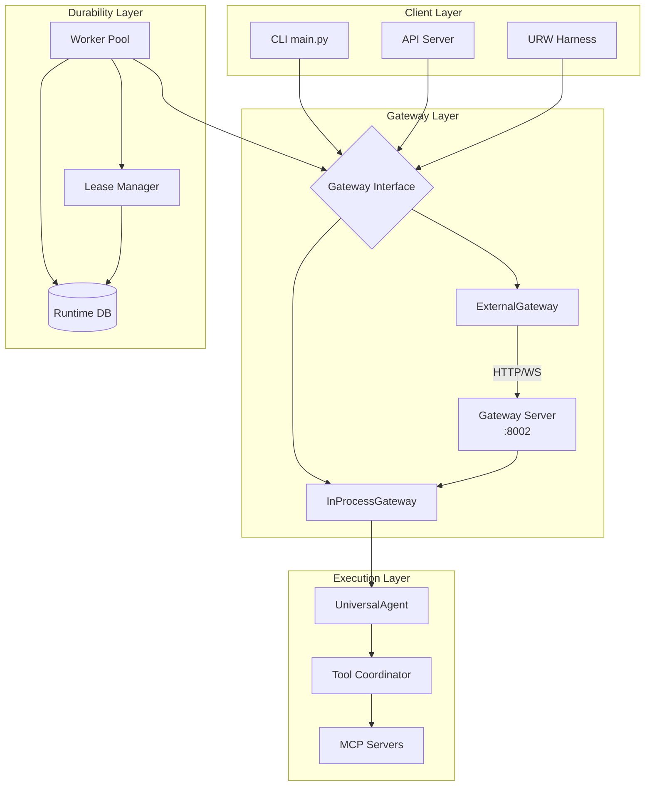
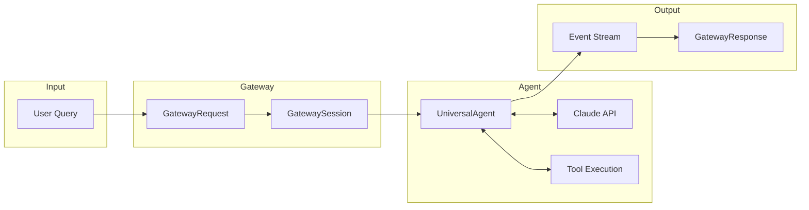
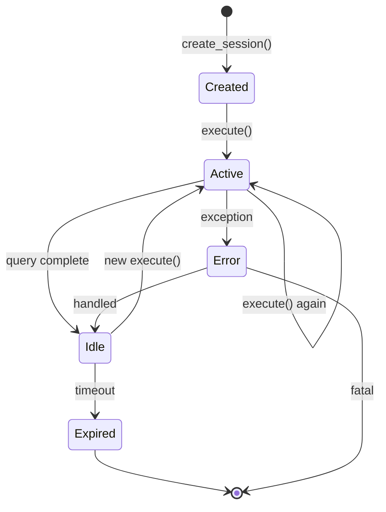

# UA Gateway Architecture Overview

## Design Principles

1. **Separation of Concerns** — Gateway handles session/execution lifecycle; agent handles LLM interaction
2. **Protocol Agnostic** — Same interface for in-process and remote execution
3. **Event-Driven** — All output flows through typed event streams
4. **Durable by Default** — Runs can survive worker failures and resume
5. **Backwards Compatible** — CLI behavior unchanged without gateway flags

---

## High-Level Architecture



---

## Component Responsibilities

### Gateway Interface (`gateway.py`)

The `Gateway` protocol defines the contract for all gateway implementations:

```python
class Gateway(Protocol):
    async def create_session(self, user_id: str, workspace_dir: Optional[str] = None) -> GatewaySession
    async def get_session(self, session_id: str) -> Optional[GatewaySession]
    async def execute(self, session: GatewaySession, request: GatewayRequest) -> AsyncIterator[AgentEvent]
    async def run_query(self, session: GatewaySession, request: GatewayRequest) -> GatewayResponse
```

### InProcessGateway

- Creates `UniversalAgent` instances directly
- Manages sessions in-memory with `AgentSetup` caching
- Streams events from `agent.run_query()` directly

### ExternalGateway

- HTTP client for session management (`POST /sessions`, `GET /sessions/{id}`)
- WebSocket client for streaming execution (`WS /sessions/{id}/execute`)
- Automatic reconnection and error handling

### Gateway Server (`gateway_server.py`)

- FastAPI application on port 8002
- REST endpoints for session CRUD
- WebSocket endpoint for streaming execution
- Uses `InProcessGateway` internally

---

## Data Flow



---

## Session Lifecycle



### Session Data Model

```python
@dataclass
class GatewaySession:
    session_id: str           # Unique identifier
    user_id: str              # Owner identifier
    workspace_dir: str        # Bound workspace path
    created_at: datetime      # Creation timestamp
    metadata: Dict[str, Any]  # Extension data
```

---

## Event Types

All agent output flows through typed events:

| Event Type | Description | Data Fields |
|------------|-------------|-------------|
| `TEXT` | LLM text output | `text` |
| `TOOL_CALL` | Tool invocation | `id`, `name`, `input` |
| `TOOL_RESULT` | Tool response | `tool_call_id`, `result` |
| `THINKING` | Model reasoning | `text` |
| `STATUS` | Progress update | `message` |
| `ERROR` | Error occurred | `error`, `code` |
| `SESSION_INFO` | Session metadata | `session_id`, `workspace` |
| `ITERATION_END` | Turn complete | `iteration` |
| `WORK_PRODUCT` | File created | `path`, `type` |
| `URW_PHASE_START` | URW phase began | `phase_id`, `phase_name` |
| `URW_PHASE_COMPLETE` | URW phase done | `phase_id`, `success` |
| `URW_PHASE_FAILED` | URW phase failed | `phase_id`, `error` |
| `URW_EVALUATION` | URW evaluation | `result`, `notes` |

---

## Configuration

### Environment Variables

| Variable | Default | Description |
|----------|---------|-------------|
| `UA_USE_GATEWAY` | `0` | Enable in-process gateway |
| `UA_GATEWAY_URL` | - | External gateway server URL |
| `UA_DEV_GATEWAY_DEFAULT` | `0` | Gateway default in dev mode |

### CLI Arguments

```bash
--use-gateway          # Enable in-process gateway
--gateway-url URL      # Connect to external gateway (implies --use-gateway)
--gateway-use-cli-workspace  # Use CLI cwd as gateway workspace
```

---

## Error Handling

### Gateway Errors

```python
class GatewayError(Exception):
    """Base class for gateway errors."""

class SessionNotFoundError(GatewayError):
    """Session does not exist."""

class SessionExpiredError(GatewayError):
    """Session has expired."""

class ExecutionError(GatewayError):
    """Error during query execution."""
```

### Graceful Degradation

- If external gateway unreachable → Fall back to in-process
- If gateway disabled → Direct agent execution (legacy path)
- If lease lost → Release work, allow another worker to take over
