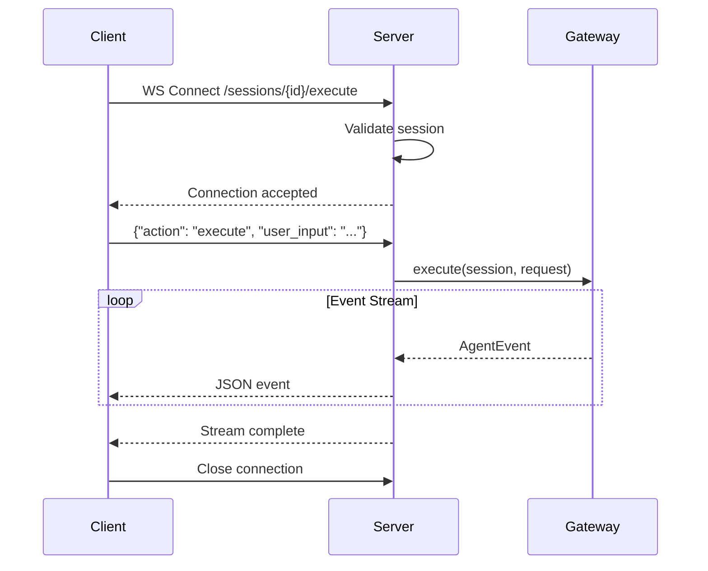
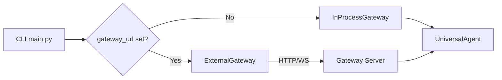

# External Gateway Server & Client

## Overview

Stage 4 introduces the ability to run the gateway as a standalone HTTP/WebSocket server, enabling:

- **Separation of concerns** — Agent execution in dedicated process
- **Resource isolation** — Memory/CPU limits per gateway instance
- **Horizontal scaling** — Multiple gateway servers behind load balancer
- **Language agnostic** — Any HTTP/WS client can connect

---

## Gateway Server

### Starting the Server

```bash
# Default port 8002
python -m universal_agent.gateway_server

# Custom port
UA_GATEWAY_PORT=8080 python -m universal_agent.gateway_server

# With uvicorn options
uvicorn universal_agent.gateway_server:app --host 0.0.0.0 --port 8002 --workers 4
```

### Server Architecture

```mermaid
graph TB
    subgraph "Gateway Server :8002"
        FAST[FastAPI App]
        
        subgraph "REST Endpoints"
            POST[POST /sessions]
            GET[GET /sessions/{id}]
            LIST[GET /sessions]
            DEL[DELETE /sessions/{id}]
        end
        
        subgraph "WebSocket"
            WS[WS /sessions/{id}/execute]
        end
        
        IPG[InProcessGateway]
        SESSIONS[(Session Store)]
    end
    
    CLIENT[Client] --> POST
    CLIENT --> GET
    CLIENT --> LIST
    CLIENT --> WS
    
    POST --> IPG
    GET --> SESSIONS
    WS --> IPG
    IPG --> SESSIONS
```

---

## REST API Endpoints

### Create Session

```http
POST /sessions
Content-Type: application/json

{
  "user_id": "user_123",
  "workspace_dir": "/home/user/project"
}
```

**Response:**

```json
{
  "session_id": "sess_abc123def456",
  "user_id": "user_123",
  "workspace_dir": "/home/user/project",
  "created_at": "2026-01-24T08:00:00Z",
  "metadata": {}
}
```

### Get Session

```http
GET /sessions/{session_id}
```

**Response:**

```json
{
  "session_id": "sess_abc123def456",
  "user_id": "user_123",
  "workspace_dir": "/home/user/project",
  "created_at": "2026-01-24T08:00:00Z",
  "metadata": {}
}
```

**Error (404):**

```json
{
  "detail": "Session not found"
}
```

### List Sessions

```http
GET /sessions?user_id=user_123
```

**Response:**

```json
{
  "sessions": [
    {
      "session_id": "sess_abc123",
      "user_id": "user_123",
      "workspace_dir": "/home/user/project1",
      "created_at": "2026-01-24T08:00:00Z"
    },
    {
      "session_id": "sess_def456",
      "user_id": "user_123",
      "workspace_dir": "/home/user/project2",
      "created_at": "2026-01-24T09:00:00Z"
    }
  ]
}
```

### Delete Session

```http
DELETE /sessions/{session_id}
```

**Response:**

```json
{
  "deleted": true
}
```

### Health Check

```http
GET /health
```

**Response:**

```json
{
  "status": "healthy",
  "version": "1.0.0",
  "sessions_active": 5
}
```

---

## WebSocket Execution

### Connection

```
WS /sessions/{session_id}/execute
```

### Client → Server Message

```json
{
  "action": "execute",
  "user_input": "List files in current directory",
  "context": {},
  "max_iterations": 25
}
```

### Server → Client Messages

Events streamed as JSON lines:

```json
{"type": "session_info", "data": {"session_id": "sess_abc"}, "timestamp": "..."}
{"type": "text", "data": {"text": "I'll list the files"}, "timestamp": "..."}
{"type": "tool_call", "data": {"id": "call_1", "name": "ListDir", "input": {...}}, "timestamp": "..."}
{"type": "tool_result", "data": {"tool_call_id": "call_1", "result": "..."}, "timestamp": "..."}
{"type": "text", "data": {"text": "Here are the files:\n"}, "timestamp": "..."}
{"type": "iteration_end", "data": {"iteration": 1}, "timestamp": "..."}
```

### Connection Lifecycle



---

## ExternalGateway Client

### Basic Usage

```python
from universal_agent.gateway import ExternalGateway, GatewayRequest

async def main():
    gateway = ExternalGateway(base_url="http://localhost:8002")
    
    # Create session
    session = await gateway.create_session(
        user_id="user_123",
        workspace_dir="/home/user/project",
    )
    
    # Execute query
    request = GatewayRequest(user_input="List files")
    async for event in gateway.execute(session, request):
        print(f"{event.type}: {event.data}")
    
    # Cleanup
    await gateway.close()

asyncio.run(main())
```

### Context Manager

```python
async with ExternalGateway("http://localhost:8002") as gateway:
    session = await gateway.create_session(user_id="user")
    response = await gateway.run_query(session, GatewayRequest(user_input="Hello"))
    print(response.output)
```

### Error Handling

```python
from universal_agent.gateway import ExternalGateway, GatewayError
import aiohttp

try:
    gateway = ExternalGateway("http://localhost:8002")
    session = await gateway.create_session(user_id="user")
except aiohttp.ClientError as e:
    print(f"Connection failed: {e}")
except GatewayError as e:
    print(f"Gateway error: {e}")
```

---

## CLI Integration

### Using External Gateway from CLI

```bash
# Set gateway URL
python -m universal_agent --gateway-url http://localhost:8002 "List files"

# Via environment variable
export UA_GATEWAY_URL=http://localhost:8002
python -m universal_agent "List files"
```

### How It Works



---

## Deployment Considerations

### Single Instance

```bash
# Simple deployment
python -m universal_agent.gateway_server
```

### Behind Reverse Proxy

```nginx
upstream gateway {
    server 127.0.0.1:8002;
}

server {
    listen 80;
    
    location / {
        proxy_pass http://gateway;
        proxy_http_version 1.1;
        proxy_set_header Upgrade $http_upgrade;
        proxy_set_header Connection "upgrade";
        proxy_set_header Host $host;
    }
}
```

### Docker

```dockerfile
FROM python:3.11-slim

WORKDIR /app
COPY . .
RUN pip install -e .

EXPOSE 8002
CMD ["python", "-m", "universal_agent.gateway_server"]
```

### Scaling

```yaml
# docker-compose.yml
services:
  gateway:
    build: .
    deploy:
      replicas: 3
    ports:
      - "8002-8004:8002"
  
  nginx:
    image: nginx
    ports:
      - "80:80"
    depends_on:
      - gateway
```

---

## Security Considerations

### Current State (Development)

- No authentication required
- All sessions accessible
- Localhost binding by default

### Production Recommendations

1. **Add Authentication** — JWT or API key validation
2. **Enable TLS** — Use HTTPS/WSS in production
3. **Rate Limiting** — Prevent abuse
4. **Session Isolation** — Users can only access their own sessions
5. **Network Isolation** — Bind to internal network, use reverse proxy

### Example Auth Middleware

```python
from fastapi import Depends, HTTPException, Header

async def verify_api_key(x_api_key: str = Header(...)):
    if x_api_key != os.getenv("GATEWAY_API_KEY"):
        raise HTTPException(status_code=401, detail="Invalid API key")
    return x_api_key

@app.post("/sessions", dependencies=[Depends(verify_api_key)])
async def create_session(...):
    ...
```
