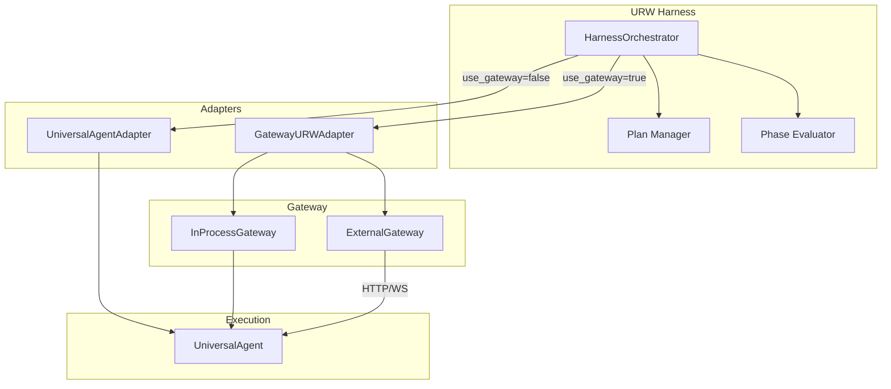
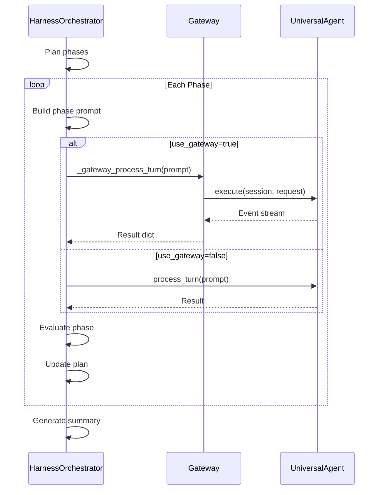
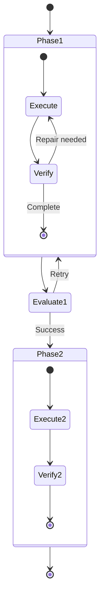

# URW (Universal Ralph Wrapper) Gateway Integration

## Overview

Stage 5 integrates the Universal Ralph Wrapper (URW) harness system with the Gateway API. This enables:

- **Unified execution path** — URW phases execute through the same gateway as interactive queries
- **Event stream visibility** — URW phase transitions emit events for monitoring
- **Distributed execution** — URW runs can leverage the worker pool for scaling

---

## Architecture



---

## GatewayURWAdapter

The `GatewayURWAdapter` implements the `AgentLoopInterface` used by URW, routing execution through the Gateway API.

### Location

`src/universal_agent/urw/integration.py`

### Class Definition

```python
class GatewayURWAdapter(BaseAgentAdapter):
    """
    URW adapter that routes execution through the Gateway API.
    
    Supports both InProcessGateway and ExternalGateway depending
    on configuration.
    """
    
    def __init__(self, config: Dict[str, Any]):
        super().__init__(config)
        self._gateway: Optional[Gateway] = None
        self._session: Optional[GatewaySession] = None
    
    async def _create_agent(self) -> Any:
        """Initialize gateway and create session."""
        gateway_url = self.config.get("gateway_url")
        
        if gateway_url:
            self._gateway = ExternalGateway(base_url=gateway_url)
        else:
            self._gateway = InProcessGateway()
        
        workspace_dir = str(self._workspace_path) if self._workspace_path else None
        
        self._session = await self._gateway.create_session(
            user_id="urw_adapter",
            workspace_dir=workspace_dir,
        )
        
        return self._gateway
    
    async def _run_agent(
        self,
        agent: Any,  # Actually the gateway
        prompt: str,
        workspace_path: Path,
    ) -> AgentExecutionResult:
        """Execute prompt through gateway and collect results."""
        # ... event collection and result building
```

### Usage

```python
from universal_agent.urw.integration import create_adapter_for_system

# Create gateway adapter
adapter = create_adapter_for_system("gateway", {
    "gateway_url": "http://localhost:8002",  # Optional: use external
    "verbose": True,
})

# Initialize workspace
await adapter.initialize_workspace(Path("/tmp/urw_workspace"))

# Execute task
result = await adapter.execute_task("Analyze the codebase and create a report")

print(f"Success: {result.success}")
print(f"Output: {result.output}")
print(f"Artifacts: {result.artifacts_produced}")
```

---

## HarnessOrchestrator Gateway Mode

The `HarnessOrchestrator` can optionally route phase execution through the gateway.

### Configuration

```python
@dataclass
class HarnessConfig:
    max_retry_per_phase: int = 3
    force_new_client_between_phases: bool = False
    persist_to_sqlite: bool = True
    verbose: bool = True
    
    # Stage 5: Gateway integration
    use_gateway: bool = False
    gateway_url: Optional[str] = None  # If set, use external gateway
```

### Usage

```python
from universal_agent.urw.harness_orchestrator import HarnessOrchestrator, HarnessConfig

# Create orchestrator with gateway enabled
config = HarnessConfig(
    use_gateway=True,
    gateway_url="http://localhost:8002",  # Optional
    verbose=True,
)

orchestrator = HarnessOrchestrator(
    workspaces_root=Path("/tmp/urw_workspaces"),
    config=config,
)

# Run harness (phases will execute through gateway)
result = await orchestrator.run(
    massive_request="Build a complete web application...",
    process_turn=process_turn_fn,
    client=client,
)
```

### Execution Flow



---

## URW Phase Events

Stage 5 adds URW-specific event types for phase visibility:

### EventType Additions

```python
class EventType(str, Enum):
    # ... existing events ...
    
    # URW Phase Events (Stage 5)
    URW_PHASE_START = "urw_phase_start"
    URW_PHASE_COMPLETE = "urw_phase_complete"
    URW_PHASE_FAILED = "urw_phase_failed"
    URW_EVALUATION = "urw_evaluation"
```

### Event Data

```python
# Phase Start
AgentEvent(
    type=EventType.URW_PHASE_START,
    data={
        "phase_id": "phase_001",
        "phase_name": "Data Collection",
        "task_count": 5,
        "session_path": "/tmp/urw/phase_001",
    }
)

# Phase Complete
AgentEvent(
    type=EventType.URW_PHASE_COMPLETE,
    data={
        "phase_id": "phase_001",
        "phase_name": "Data Collection",
        "success": True,
        "artifacts": ["data.csv", "summary.json"],
        "duration_seconds": 45.2,
    }
)

# Phase Failed
AgentEvent(
    type=EventType.URW_PHASE_FAILED,
    data={
        "phase_id": "phase_001",
        "phase_name": "Data Collection",
        "error": "API rate limit exceeded",
        "retry_count": 3,
        "will_retry": False,
    }
)

# Evaluation Result
AgentEvent(
    type=EventType.URW_EVALUATION,
    data={
        "phase_id": "phase_001",
        "is_complete": True,
        "missing_elements": [],
        "suggested_actions": [],
        "artifacts_found": ["data.csv"],
    }
)
```

### Monitoring Phase Progress

```python
async for event in gateway.execute(session, request):
    if event.type == EventType.URW_PHASE_START:
        print(f"▶ Starting phase: {event.data['phase_name']}")
    
    elif event.type == EventType.URW_PHASE_COMPLETE:
        if event.data['success']:
            print(f"✅ Phase complete: {event.data['phase_name']}")
        
    elif event.type == EventType.URW_PHASE_FAILED:
        print(f"❌ Phase failed: {event.data['error']}")
    
    elif event.type == EventType.URW_EVALUATION:
        if not event.data['is_complete']:
            print(f"⚠ Missing: {event.data['missing_elements']}")
```

---

## Session and Workspace Management

### Workspace Binding

Each URW phase gets its own workspace directory. The gateway adapter rebinds the workspace for each phase:

```python
# In GatewayURWAdapter
async def _rebind_workspace(self, new_workspace: Path):
    """Rebind gateway session to new workspace for phase transition."""
    if self._session and self._gateway:
        self._session = await self._gateway.create_session(
            user_id="urw_adapter",
            workspace_dir=str(new_workspace),
        )
```

### Session Reuse

Within a phase, the same gateway session is reused for repair loops:



---

## Error Handling

### Gateway Unavailable

If the gateway is unavailable, the orchestrator falls back to direct execution:

```python
async def _execute_phase(self, phase, ...):
    try:
        if self.config.use_gateway and await self._get_gateway():
            result = await self._gateway_process_turn(prompt, workspace)
        else:
            # Fallback to direct process_turn
            result = await process_turn(client, prompt, workspace)
    except GatewayError as e:
        self._log(f"Gateway error, falling back: {e}")
        result = await process_turn(client, prompt, workspace)
```

### Phase Retry Logic

Phase failures trigger retries with the same gateway session:

```python
for attempt in range(max_retries + 1):
    result = await self._gateway_process_turn(prompt, workspace)
    eval_result = await self._evaluate_phase(phase, result)
    
    if eval_result.is_complete:
        return PhaseResult(success=True, ...)
    
    # Prepare repair prompt for next attempt
    prompt = f"Verification failed. Missing: {eval_result.missing_elements}"
```

---

## Best Practices

1. **Use External Gateway for Long Runs** — Isolates URW execution from crashes
2. **Monitor Phase Events** — Track progress through event stream
3. **Set Appropriate Timeouts** — URW phases can be long-running
4. **Enable Verbose Mode** — Helps debug phase evaluation issues
5. **Checkpoint Progress** — Use SQLite persistence for resumable runs
