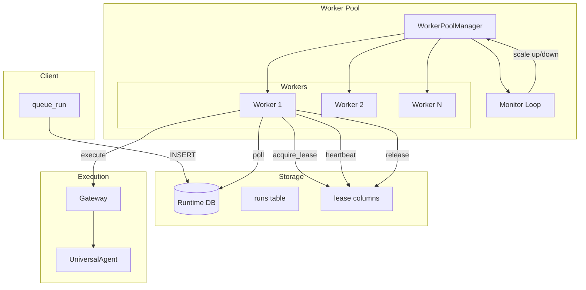
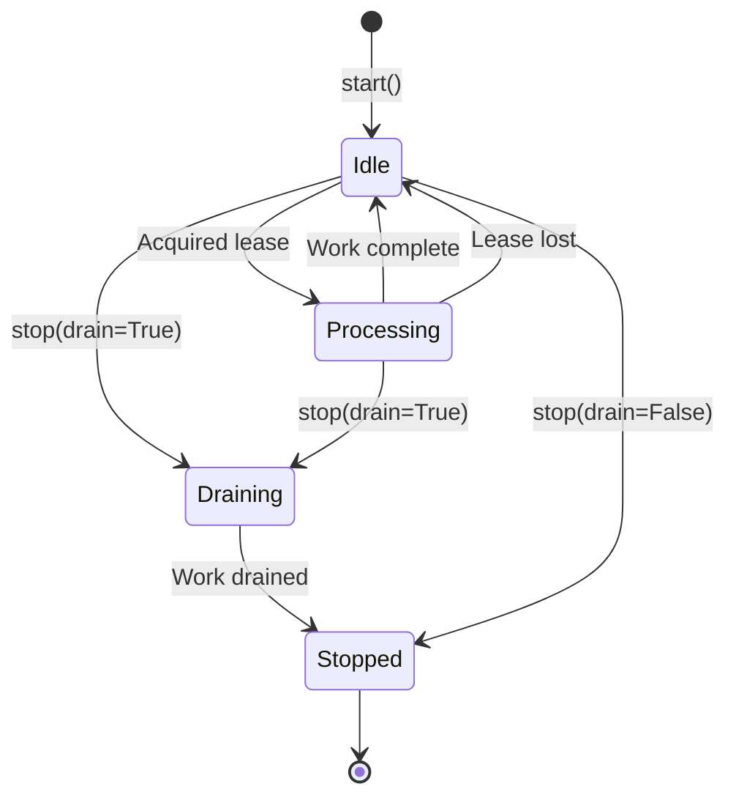
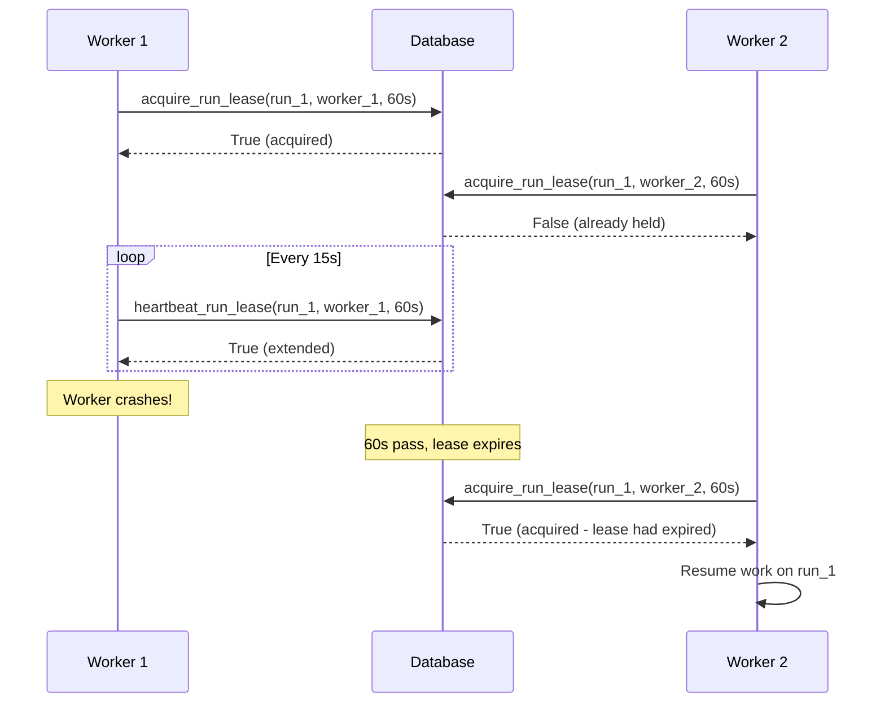
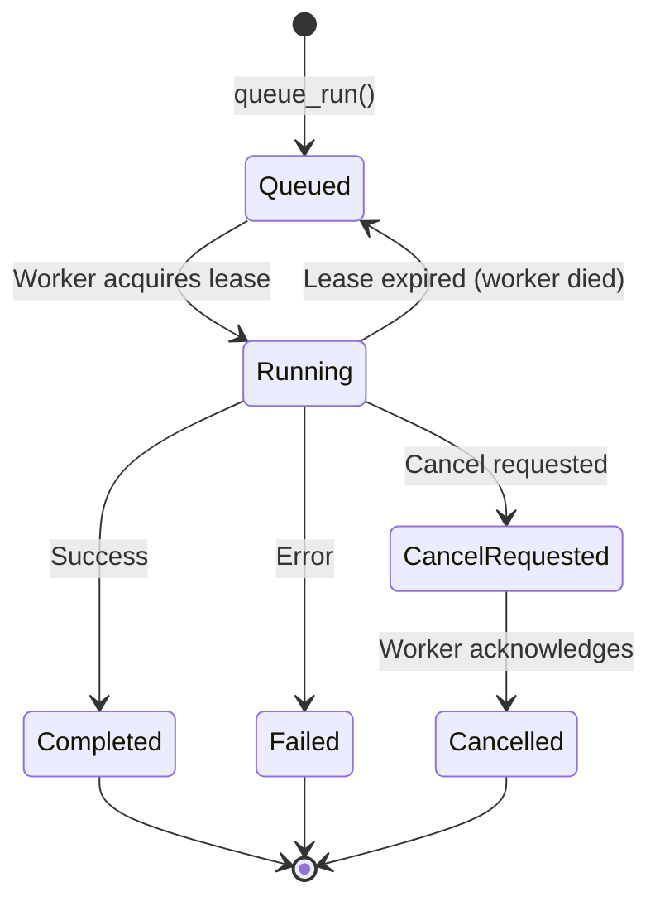
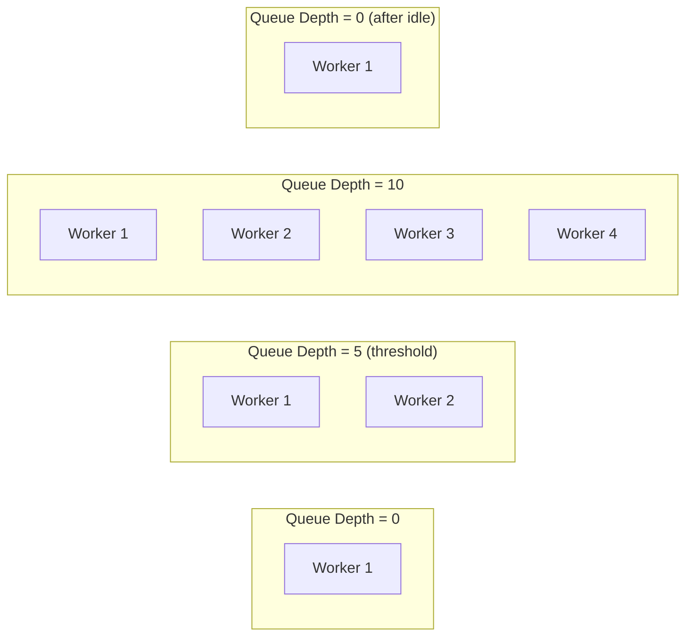

# Worker Pool & Lease Durability

## Overview

Stage 6 provides distributed execution capabilities with durable leases:

- **Worker Pool** — Multiple workers process queued runs concurrently
- **Lease Coordination** — Only one worker processes each run at a time
- **Automatic Failover** — If a worker dies, another takes over
- **Dynamic Scaling** — Pool grows/shrinks based on queue depth

---

## Architecture



---

## Core Components

### WorkerPoolManager

Manages the pool of workers with dynamic scaling.

```python
from universal_agent.durable import WorkerPoolManager, PoolConfig, WorkerConfig

# Configure pool
pool_config = PoolConfig(
    db_path="runtime.db",       # SQLite database
    min_workers=1,              # Minimum workers
    max_workers=4,              # Maximum workers
    scale_up_threshold=5,       # Queue size to trigger scale up
    scale_down_idle_seconds=300 # Idle time before scale down
)

# Configure workers
worker_config = WorkerConfig(
    lease_ttl_seconds=60,           # Lease duration
    heartbeat_interval_seconds=15,  # Heartbeat frequency
    poll_interval_seconds=5,        # Queue polling frequency
    gateway_url=None,               # Optional: external gateway
)

# Create and start pool
pool = WorkerPoolManager(pool_config, worker_config)
await pool.start()

# Get stats
stats = pool.get_pool_stats()
print(f"Active workers: {stats['total_workers']}")
print(f"Completed: {stats['total_completed']}")

# Stop pool
await pool.stop(drain=True)  # Wait for current work to finish
```

### Worker

Individual worker that polls for and processes runs.

```python
from universal_agent.durable.worker_pool import Worker, WorkerConfig

config = WorkerConfig(worker_id="worker_001")
worker = Worker(config, db_connection, run_handler)

await worker.start()
# Worker now polling for work...

await worker.stop(drain=True)
```

### Worker Lifecycle



---

## Lease System

### How Leases Work

1. **Acquire** — Worker claims a run with `acquire_run_lease()`
2. **Heartbeat** — Worker extends lease with `heartbeat_run_lease()`
3. **Release** — Worker releases lease with `release_run_lease()`
4. **Expiry** — If heartbeat stops, lease expires and run becomes available

### Lease Functions

Located in `src/universal_agent/durable/state.py`:

```python
def acquire_run_lease(
    conn: sqlite3.Connection,
    run_id: str,
    lease_owner: str,
    lease_ttl_seconds: int,
) -> bool:
    """
    Attempt to acquire lease on a run.
    
    Returns True if lease acquired, False if already held.
    Only succeeds if:
    - Run status is 'queued' or 'running'
    - No current lease OR lease has expired
    """

def heartbeat_run_lease(
    conn: sqlite3.Connection,
    run_id: str,
    lease_owner: str,
    lease_ttl_seconds: int,
) -> bool:
    """
    Extend lease TTL.
    
    Returns True if heartbeat successful, False if lease lost.
    """

def release_run_lease(
    conn: sqlite3.Connection,
    run_id: str,
    lease_owner: str,
) -> None:
    """
    Release lease on a run.
    """
```

### Lease Flow



---

## Queueing Runs

### queue_run Function

```python
from universal_agent.durable import queue_run
from universal_agent.durable.db import connect_runtime_db

conn = connect_runtime_db()

# Queue a new run
queue_run(
    conn,
    run_id="job_abc123",
    prompt="Analyze the codebase and generate a report",
    workspace_dir="/home/user/project",
    max_iterations=50,
)
```

### Run States



---

## Dynamic Scaling

### Scale Up

When queue depth exceeds threshold, new workers are spawned:

```python
# In monitor loop
if queue_depth >= self.pool_config.scale_up_threshold:
    if len(self.workers) < self.pool_config.max_workers:
        await self._spawn_worker()
```

### Scale Down

When queue is empty and workers idle, excess workers are removed:

```python
# In monitor loop
if queue_depth == 0 and len(self.workers) > self.pool_config.min_workers:
    idle_workers = [w for w in self.workers.values() if w.is_idle()]
    if idle_workers and idle_workers[0].idle_duration > scale_down_threshold:
        await self._remove_worker(idle_workers[0].worker_id)
```

### Scaling Diagram



---

## Gateway Integration

Workers execute runs through the gateway:

```python
async def _default_run_handler(self, run_id: str, workspace_dir: str) -> bool:
    """Default run handler using gateway."""
    gateway_url = self.worker_config_template.gateway_url
    
    if gateway_url:
        gateway = ExternalGateway(base_url=gateway_url)
    else:
        gateway = InProcessGateway()
    
    # Get run details from DB
    run = get_run(self.conn, run_id)
    prompt = run.get("last_job_prompt")
    
    # Create session and execute
    session = await gateway.create_session(
        user_id=f"worker_{run_id}",
        workspace_dir=workspace_dir,
    )
    
    request = GatewayRequest(user_input=prompt)
    result = await gateway.run_query(session, request)
    
    return result.success
```

### Custom Run Handler

```python
async def my_run_handler(run_id: str, workspace_dir: str) -> bool:
    """Custom run handler with special logic."""
    # Load run data
    run = get_run(conn, run_id)
    
    # Custom preprocessing
    prepared_prompt = preprocess(run["last_job_prompt"])
    
    # Execute through gateway
    gateway = InProcessGateway()
    session = await gateway.create_session(user_id="custom", workspace_dir=workspace_dir)
    result = await gateway.run_query(session, GatewayRequest(user_input=prepared_prompt))
    
    # Custom postprocessing
    if result.success:
        save_results(run_id, result)
    
    return result.success

# Use custom handler
pool = WorkerPoolManager(pool_config, worker_config, run_handler=my_run_handler)
```

---

## Monitoring

### Pool Statistics

```python
stats = pool.get_pool_stats()

# Returns:
{
    "total_workers": 3,
    "idle_workers": 1,
    "processing_workers": 2,
    "total_completed": 150,
    "total_failed": 5,
    "workers": {
        "worker_abc": {
            "status": "processing",
            "current_run": "job_123",
            "completed": 50,
            "failed": 2,
        },
        "worker_def": {
            "status": "idle",
            "current_run": None,
            "completed": 100,
            "failed": 3,
        },
    }
}
```

### Database Queries

```sql
-- Active runs
SELECT * FROM runs WHERE status = 'running';

-- Queued runs
SELECT * FROM runs WHERE status = 'queued' ORDER BY created_at;

-- Stale leases (workers that may have died)
SELECT * FROM runs 
WHERE status = 'running' 
AND lease_expires_at < datetime('now');
```

---

## Failure Scenarios

### Worker Crash

1. Worker stops heartbeating
2. Lease expires after TTL
3. Another worker acquires lease
4. Work resumes from last checkpoint

### Database Connection Lost

1. Heartbeat fails
2. Worker logs error, retries
3. If persistent, worker stops gracefully
4. Pool spawns replacement worker

### Gateway Unreachable

1. Run handler catches error
2. Run marked as failed
3. Worker returns to polling
4. Can be re-queued manually if needed
