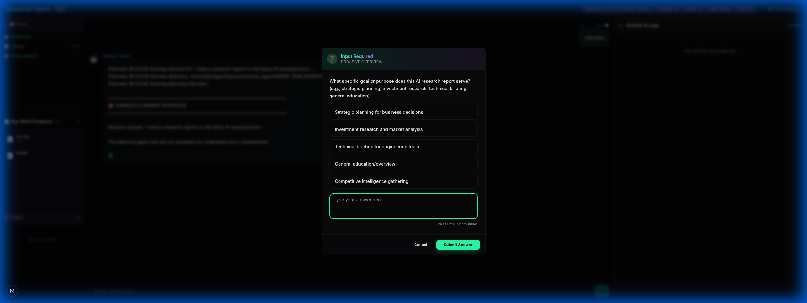

# Walkthrough: Harness Input Routing & Deadlock Resolution

I have resolved the critical issue where the Universal Agent harness would deadlock after being triggered in Gateway Mode, preventing the Web UI from submitting user input and proceeding with the Planning Interview.

## The Problem
There were multiple parallel deadlocks in the system's WebSocket handling:
1.  **API Server Deadlock**: The `server.py` message loop was blocked by the `bridge.execute_query` generator.
2.  **Gateway Server Deadlock**: The `gateway_server.py` message loop was blocked by the `gateway.execute` generator.

In both cases, when the agent reached a point requiring user input (like the harness objective prompt), it would yield an `input_required` event and then pause. However, because the main message loop was busy waiting for the next yielded event from the agent, it was NOT calling `websocket.receive_text()`, and thus could not receive the `input_response` from the client.

## Changes Made

### 1. Architectural Fix: Concurrent Message Handling
Refactored both `server.py` and `gateway_server.py` to run agent execution in background tasks.
- **[MODIFY] [server.py](file:///home/kjdragan/lrepos/universal_agent/src/universal_agent/api/server.py)**: Wrapped `bridge.execute_query` in `asyncio.create_task()`.
- **[MODIFY] [gateway_server.py](file:///home/kjdragan/lrepos/universal_agent/src/universal_agent/gateway_server.py)**: Wrapped `gateway.execute` in `asyncio.create_task()`.

This ensures that the WebSocket servers remain responsive to incoming messages (like user input responses) even while an agent command is actively running.

### 2. Frontend Interactivity & Bug Fixes
- **[MODIFY] [InputModal.tsx](file:///home/kjdragan/lrepos/universal_agent/web-ui/components/inputs/InputModal.tsx)**: 
    - Allowed the modal to be interactive and submittable when the connection status is `"processing"`.
    - Fixed a runtime error by replacing a Python-style `.strip()` call with the correct JavaScript `.trim()` method.
- **[MODIFY] [page.tsx](file:///home/kjdragan/lrepos/universal_agent/web-ui/app/page.tsx)**: Added `"input_required"` to the list of active WebSocket listeners.

## Verification Results

The fix was verified with a full end-to-end test using the browser subagent:
1.  **Harness Start**: Sent `/harness` from the Web UI.
2.  **Objective Prompt**: The "Input Required" modal appeared correctly in the UI.
3.  **Submission**: Entering an objective successfully reached the backend and resolved the input request.
4.  **Interview Resumption**: The harness successfully started the **Planning Interview**, displaying the first interview question in a new interactive modal.

### Proof of Work
The following recording demonstrates the complete flow, from triggering the harness to the start of the planning interview:

*The recording shows the objective prompt appearing, being submitted, and then the planning interview starting with a multiple-choice question.*

### Final State

